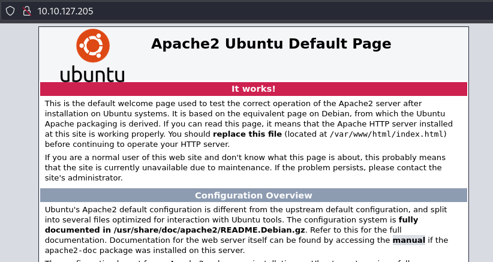
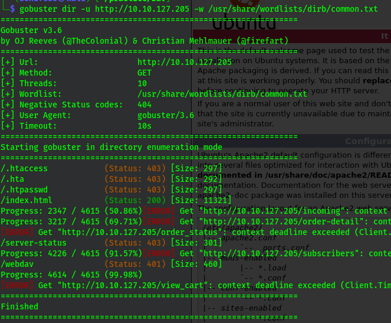
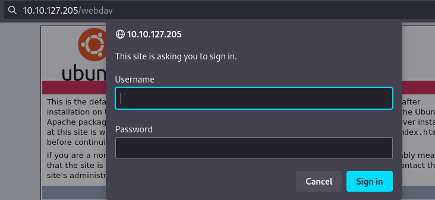
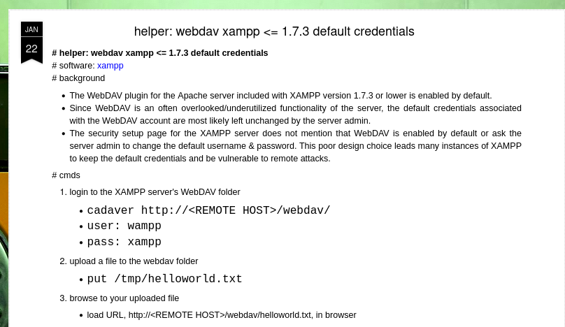
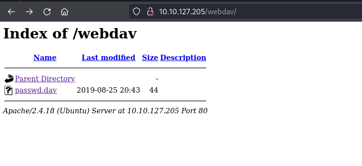
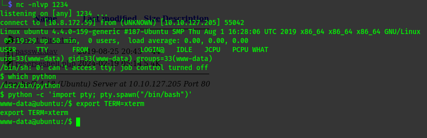
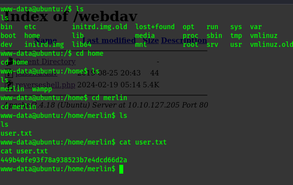
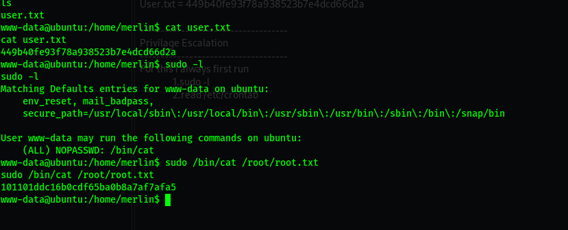

# Dav

Boot2root machine for FIT and bsides guatemala CTF.  

# Tasks

Read user.txt and root.txt.  

# nmap

## `ip = 10.10.127.205`

## Command 
```sh
 nmap -sV -sC -A -v 10.10.127.205 | tee nmap.txt
```

## Results
```sh
80/tcp open http Apache httpd 2.4.18 ((Ubuntu))
| http-methods:
|_ Supported Methods: POST OPTIONS GET HEAD
|_http-server-header: Apache/2.4.18 (Ubuntu)
|_http-title: Apache2 Ubuntu Default Page: It works
106/tcp filtered pop3pw
```

# http_80

To Do List  

- run gobuster  
- surf the web  
- view source code  
- robots.txt  
- gobuster  

)

### gobuster
```sh
 gobuster dir -u http://10.10.127.205 -w /usr/share/wordlists/dirb/common.txt
 ```

)

We get this directory known as `/weddav`  
)

Here i need a username and password.  
Did some research and got this default credentials.  
)

User = `wampp`  
pass = `xampp`  
Entering the credentials i get a file `passwd.dav`file.  
)

`=wampp:$apr1$Wm2VTkFL$PVNRQv7kzqXQIHe14qKA91`
Cracked the hash but got nothing much.  

I searched for web-dav vulnerability and got that we can upload files to it's server.  
I think if I can upload the shell and connect to it we can login into the system easily.  

I used a php reverse shell , changed the ip and uploaded it  
```sh
curl --user "wamp:xamp" http://10.10.127.205/webdev/ --upload-file reverseshell.php -v
```
)

Run nc cat on my machine then run the code.  
Got the shell and stabilized it.  
)  


Now it's just a matter of looking for the `user.txt `   
)

# Privilege Escalation
For this i always first run  
- `sudo -l`
- cat `/etc/crontab`

## sudo -l
)  
This was simple since the user can read any file with `sudo` without a password.  