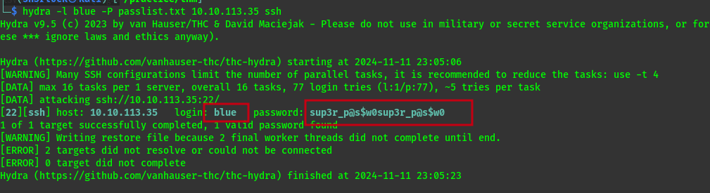
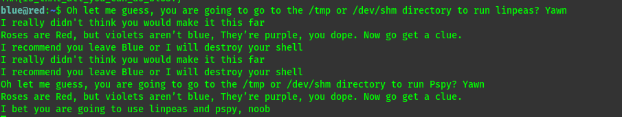

The match has started, and Red has taken the lead on you.  
But you are Blue, and only you can take Red down.  
  
However, Red has implemented some defense mechanisms that will make the battle a bit difficult:  
1. Red has been known to kick adversaries out of the machine. Is there a way around it?  
2. Red likes to change adversaries' passwords but tends to keep them relatively the same.   
3. Red likes to taunt adversaries in order to throw off their focus. Keep your mind sharp!

We start off with a typical port scan using `rustscan` 
```bash
rustscan -r 0-65535 --ulimit 5000 10.10.207.248 -t 3000 -- -sV -sC
```

```bash
PORT   STATE SERVICE REASON         VERSION
22/tcp open  ssh     syn-ack ttl 63 OpenSSH 8.2p1 Ubuntu 4ubuntu0.5 (Ubuntu Linux; protocol 2.0)
| ssh-hostkey: 
|   3072 e2:74:1c:e0:f7:86:4d:69:46:f6:5b:4d:be:c3:9f:76 (RSA)
| ssh-rsa AAAAB3NzaC1yc2EAAAADAQABAAABgQC1MTQvnXh8VLRlrK8tXP9JEHtHpU13E7cBXa1XFM/TZrXXpffMfJneLQvTtSQcXRUSvq3Z3fHLk4xhM1BEDl+XhlRdt+bHIP4O5Myk8qLX9E1FFpcy3NrEHJhxCCY/SdqrK2ZXyoeld1Ww+uHpP5UBPUQQZNypxYWDNB5K0tbDRU+Hw+p3H3BecZwue1J2bITy6+Y9MdgJKKaVBQXHCpLTOv3A7uznCK6gLEnqHvGoejKgFXsWk8i5LJxJqsHtQ4b+AaLS9QAy3v9EbhSyxAp7Zgcz0t7GFRgc4A5LBFZL0lUc3s++AXVG0hJ9cdVTBl282N1/hF8PG4T6JjhOVX955sEBDER4T6FcCPehqzCrX0cEeKX6y6hZSKnT4ps9kaazx9O4slrraF83O9iooBTtvZ7iGwZKiCwYFOofaIMv+IPuAJJuRT0156NAl6/iSHyUM3vD3AHU8k7OISBkndyAlvYcN/ONGWn4+K/XKxkoXOCW1xk5+0sxdLfMYLk2Vt8=
|   256 fb:84:73:da:6c:fe:b9:19:5a:6c:65:4d:d1:72:3b:b0 (ECDSA)
| ecdsa-sha2-nistp256 AAAAE2VjZHNhLXNoYTItbmlzdHAyNTYAAAAIbmlzdHAyNTYAAABBBDooZFwx0zdNTNOdTPWqi+z2978Kmd6db0XpL5WDGB9BwKvTYTpweK/dt9UvcprM5zMllXuSs67lPNS53h5jlIE=
|   256 5e:37:75:fc:b3:64:e2:d8:d6:bc:9a:e6:7e:60:4d:3c (ED25519)
|_ssh-ed25519 AAAAC3NzaC1lZDI1NTE5AAAAIDyWZoVknPK7ItXpqVlgsise5Vaz2N5hstWzoIZfoVDt
80/tcp open  http    syn-ack ttl 63 Apache httpd 2.4.41 ((Ubuntu))
| http-methods: 
|_  Supported Methods: GET HEAD POST OPTIONS
| http-title: Atlanta - Free business bootstrap template
|_Requested resource was /index.php?page=home.html
|_http-server-header: Apache/2.4.41 (Ubuntu)
Service Info: OS: Linux; CPE: cpe:/o:linux:linux_kernel

```

We have two open ports : 22 and 80
will start with port 80(http) for 22 requires some credential.

## Web_enumeration
### To do list
- [ ] visit the site and look around for any entry point 
- [ ] view the source code 
- [ ] Reads the `robots.txt` file
- [ ] Scan for other useful directories

**visit the site and look around for any entry point** 


This suggests that the site might be vulnerable to `LFI`.
Using a normal lfi payload`../../../etc/passwd` will get you nothing, of which we can relate from the challenge description.

However using a php filter like `php://filter/convert.base64-encode/resource=/etc/passwd` we get:  
  

Decoding the base64   
  
We get two users   
Would go direct to brute forcing but lets first understand how the php filter that was being used.  
  

Decoding we get    

This shows two protections:
- `preg_match("/^[a-z]/", $page)` ensures that the first character of the page must be an alphabetic character
- `sanitize_input` function prevents any path traversal.

 *php filter*,  is an easy way to bypass this (as the first character is `p` in `php://`)

We can only read files as the `readfile` function will prevent loading PHP code (it will be read as text).

Since we know the two users lets try reading some files. Could read the flag direct but we don't have the file name format ,let's read the bash_history maybe we can get a password or so ...

Decoding we get:

Here we have two interesting files.
The `passlist.txt` is delete but we can see its origin is `.reminder` 
Lets see if the file still exists and if we have read permissions.

Decoding :  


Now we have the contents of the file used in the command
```sh

hashcat --stdout .reminder -r /usr/share/hashcat/rules/best64.rule > passlist.txt
```
But what does the command do??

1. **`hashcat --stdout .reminder`**: This part reads the `.reminder` file as an input wordlist and outputs each word after applying modifications.
2. **`-r /usr/share/hashcat/rules/best64.rule`**: The `-r` flag specifies a rule file to apply to each word in the wordlist. Here, it's using `best64.rule`, which is a popular set of password mutation rules included with `hashcat`. These rules apply various transformations like capitalization, appending numbers, and other alterations to each word.
3. **`> passlist.txt`**: The `>` symbol redirects the output to a file named `passlist.txt`, saving all the modified words.

Lets try creating a `passlist` on our attacker machine then use it to brute force ssh account for user blue.  


we use hydra to brute force.



now we have user `blue` with password `sup3r_p@s$w0sup3r_p@s$w0` 

```bash 
ssh blue@$ip 
```

From here we get the flag1 and start looking for any details that can lead us  to user `red`.
But the blue team we aware of this and made a mitigation.


Did some research and got this ssh option that will avoid the prompt and maintain the shell.
```
  -T      Disable pseudo-terminal allocation.
```

We ssh again but add the option.

```bash
ssh blue@$ip -T
```

We get a shell and stabilize it   


### lateral movement
### To do list
- [ ] sudo -l
- [ ] cat /etc/hosts
- [ ] cat /etc/crontab
- [ ] Check for SUID

When doing the enumeration i found this useful  


The file only be appended thus we shall use this command to add our attacker ip address so that we can connect to it through nc.
`echo $ipredrules.thm >> /etc/hosts`  


## Privilege escalation
At this point the only other user that we can enumerate with higher privileges is `root`

### To do list
- [ ] sudo -l
- [ ] cat /etc/hosts
- [ ] cat /etc/crontab
- [ ] Check for SUID

But even before i could go further i saw this `.git` directory and i was kind of odd.


To exploit this i used this payload from [here](https://packetstormsecurity.com/files/165739/PolicyKit-1-0.105-31-Privilege-Escalation.html) 

It involves creating a `makefile`, `evil-so.c` and `exploit.c` file on the attack box, altering `exploit.c` so that the path to `pkexec` uses the path for red's copy, running make, then copying the created `evil.so` and `exploit` to the target machine (/tmp is writable, so I placed them there).
Running `chmod +x exploit` and then `./exploit` granted a root shell.
